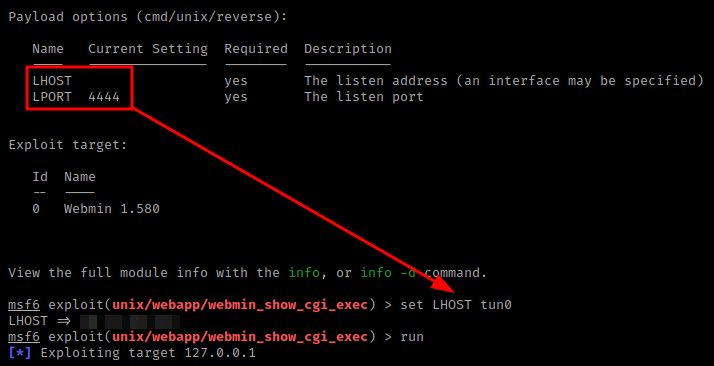

<h2 class="menu-header" id="main">
<a href="https://github.com/Mithlonde/Mithlonde">Root</a>&#xA0;&#xA0;&#xA0;
<a href="https://github.com/Mithlonde/Mithlonde/blob/main/blog/index.md">Blog</a>&#xA0;&#xA0;&#xA0;
<a href="https://github.com/Mithlonde/Mithlonde/blob/main/projects/index.md">Projects</a>&#xA0;&#xA0;&#xA0;
<a href="https://github.com/Mithlonde/Mithlonde/blob/main/all-writeups.md">Writeups</a>&#xA0;&#xA0;&#xA0;
<a href="https://github.com/Mithlonde/Mithlonde/blob/main/thm/2023-02-12-gamezone.md">~/Gamezone</a>&#xA0;&#xA0;&#xA0;
</h2>

# 👾 Mithlonde
└─$ cat writeups/thm/gamezone.md


*https://tryhackme.com/room/gamezone*<br />
`Linux` `SQLi` `John` `SSHTunneling` `Webmin` `SQLMAP` `CVE-2012-2982`
 
<br />

## TryHackMe CTF Writeup: Gamezone
- [Summary](#summary)
- [1. Enumeration](#1-enumeration)
  - [1.1 Nmap](#11-nmap)
  - [1.2 Web Discovery (Port 80/tcp)](#12-web-discovery-port-80-tcp)
- [2. Exploitation](#2-exploitation)
  - [2.1 SQLi](#21-sqli)
  - [2.2 SQLMap](#22-sqlmap)
  - [2.3 JohnTheRipper](#23-johntheripper)
  - [2.4 Initial Foothold](#24-initial-foothold)
- [3. Post Exploitation](#3-post-exploitation)
  - [3.1 User Flag](#31-user-flag)
  - [3.2 SSH Tunneling](#32-ssh-tunneling)
  - [3.3 Attack Vector (CVE: 2012-2982)](#33-attack-vector-cve-2012-2982)
  - [3.4 Metasploit](#34-metasploit)
  - [3.5 Root Flag](#35-root-flag)
- [4. Remediation](#4-remediation)
  - [4.1 Recommendations](#41-recommendations)
- [5. Conclusion](#5-conclusion)
- [References](#references)

# Walkthrough

### Summary:

The TryHackMe room is a virtual machine that simulates a scenario where a server is being used.

The goal of the room is to learn how to gain an initial shell via SQL injection, hashcracking, performing SSH tunneling to reveal a hidden service and then escalate privileges by exploiting a Webmin vulnerability.

The Gamezone room on TryHackMe is a beginner-friendly room that teaches basic penetration testing concepts. Users are tasked with exploiting vulnerabilities in a Linux-based web server running outdated software versions, weak authentication mechanisms, and misconfigured access controls.

## 1. Enumeration 

### 1.1 Nmap:<a name="11-nmap"></a>

We start with the reconnaissance by running an initial Nmap scan.

```
sudo nmap -p- --min-rate 10000 $IP -Pn -oN scans/all-ports.nmap && ports=$(cat scans/all-ports.nmap | grep "open" | grep -v "filtered" | cut -d "/" -f 1 | sort -u | xargs | tr ' ' ',')
```

-   **-p-**: scan all ports
-   **--min-rate**: set high scanning rate
-   **-oN**: write output to nmap file

The script then uses **grep** and **cut** commands to filter and extract the open ports from the output file, sorts them, and stores them in a variable called ports. It was noted that this machine does not respond to ping (ICMP), thus the `-Pn` syntax will be added.  

The second script is used to scan the open ports identified in the first script for any services running on them. It uses the Nmap command with the options `-p$ports` to scan the open ports stored in the variable, `-sCV` to perform a service version scan and OS detection, and `-oN scans/services.nmap` to output the results to a file named **services.nmap** in the scans directory. This script allows you to gather more information about the open ports and the services running on them.

```
sudo nmap -p$ports -sCV -Pn -oN scans/targeted.nmap $IP
```

-   **-sC**: run default nmap scripts
-   **-sV**: detect service version

**Summary of the Nmap scan results**:

```
# Nmap 7.93 scan initiated Thu Feb  2 21:31:41 2023 as: nmap -p22,80 -sCV -oN scans/services.nmap 10.10.240.209
Nmap scan report for 10.10.240.209
Host is up (0.051s latency).

PORT   STATE SERVICE VERSION
22/tcp open  ssh     OpenSSH 7.2p2 Ubuntu 4ubuntu2.7 (Ubuntu Linux; protocol 2.0)
| ssh-hostkey: 
|   2048 61ea89f1d4a7dca550f76d89c3af0b03 (RSA)
|   256 b37d72461ed341b66a911516c94aa5fa (ECDSA)
|_  256 536709dcfffb3a3efbfecfd86d4127ab (ED25519)
80/tcp open  http    Apache httpd 2.4.18 ((Ubuntu))
| http-cookie-flags: 
|   /: 
|     PHPSESSID: 
|_      httponly flag not set
|_http-server-header: Apache/2.4.18 (Ubuntu)
|_http-title: Game Zone
Service Info: OS: Linux; CPE: cpe:/o:linux:linux_kernel
```

From the above output we can see that ports, **22**, and **80** are open.

We get back that this includes an **OpenSSH version of 7.2p2** most likely running on **Ubuntu** and an Apache web server running **Apache httpd 2.4.18**.

### 1.2 Web Discovery (Port 80/tcp):<a name="12-web-discovery-port-80-tcp"></a>

Upon discovering the website, the next logical step is to navigate to the homepage and take a closer look. The homepage reveals that the character featured is "**Agent 47**," which could potentially serve as a username. The page appears to be fairly simple, with a login and site search box displayed. 


---
## 2. Exploitation

In order to gain our initial foothold we need to try to get a way to bypass the login.

### 2.1 SQLi:<a name="21-sqli"></a>

After noticing the presence of a login box, we attempted default credentials but they were unsuccessful. As the website appears to be custom-made, we attempted a basic login bypass using SQL injection. Specifically, we utilized the syntax: `Agent 47' AND 1=1; -- -`. This allowed us to bypass the login and gain access to a "portal.php" page that contains another search box.


> **Now here is something very important I wish to address here.** Recently, Tib3rius warned the cyberspace about the possible dangers of SQL injections, specifically `‘ OR 1=1; -- -`. According to his intel, `OR 1=1` should not be the go-to example for SQL injection. There are reasons why it has been so widely accepted as it is, but using it without mentioning the risks is teaching bad practice. Even tools like SQLMap don't use this by default for a very good reasons!
>
> **Here are some of those reasons**:
> 1. Assuming the query is returning at least one row prior to your injection, AND will return the same result, while OR could potentially return every row. Not good if the table is large!
>
> 2. If the app only proceeds if one row is returned (a common login check), using AND can succeed when OR will not (it will return multiple rows and sometimes you can't use LIMIT).
>
> 3. Another important consideration is that relying on OR 1=1 as a login bypass is not foolproof, especially when dealing with a system that has multiple users. In cases where the login check expects only one row, OR 1=1 may work as a bypass. However, if there are multiple users, this technique may not work. This is another reason why it is essential to thoroughly test for SQL injection authentication bypass and not rely solely on OR 1=1 as a catch-all solution.
>
> 4. **Perhaps the most important reason**. You often don't know what kind of statement you are injecting into. An OR 1=1 injected into an UPDATE or DELETE statement can ruin a load of data! Avoid OR as much as possible. Do you know which tool avoids OR? SQLmap. Be like SQLmap.
>
> 5. The focus here is on pentesting rather than malicious activity. The goal is to identify and address any SQL injection vulnerabilities in a non-threatening manner. The main point is that if there are no SQL injection vulnerabilities, bad actors won't be able to exploit OR 1=1 if there's no SQLi in the first place.
>
> **So in short: `' AND '1'='1` can often be better than `' OR '1'='1`**
>
>If you have an SQLi where you can't/don't want to use OR, but you also don't have a valid value to use, you can try guessing the column name and use concatenation to get valid results: http://sqlfiddle.com/#!9/598127/3.

Once again, kudos to Tib3rius for addressing the above. You can often find him streaming here: https://www.twitch.tv/0xtib3rius. He also has some superb privesc courses: https://tib3rius.com/.


After gaining initial access to the web server, we find ourselves with a limited search box that doesn't provide much information. To extract more useful data, we'll utilize SQLMap to dump the entire GameZone database.

After observing the aforementioned, the initial step would be to intercept a request made to the search feature through BurpSuite.


We can save the intercepted request made to the search feature using BurpSuite into a text file and then pass it to SQLMap to utilize our authenticated user session.

### 2.2 SQLMap:<a name="22-sqlmap"></a>

There exist several types of SQL injection attacks, such as boolean or time-based attacks. Fortunately, SQLMap automates the process by attempting various techniques until it identifies the vulnerable one. Once it is successful, SQLMap will output the entire database.

`sqlmap -r request.txt --dbms=mysql --dump`

- **-r**: uses the intercepted request saved earlier
- **--dbms**: tells SQLMap what type of database management system it is
- **--dump**: attempts to output the entire database

The password hash for Agent 47 can be observed in the users table.


Using hash-identifier we can easily find the corresponding hashing algorithm used, in this case SHA-256. We can save it to hash.txt so we can have JohnTheRipper a crack at it.


### 2.3 JohnTheRipper:<a name="23-johntheripper"></a>

In order to find the correct syntax to use with John, we can `--list=formats` and find the corresponding format with a `grep` command.


After obtaining the hashed password associated with the target user, execute it against the hash using the following arguments:

- **hash.txt**: contains a list of your hashes
- **--wordlist**: is the wordlist used to find the dehashed value
- **--format**: is the hashing algorithm used

After not even a minute, the password was cracked revealing the password for the agent47 user.


### 2.4 Initial Foothold:<a name="24-initial-foothold"></a>

Having obtained the username and password through the previous steps, we can attempt to establish a SSH connection to the target machine. It's worth noting that during the Nmap scan, port 22 was found open, suggesting SSH was running. 

If we try these credentials via SSH, we will get a full shell on the remote system running as agent47. So now we can further enumerate the machine and escalate our privileges to root.

---
## 3. Post Exploitation

### 3.1 User Flag:<a name="31-user-flag"></a>

Once I gained access, I used the `find /home -name user.txt` command to search for the user flag, making it a quick and efficient method for finding it.


### 3.2 SSH Tunneling:<a name="32-ssh-tunneling"></a>

By this point, it should be clear that in order to reveal additional services on this box, we need to use SSH tunneling, as it has been mentioned repeatedly throughout the TryHackMe room.

Reverse SSH port forwarding directs a specific port on the remote server to be forwarded to the designated host and port on the local side. To investigate sockets operating on a host, we will utilize a utility named `ss`. Running the command `ss -tulpn` will provide us with information regarding the socket connections that are currently running.

> The `ss` tool (short for **socket statistics**) is a Linux command-line utility used to display detailed information about network connections, including listening ports, established connections, and network sockets. It provides a faster and more detailed alternative to the older `netstat` command.


We have discovered that there is a running service on **port 10000** that was not detected during our initial Nmap scan. Fortunately, we can use SSH tunneling to expose the port to our local machine, allowing us to access it.

To set up the local tunnel, we use the command `ssh -L 10000:localhost:10000 agent47@$IP`. 

- **-L**: indicates that we are creating a local tunnel. This means that if there are any blocked sites or services, we can forward their traffic to a server we own and view it.

> **Note**: **-R** syntax for example is used for creating a remote tunnel. This means that we forward our traffic to another server for others to view, which is similar to the previous example but in reverse.

Now that the port is open to us, we can navigate to localhost:10000 to reveal access the newly-exposed webserver with a login page running Webmin.


During our login attempt here, we found that the Agent 47 user had reused their password, which is a security issue. After accessing the machine, we discovered that it was running an outdated version of **Webmin (1.580)** and **Ubuntu 16.0.4.6 LTS**, which is no longer supported. It's essential to note that the latest version of Ubuntu (22.04.2 LTS) was released on February 23, 2023, while Webmin 2.021 was released on March 19, 2023.

##### See https://webmin.com/ and https://wiki.ubuntu.com/Releases for all releases.


### 3.3 Attack Vector (CVE: 2012-2982):<a name="33-attack-vector-cve-2012-2982"></a>

As we proceed with our attack vector, we decided to focus on the CMS dashboard version and leverage `searchsploit` to find a suitable payload to execute against the target machine, which yielded numerous options available for Webmin. However, we eventually settled on the Remote Code Execution Metasploit module specifically designed for version 1.580.


**CVE: 2012-2982 - Webmin 1.580 - '/file/show.cgi' Remote Command Execution (Metasploit)**: 

```
Description
This module exploits an arbitrary command execution vulnerability in Webmin 1.580. The vulnerability exists in the /file/show.cgi component and allows an authenticated user, with access to the File Manager Module, to execute arbitrary commands with root privileges. The module has been tested successfully with Webmin 1.580 over Ubuntu 10.04.

Source: https://www.rapid7.com/db/modules/exploit/unix/webapp/webmin_show_cgi_exec/
```

As per the Exploit Database (https://www.exploit-db.com/exploits/21851), it was observed that the same vulnerability we can use for remote code execution could also be used to manually extract information from the underlying system as part of a **File Disclosure vulnerability**. The exploit operates by using "/Document follows/" via an URL path.


So knowing that, we can bypass the whole privilege escalation part by simply requesting the root.txt flag via `http://localhost:10000/file/show.cgi/root/root.txt.`


>**Non-Metasploit approach**: The exploit also shows that if we can supply any filename followed by a pipe and then we can inject our payload. Very interesting manual method reading material here: https://chalk-headphones-f81.notion.site/GAMEZONE-WRITE-UP-2e762633c6234e3b9e1fbb0bcf743fcb.


### 3.4 Metasploit:<a name="34-metasploit"></a>

Once we identified the attack vector, we utilized Metasploit to execute the `webmin_show_cgi_exec` module. Next, we displayed the required options to initiate the exploit.


To successfully execute the `webmin_show_cgi_exec` module, we need to configure several options in Metasploit. These options include setting the `PAYLOAD`, `RHOSTS`, `RPORT`, `USERNAME`, `PASSWORD`, and `LHOST`.


As we established an SSH tunnel to the target machine earlier, we set the RHOSTS option to our local machine's IP address. Additionally, we set the LHOST option to our TryHackMe OpenVPN tun0 interface address.



### 3.5 Root Flag:<a name="35-root-flag"></a>

After running the exploit, we see that authentication was successful and a command shell session opens. 

As you can see by running running a simple `whoami` command, we have successfully elevated our privileges to root and completed the task. 

The root flag can be found by running the commands `find /home -name root.txt` and `cat /root/root.txt`.


---
## 4. Remediation 

It's important to note that remediating vulnerabilities requires an ongoing effort and it's important to keep the system up to date and review it regularly for new vulnerabilities. It's also important to give clear instructions and guidelines for the staff, and to establish a plan of action in case of a security breach.

### 4.1 Recommendations:<a name="41-recommendations"></a>

The following tables illustrate the vulnerabilities found by impact and recommended remediations:

| Critical / C | High / H | Moderate / M | Low / L | Info / I |
|----------|------|----------|-----|-----|
| <p align="center">:red_circle: x1</p> | <p align="center">:orange_circle: x4</p> | <p align="center">:yellow_circle: x1</p> | <p align="center">:green_circle: x5</p> | <p align="center">:large_blue_circle: x2</p> |

| Finding | Severity | Recommendation |
|---------|----------|----------------|
| Webmin Remote Code Execution and File Disclosure (CVE-2012-2982) | <p align="center">:red_circle: C</p> | Upgrade to the latest version of Webmin (2.021 or later) to mitigate this vulnerability. Additionally, Webmin users should limit access to the File Manager module to authorized personnel only. It is also recommended to regularly review the system logs for suspicious activity. |
| SQL Injection vulnerability allows login bypass | <p align="center">:orange_circle: H</p> | The fact that the username is easily guessable or obtainable from public sources can increase the severity of the vulnerability. Sanitize and validate all user inputs to prevent SQL injection attacks.  |
| SQL injection via search perimeter | <p align="center">:orange_circle: H</p> | Perform a code review to identify and sanitize any input parameters that could be susceptible to SQL injection attacks. Additionally, it is recommended to use prepared statements and parameterized queries to mitigate the risk of SQL injection. |
| Outdated Webmin version (Severity: High) | <p align="center">:orange_circle: H</p> | Upgrade to the latest version of Webmin (2.021 or later). |
| Outdated Ubuntu OS version (Severity: High) | <p align="center">:orange_circle: H</p> | Upgrade to the latest version of Ubuntu (22.04.2 LTS or later) or at least to a supported LTS version. |
| Password reuse | <p align="center">:yellow_circle: M</p> | Advise the user to not reuse passwords and to use a password manager to generate and store unique, strong passwords for each account. |
| Weak password policy | <p align="center">:green_circle: L</p> | The password should be changed to a stronger one that contains a mix of uppercase and lowercase letters, numbers, and special characters. Enable Multi-Factor Authentication (MFA). | 
| Port Forwarding to Jenkins server via SSH connection | <p align="center">:green_circle: L</p> | Review and update SSH configuration to ensure secure connections. Use a VPN for secure remote access to the server. Restrict port forwarding and limit access to only authorized users. Enable Multi-Factor Authentication (MFA) for accessing sensitive services like Jenkins. | 
| Permissions review | <p align="center">:green_circle: L</p> | Review permissions and roles assigned to users and groups, and limit access to sensitive data and functionality. |
| IP-based firewall | <p align="center">:green_circle: L</p> | Use a firewall to restrict access to Webmin login portal to only trusted IP addresses. |
| Intrusion detection | <p align="center">:green_circle: L</p> | Monitor for suspicious activity and implement intrusion detection and prevention measures. |
| Open Ports | <p align="center">:large_blue_circle: I</p> | Unused open ports expose attack surface. Close unused ports to reduce attack surface. |
| Banner Grabbing | <p align="center">:large_blue_circle: I</p> | Server banner reveals software and version information. Disable server banner or customize it to prevent information disclosure. |

For all findings, it is also recommended to follow best practices for system security, such as regularly applying security updates, using strong passwords, and implementing access controls to limit unauthorized access to sensitive data.

---
## 5. Conclusion 

Overall, this room was an excellent learning experience that gave me a deeper understanding of SQL injection.

This box presented several security vulnerabilities, including the use of weak passwords, SQL injection to bypass logins, and the Webmin application allowing an attacker to disclose sensitive files through the "/file/show.cgi" component. This particular vulnerability allowed us to quickly escalate privileges to gain full control of the system via a Metasploit module. The use of outdated software versions also contributed to the system's vulnerability.

It's important to note that these methods should only be performed on systems that you have permission to test. Unauthorized testing is illegal and can result in serious consequences.

In conclusion, I hope this write-up has helped you understand some of the basic techniques used in penetration testing and how to identify and exploit vulnerabilities to gain access to a system.

---
## References
1. https://tryhackme.com/room/gamezone
2. http://sqlfiddle.com/#!9/598127/3
3. https://www.twitch.tv/0xtib3rius
4. https://tib3rius.com
5. https://webmin.com/
6. https://wiki.ubuntu.com/Releases
7. https://www.exploit-db.com/exploits/21851
8. https://www.rapid7.com/db/modules/exploit/unix/webapp/webmin_show_cgi_exec/
9. https://chalk-headphones-f81.notion.site/GAMEZONE-WRITE-UP-2e762633c6234e3b9e1fbb0bcf743fcb
